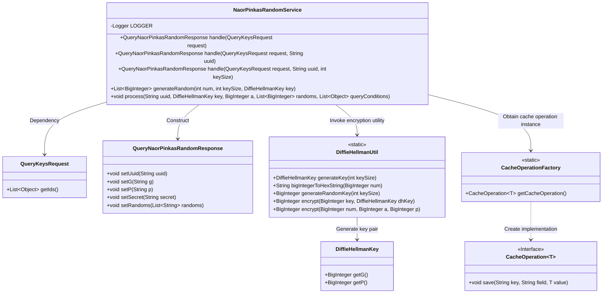
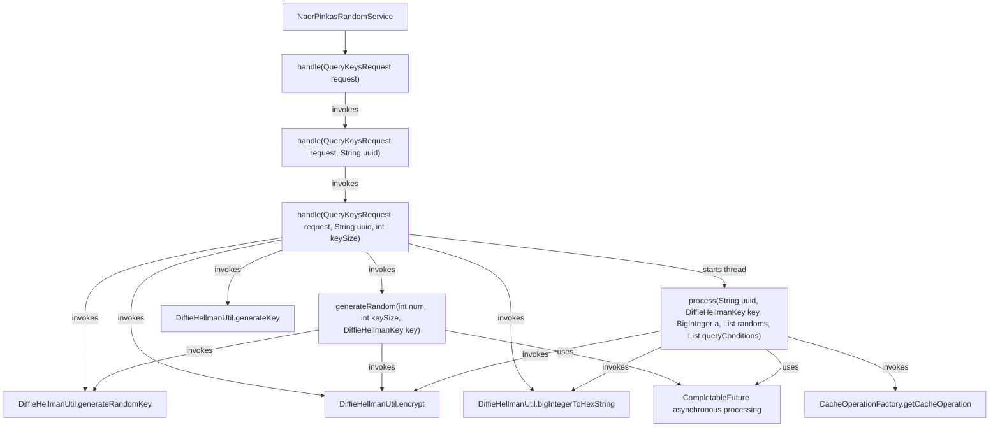

# Basic Information

|      |      |
|------|------|
| Name | NaorPinkasRandomService |
| Language | .java |
| Code Path | WeFe/mpc/mpc-pir/mpc-pir-server/src/main/java/com/welab/wefe/mpc/pir/server/service/naor/NaorPinkasRandomService.java |
| Package Name | com.welab.wefe.mpc.pir.server.service.naor |
| Dependencies | ['com.welab.wefe.mpc.cache.intermediate.CacheOperation', 'com.welab.wefe.mpc.cache.intermediate.CacheOperationFactory', 'com.welab.wefe.mpc.commom.Constants', 'com.welab.wefe.mpc.key.DiffieHellmanKey', 'com.welab.wefe.mpc.pir.request.QueryKeysRequest', 'com.welab.wefe.mpc.pir.request.naor.QueryNaorPinkasRandomResponse', 'com.welab.wefe.mpc.util.DiffieHellmanUtil', 'org.slf4j.Logger', 'org.slf4j.LoggerFactory', 'java.math.BigInteger', 'java.util.ArrayList', 'java.util.List', 'java.util.UUID', 'java.util.concurrent.CompletableFuture', 'java.util.stream.Collectors', 'java.util.stream.IntStream'] |
| Brief Description | The NaorPinkasRandomService class handles key requests, generates UUIDs and Diffie-Hellman keys, returns responses containing random numbers and encryption results, and asynchronously processes data storage in the cache. |

# Description

The `NaorPinkasRandomService` class implements random number generation and processing functionality based on the Naor-Pinkas protocol. It primarily includes three overloaded `handle` methods for processing `QueryKeysRequest` requests, generating UUIDs, Diffie-Hellman keys, and random numbers. The core logic involves: validating non-empty query conditions, generating DH key pairs, creating random keys and secret values, and generating multiple random numbers converted to hexadecimal strings. The processing is executed asynchronously via a new thread, with parameters saved to a cache. The `generateRandom` method concurrently generates a specified quantity of random `BigInteger` values. The `process` method encrypts the generated random numbers and stores them in the cache along with the query conditions. The entire workflow is tracked using UUIDs and logs detailed records.

# Class Summary

| Name   | Type  | Description |
|-------|------|-------------|
| NaorPinkasRandomService | class | The NaorPinkasRandomService class handles key requests, generates Diffie-Hellman keys and random numbers, processes asynchronously, and caches results. It includes UUID generation, parameter validation, key encryption, and thread processing logic. |

## Class NaorPinkasRandomService

|      |      |
|------|------|
| Access Modifier | public |
| Type | class |
| Name | NaorPinkasRandomService |
| Description | The NaorPinkasRandomService class handles key requests, generates Diffie-Hellman keys and random numbers, processes asynchronously, and caches results. It includes UUID generation, parameter validation, key encryption, and thread processing logic. |

### UML Class Diagram

Class diagram description:
NaorPinkasRandomService is a core service class implementing the Naor-Pinkas encryption protocol, processing requests with different parameter combinations through overloaded handle methods to generate response objects containing UUID, cryptographic parameters, and random numbers. The class relies on DiffieHellmanUtil for key generation and encryption operations, and uses CacheOperationFactory to obtain cache interface instances for asynchronous intermediate data storage. The workflow involves concurrent random number generation, Diffie-Hellman key exchange protocol implementation, and result caching, demonstrating the integration of cryptographic protocol implementation with high-performance asynchronous processing.

### Internal Method Call Graph

The flowchart depicts the core processing flow of the NaorPinkasRandomService class. The entry method handle undergoes three overloaded invocations, ultimately completing Diffie-Hellman key generation, random number encryption, and asynchronous processing in the third overloaded method. The generateRandom method generates encrypted random number lists through parallel computation, while the process method asynchronously stores encrypted parameters in cache. The entire flow involves key operations, hexadecimal conversion, and multithreaded processing, finally returning a response object containing encrypted parameters.

### Field List

| Name  | Type  | Description |
|-------|-------|------|
| LOGGER = LoggerFactory.getLogger(NaorPinkasRandomService.class) | Logger | The NaorPinkasRandomService class defines a static immutable logger instance. |

### Method List

| Name  | Type  | Description |
|-------|-------|------|
| handle | QueryNaorPinkasRandomResponse | This method processes the query key request, generates a random UUID with hyphens removed, invokes another processing method, and returns the response. |
| generateRandom | List<BigInteger> | Generate a specified number of random large integers, encrypt them asynchronously, and return the list. Handle exceptions and log error messages. |
| handle | QueryNaorPinkasRandomResponse | Process the query request, generate Diffie-Hellman keys and random numbers, return a response containing UUID, G, P, keys, and random numbers, and initiate a new thread to handle subsequent processes. |
| handle | QueryNaorPinkasRandomResponse | Process the query request, invoke the method with the default parameter 1024. |
| process | void | Method for processing NaorPinkas protocol data: Save key parameters, asynchronously encrypt the nonce list, and store the encryption results and query conditions. |

