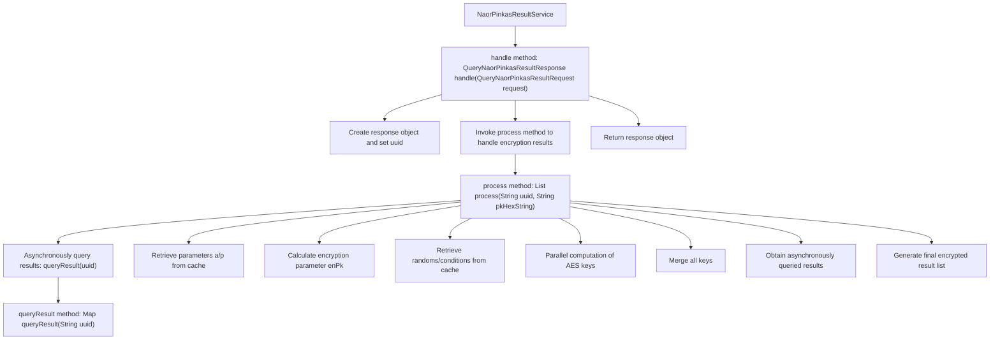

# Basic Information

|      |      |
|------|------|
| Name | NaorPinkasResultService |
| Language | .java |
| Code Path | WeFe/mpc/mpc-pir/mpc-pir-server/src/main/java/com/welab/wefe/mpc/pir/server/service/naor/NaorPinkasResultService.java |
| Package Name | com.welab.wefe.mpc.pir.server.service.naor |
| Dependencies | ['java.math.BigInteger', 'java.util.ArrayList', 'java.util.List', 'java.util.Map', 'java.util.concurrent.CompletableFuture', 'org.slf4j.Logger', 'org.slf4j.LoggerFactory', 'com.welab.wefe.mpc.cache.intermediate.CacheOperation', 'com.welab.wefe.mpc.cache.intermediate.CacheOperationFactory', 'com.welab.wefe.mpc.cache.intermediate.CacheUtil', 'com.welab.wefe.mpc.commom.Constants', 'com.welab.wefe.mpc.commom.Conversion', 'com.welab.wefe.mpc.pir.protocol.ro.hf.HashFunction', 'com.welab.wefe.mpc.pir.protocol.ro.hf.Sha256', 'com.welab.wefe.mpc.pir.protocol.se.SymmetricKey', 'com.welab.wefe.mpc.pir.protocol.se.aes.AESEncryptKey', 'com.welab.wefe.mpc.pir.request.naor.QueryNaorPinkasResultRequest', 'com.welab.wefe.mpc.pir.request.naor.QueryNaorPinkasResultResponse', 'com.welab.wefe.mpc.util.DiffieHellmanUtil'] |
| Brief Description | The NaorPinkasResultService processes query requests by performing asynchronous queries and cryptographic operations to generate responses. It employs Diffie-Hellman and AES encryption, combined with cached data, to ultimately return an encrypted result list. |

# Description

The `NaorPinkasResultService` class processes query requests and generates encrypted results. It retrieves parameters `a`, `p`, and random numbers from the cache via UUID, then encrypts the public key `pk` using Diffie-Hellman. Multiple symmetric keys are generated, including `k0` based on the encrypted `pk` and a list of keys derived from random numbers. After querying the result data, it encrypts the results using AES with the generated keys and finally returns the list of encrypted results. The process employs `CompletableFuture` for asynchronous task handling and logs error messages.

# Class Summary

| Name   | Type  | Description |
|-------|------|-------------|
| NaorPinkasResultService | class | The NaorPinkasResultService processes query requests, retrieves cached data via UUID, and generates response results using Diffie-Hellman and AES encryption. |

## Class NaorPinkasResultService

|      |      |
|------|------|
| Access Modifier | public |
| Type | class |
| Name | NaorPinkasResultService |
| Description | The NaorPinkasResultService processes query requests, retrieves cached data via UUID, and generates response results using Diffie-Hellman and AES encryption. |

### UML Class Diagram

```mermaid
classDiagram
    class NaorPinkasResultService {
        -LOGGER : Logger
        +handle(QueryNaorPinkasResultRequest request) QueryNaorPinkasResultResponse
        -process(String uuid, String pkHexString) List~String~
        -queryResult(String uuid) Map~String, String~
    }

    class QueryNaorPinkasResultRequest {
        +getUuid() String
        +getPk() String
    }

    class QueryNaorPinkasResultResponse {
        +setUuid(String uuid) void
        +setEncryptResults(List~String~ results) void
    }

    class CacheOperationFactory {
        +getCacheOperation() CacheOperation~T~
    }

    class CacheOperation~T~ {
        <<Interface>>
    }

    class CacheUtil {
        +get(String key, String field, CacheOperation~T~ operation) T
    }

    class DiffieHellmanUtil {
        +hexStringToBigInteger(String hex) BigInteger
        +encrypt(BigInteger pk, BigInteger a, BigInteger p) BigInteger
        +modDivide(BigInteger r, BigInteger enPk, BigInteger p) BigInteger
    }

    class AESEncryptKey {
        +AESEncryptKey(byte[] key)
        +getIv() byte[]
    }

    class SymmetricKey {
        <<Interface>>
        +encrypt(byte[] data) byte[]
    }

    class Sha256 {
        +digest(byte[] input) byte[]
    }

    class Conversion {
        +bytesToHexString(byte[] bytes) String
    }

    NaorPinkasResultService --> QueryNaorPinkasResultRequest : Dependency
    NaorPinkasResultService --> QueryNaorPinkasResultResponse : Dependency
    NaorPinkasResultService --> CacheOperationFactory : Dependency
    NaorPinkasResultService --> CacheUtil : Dependency
    NaorPinkasResultService --> DiffieHellmanUtil : Dependency
    NaorPinkasResultService --> AESEncryptKey : Dependency
    NaorPinkasResultService --> SymmetricKey : Dependency
    NaorPinkasResultService --> Sha256 : Dependency
    NaorPinkasResultService --> Conversion : Dependency
    CacheOperationFactory --> CacheOperation~T~ : Creates
    AESEncryptKey ..|> SymmetricKey : Implements
```

Class Diagram Description:
This diagram illustrates the core structure of NaorPinkasResultService and its dependencies. The service class obtains cache operation interfaces through CacheOperationFactory, utilizes CacheUtil for cache read/write operations, relies on DiffieHellmanUtil for cryptographic computations, and generates AESEncryptKey implementing the SymmetricKey interface. It also integrates the Sha256 hashing algorithm and byte conversion utility Conversion. During request processing, it interacts with QueryNaorPinkasResultRequest/Response, collectively implementing an asynchronous encryption query flow based on the Naor-Pinkas protocol.

### Internal Method Call Graph

This code flowchart illustrates the core processing flow of NaorPinkasResultService. It primarily consists of three key methods: handle serves as the entry point to receive requests and return responses; the process method handles core encryption logic, including asynchronous result queries, parameter retrieval, key computation, and result encryption; the queryResult method asynchronously fetches cached data. The flowchart clearly demonstrates method invocation relationships and data flow paths, particularly highlighting the complex parallel computation and result merging processes within the process method. The entire workflow involves multiple encryption operations and cache interactions, ultimately generating an encrypted result list.

### Field List

| Name  | Type  | Description |
|-------|-------|------|
| LOGGER = LoggerFactory.getLogger(NaorPinkasResultService.class) | Logger | The NaorPinkasResultService class defines a static immutable logger instance named LOGGER. |

### Method List

| Name  | Type  | Description |
|-------|-------|------|
| handle | QueryNaorPinkasResultResponse | Process query requests and generate responses containing UUID and encrypted results. |
| process | List<String> | This method retrieves parameters through asynchronous queries and caching operations, processes the data using Diffie-Hellman encryption and AES key generation techniques, and ultimately returns a list of encrypted results. |
| queryResult | Map<String, String> | The method `queryResult` retrieves the result from the cache by UUID, utilizing `CacheOperation` and `CacheUtil` for operations. Upon completion, it logs the activity and returns the result. |

