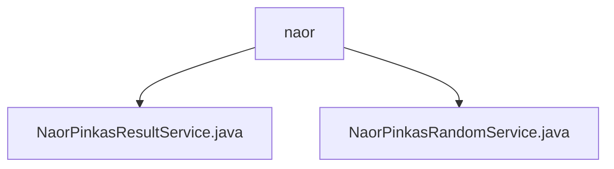

# Basic Information

|      |      |
|------|------|
| Name | naor |
| Language | .java |
| Code Path | WeFe/mpc/mpc-pir/mpc-pir-server/src/main/java/com/welab/wefe/mpc/pir/server/service/naor |
| Package Name | docs.mpc.mpc-pir.mpc-pir-server.src.main.java.com.welab.wefe.mpc.pir.server.service.naor |
| Brief Description | The NaorPinkasResultService processes queries, generates encrypted results, and employs Diffie-Hellman and AES encryption. The NaorPinkasRandomService implements the Naor-Pinkas protocol to generate random numbers and DH keys, handling operations asynchronously with caching. |

# Description

## Overview  
This module implements a secure multi-party computation query service based on the Naor-Pinkas protocol. Its core responsibilities include generating encrypted random numbers (NaorPinkasRandomService) and processing encrypted query results (NaorPinkasResultService). The interface specification adopts an asynchronous processing model (e.g., CompletableFuture) and a UUID tracking mechanism. Key data structures include Diffie-Hellman key pairs, random number lists, and AES encryption keys. External dependencies involve the JCE encryption library and thread pools. For example, NaorPinkasRandomService generates BigInteger random numbers in parallel, similar to a key distribution center, while NaorPinkasResultService functions like a hybrid encryption gateway, combining DH key exchange with symmetric encryption.  

## Key Business Scenarios  
The typical workflow consists of two phases: First, the generation phase (NaorPinkasRandomService) creates DH parameters and a random number pool, which are then cached. For instance, when processing a QueryKeysRequest, hexadecimal random numbers are generated. The query phase (NaorPinkasResultService) derives keys based on cached parameters and encrypts the results, such as performing multi-layer AES encryption using k0 and a random number key chain. The interaction model employs a "pre-generation-consumption" mechanism, akin to a one-time pad. API types encompass key generation and result encryption interfaces, with integration cases including asynchronous thread pool processing and encrypted log tracking.

### Package Internal Structure View

This flowchart illustrates the hierarchical structure of the naor service directory under the mpc-pir-server module in the WeFe project. As the parent node, naor contains two service classes: NaorPinkasResultService and NaorPinkasRandomService. These Java files implement Naor-Pinkas protocol-related service functionalities for private information retrieval scenarios in secure multi-party computation.

# File List

| Name   | Type  | Description |
|-------|------|-------------|
| [NaorPinkasResultService.java](NaorPinkasResultService.md) | file | The NaorPinkasResultService processes query requests, generating responses through asynchronous queries and cryptographic operations. It employs Diffie-Hellman and AES encryption, combined with cached data, to ultimately return an encrypted result list. |
| [NaorPinkasRandomService.java](NaorPinkasRandomService.md) | file | The NaorPinkasRandomService class handles key requests, generates UUIDs and Diffie-Hellman keys, returns responses containing random numbers and encryption results, and asynchronously processes data storage in the cache. |

