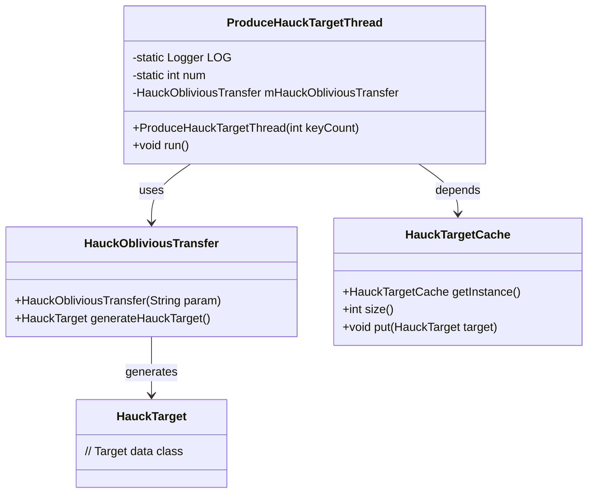
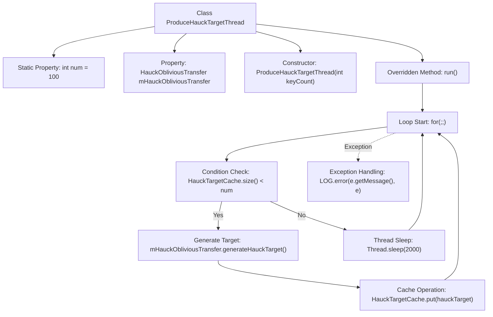

# Basic Information

|      |      |
|------|------|
| Name | ProduceHauckTargetThread |
| Language | .java |
| Code Path | WeFe/mpc/mpc-pir/mpc-pir-server/src/main/java/com/welab/wefe/mpc/pir/server/thread/ProduceHauckTargetThread.java |
| Package Name | com.welab.wefe.mpc.pir.server.thread |
| Dependencies | ['com.welab.wefe.mpc.pir.protocol.ot.hauck.HauckObliviousTransfer', 'com.welab.wefe.mpc.pir.protocol.ot.hauck.HauckTarget', 'com.welab.wefe.mpc.pir.server.cache.HauckTargetCache', 'org.slf4j.Logger', 'org.slf4j.LoggerFactory'] |
| Brief Description | The `ProduceHauckTargetThread` thread class is used to generate `HauckTarget` objects and cache them. It continuously generates objects when the cache quantity is insufficient, otherwise it sleeps for 2 seconds. Logs are recorded when exceptions occur. |

# Description

This is a thread class named ProduceHauckTargetThread, designed to continuously generate HauckTarget objects and cache them. The class contains a static logger, a configurable cache count parameter `num`, and an instance of HauckObliviousTransfer. The constructor accepts a `keyCount` parameter to set the cache threshold and names the thread "produce-hauck-target". The `run` method implements an infinite loop logic: when the cache is not full, it generates new HauckTarget objects and stores them in the cache; when full, it sleeps for 2 seconds. Exception handling logs InterruptedException errors.

# Class Summary

| Name   | Type  | Description |
|-------|------|-------------|
| ProduceHauckTargetThread | class | The `ProduceHauckTargetThread` thread class is used to continuously generate `HauckTarget` objects and cache them. When the cache quantity is insufficient, it generates new objects; otherwise, it sleeps for 2 seconds. It utilizes `HauckObliviousTransfer` to generate target objects. |

## Class ProduceHauckTargetThread

|      |      |
|------|------|
| Access Modifier | public |
| Type | class |
| Name | ProduceHauckTargetThread |
| Description | The `ProduceHauckTargetThread` thread class is used to continuously generate `HauckTarget` objects and cache them. When the cache quantity is insufficient, it generates new objects; otherwise, it sleeps for 2 seconds. It utilizes `HauckObliviousTransfer` to generate target objects. |

### UML Class Diagram

This code describes a thread class that produces HauckTarget, which continuously checks cache capacity and generates new target data when insufficient. The class diagram illustrates four core components: the thread class generates target data via HauckObliviousTransfer and stores it in the singleton cache HauckTargetCache. The thread contains static configuration parameter 'num' to control cache threshold, employing infinite loops and sleep mechanisms to achieve production-consumption balance, with exception handling logged. Overall, it implements an asynchronous, flow-controlled target data production pipeline.

### Internal Method Call Graph

This flowchart illustrates the core logic of the ProduceHauckTargetThread. Upon startup, the thread enters an infinite loop that first checks whether the cache size is smaller than the preset value 'num'. If the cache is not full, it generates a new target via HauckObliviousTransfer and stores it in the cache; if full, it sleeps for 2 seconds. The entire process captures InterruptedException and logs errors. This design implements an on-demand target generation mechanism with continuous production, balancing resource consumption through cache control and sleep strategies.

### Field List

| Name  | Type  | Description |
|-------|-------|------|
| LOG = LoggerFactory.getLogger(ProduceHauckTargetThread.class) | Logger | Define a private static constant LOG, using LoggerFactory to obtain the logger for the ProduceHauckTargetThread class. |
| num = 100 | int | The static integer variable num has an initial value of 100. |
| mHauckObliviousTransfer = new HauckObliviousTransfer("") | HauckObliviousTransfer | Create a private instance mHauckObliviousTransfer of the HauckObliviousTransfer class, with an empty string as the constructor parameter. |

### Method List

| Name  | Type  | Description |
|-------|-------|------|
| run | void | Continuously check the cache size; if insufficient, generate and store new targets, otherwise sleep for 2 seconds; log exceptions when they occur. |

