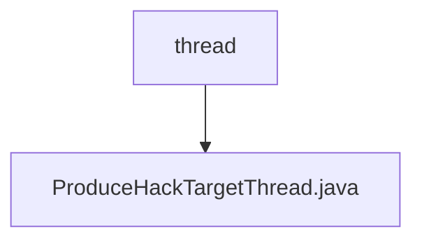

# Basic Information

|      |      |
|------|------|
| Name | thread |
| Language | .java |
| Code Path | WeFe/mpc/mpc-pir/mpc-pir-server/src/main/java/com/welab/wefe/mpc/pir/server/thread |
| Package Name | docs.mpc.mpc-pir.mpc-pir-server.src.main.java.com.welab.wefe.mpc.pir.server.thread |
| Brief Description | The `ProduceHauckTargetThread` thread class is used to generate `HauckTarget` objects and cache them. It continuously generates objects when the cache quantity is insufficient; otherwise, it sleeps for 2 seconds. Logs are recorded in case of exceptions. |

# Description

This is a thread class named `ProduceHauckTargetThread`, designed to continuously generate `HauckTarget` objects and cache them. The class contains a static logger, a configurable cache count `num`, and an instance of `HauckObliviousTransfer`. The constructor takes a `keyCount` parameter to set the cache threshold and names the thread `produce-hauck-target`. The `run` method implements an infinite loop logic: when the cache is not full, it generates a new `HauckTarget` and stores it in the cache; when full, it sleeps for 2 seconds. Exception handling logs `InterruptedException` errors.

### Package Internal Structure View

This flowchart illustrates the thread module structure of the MPC-PIR server in the WeFe project. The root node is the thread directory, which contains only one specific thread implementation class, ProduceHackTargetThread.java, at its lower level. This concise hierarchical relationship indicates that the module is functionally focused, currently requiring only a single thread class to achieve specific functionality, aligning with the typical design pattern for thread management in privacy information retrieval servers.

# File List

| Name   | Type  | Description |
|-------|------|-------------|
| [ProduceHauckTargetThread.java](ProduceHauckTargetThread.md) | file | The `ProduceHauckTargetThread` thread class is used to generate `HauckTarget` objects and cache them. It continuously generates objects when the cache quantity is insufficient, otherwise it sleeps for 2 seconds. Logs are recorded when exceptions occur. |

