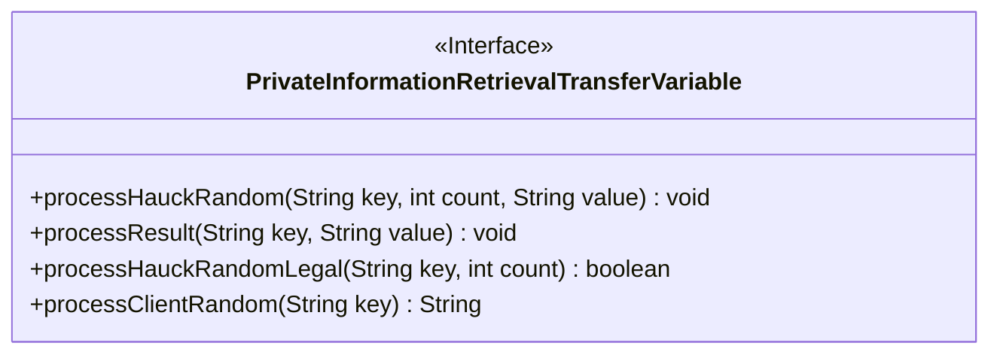
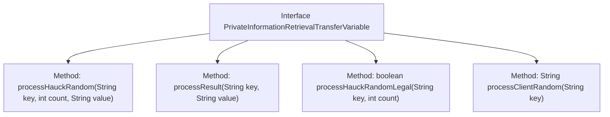

# Basic Information

|      |      |
|------|------|
| Name | PrivateInformationRetrievalTransferVariable |
| Language | .java |
| Code Path | WeFe/mpc/mpc-pir/mpc-pir-server/src/main/java/com/welab/wefe/mpc/pir/server/trasfer/PrivateInformationRetrievalTransferVariable.java |
| Package Name | com.welab.wefe.mpc.pir.server.trasfer |
| Dependencies | [] |
| Brief Description | The interface `PrivateInformationRetrievalTransferVariable` defines the data transfer methods for the PIR protocol, including sending random numbers, encrypted results, verifying the validity of random numbers, and obtaining client conversion results. |

# Description

This interface defines the key operational methods during the Private Information Retrieval (PIR) transmission process, comprising four core functions: sending PIR random numbers (requiring request ID, count, and quantity parameters), sending encrypted results (requiring request ID and result string), validating the legitimacy of client PIR random numbers (requiring request ID and count parameters and returning a boolean value), and retrieving the client's transformation results of PIR random numbers (requiring request ID parameter and returning a string). Together, these methods form the foundational framework for data transmission and verification in the PIR protocol.

# Class Summary

| Name   | Type  | Description |
|-------|------|-------------|
| PrivateInformationRetrievalTransferVariable | interface | The interface `PrivateInformationRetrievalTransferVariable` defines four methods for PIR (Private Information Retrieval) transfer: sending random numbers, sending encrypted results, verifying the validity of random numbers, and obtaining the client's random number conversion results. |

## Class PrivateInformationRetrievalTransferVariable

|      |      |
|------|------|
| Access Modifier | public |
| Type | interface |
| Name | PrivateInformationRetrievalTransferVariable |
| Description | The interface `PrivateInformationRetrievalTransferVariable` defines four methods for PIR (Private Information Retrieval) transfer: sending random numbers, sending encrypted results, verifying the validity of random numbers, and obtaining the client's random number conversion results. |

### UML Class Diagram

This class diagram illustrates an interface named `PrivateInformationRetrievalTransferVariable`, which defines data transfer methods for Private Information Retrieval (PIR) processes. The interface contains four methods: `processHauckRandom` for sending PIR random numbers, `processResult` for transmitting encrypted results, `processHauckRandomLegal` for validating client-side random number legitimacy, and `processClientRandom` for retrieving client-side transformation results. Together, these methods form the core data transfer interface for client-server interactions in the PIR protocol.

### Internal Method Call Graph

This flowchart illustrates the structure of an interface named PrivateInformationRetrievalTransferVariable, which defines four core methods: processHauckRandom for sending PIR random numbers, processResult for transmitting encrypted results, processHauckRandomLegal for validating random number legality, and processClientRandom for retrieving client transformation results. Each method is represented by an independent node, clearly displaying the method signatures and return types, demonstrating the key operational flow of data transmission and verification in the PIR (Private Information Retrieval) protocol.

### Field List

| Name  | Type  | Description |
|-------|-------|------|

### Method List

| Name  | Type  | Description |
|-------|-------|------|
| processResult | void | Methods for processing key-value pair results, with parameters being key and value. |
| processHauckRandom | void | Processing Hauck Random Data: Input keys, counts, and values, then perform relevant operations. |
| processHauckRandomLegal | boolean | Boolean method for handling Hauck random legality, with parameters string key and integer count. |
| processClientRandom | String | Methods for handling client-side random strings, where the input is a key and the processed string is returned. |

