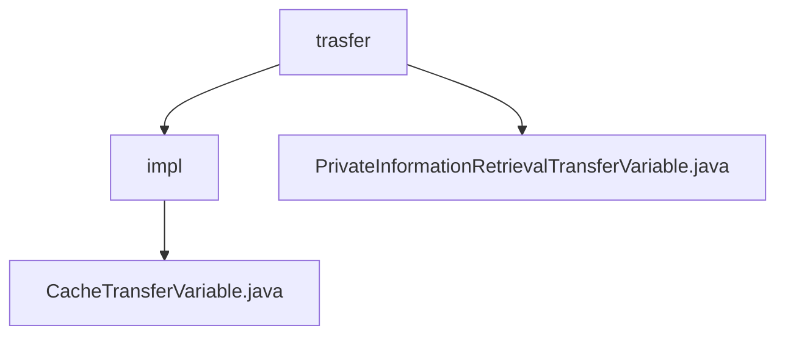

# Basic Information

|      |      |
|------|------|
| Name | trasfer |
| Language | .java |
| Code Path | WeFe/mpc/mpc-pir/mpc-pir-server/src/main/java/com/welab/wefe/mpc/pir/server/trasfer |
| Package Name | docs.mpc.mpc-pir.mpc-pir-server.src.main.java.com.welab.wefe.mpc.pir.server.trasfer |
| Brief Description | The CacheTransferVariable class implements the PIR data transfer interface, containing four methods to handle random numbers, encryption results, and validity checks, with cache operations featuring a 120-second timeout. |

# Description

## Overview  
The core responsibility of this module is to facilitate data transmission and verification in Private Information Retrieval (PIR) protocols by managing sensitive data such as random numbers and encrypted results through a caching mechanism. The interface specification includes four key operations: sending/verifying PIR random numbers, processing encrypted results, and retrieving client conversion results, resembling a secure middleware pattern. Key data structures consist of request IDs, timestamps, and encrypted strings. External dependencies are limited to singleton cache operation instances. For example, `processHauckRandomLegal` validates the legitimacy of random numbers using request IDs.  

## Primary Business Scenarios  
A typical application involves privacy-preserving data queries in secure multi-party computation scenarios, with a complete workflow encompassing random number generation, legitimacy verification, and encrypted result transmission. The interaction model adopts a request-response mechanism—for instance, `processClientRandom` retrieves client random numbers via request IDs. Functional completeness is reflected in details such as 120-second timeout control and cache persistence. All APIs are synchronous calls, with integration cases including secure parameter exchanges in PIR protocols.

### Package Internal Structure View

This flowchart illustrates the file structure relationships within the MPC-PIR server of the WeFe project. The trasfer directory contains the impl subdirectory and the PrivateInformationRetrievalTransferVariable.java file, while the impl subdirectory further includes the CacheTransferVariable.java implementation file. This hierarchical structure clearly reflects the code organization of the server's transfer module.

# File List

| Name   | Type  | Description |
|-------|------|-------------|
| [PrivateInformationRetrievalTransferVariable.java](PrivateInformationRetrievalTransferVariable.md) | file | The interface `PrivateInformationRetrievalTransferVariable` defines the data transfer methods for the PIR protocol, including sending random numbers, encryption results, verifying the validity of random numbers, and obtaining client transformation results. |
| [impl](impl/_module.md) | package | The `CacheTransferVariable` class implements the private information retrieval transfer interface, providing cache operation functionalities, including handling random numbers, results, and validity checks, with support for timeout-based waiting to retrieve cached values. |

