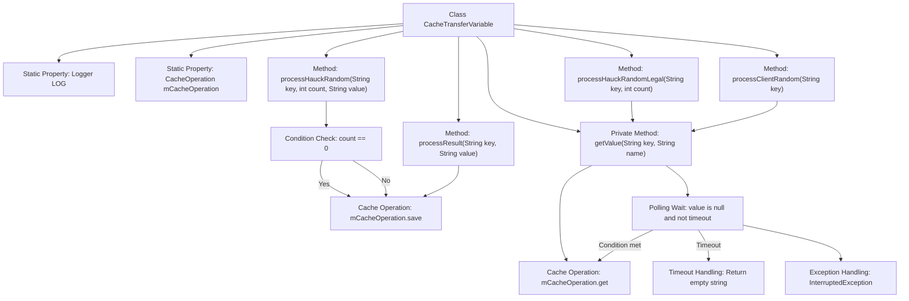

# Basic Information

|      |      |
|------|------|
| Name | CacheTransferVariable |
| Language | .java |
| Code Path | WeFe/mpc/mpc-pir/mpc-pir-server/src/main/java/com/welab/wefe/mpc/pir/server/trasfer/impl/CacheTransferVariable.java |
| Package Name | com.welab.wefe.mpc.pir.server.trasfer.impl |
| Dependencies | ['com.welab.wefe.mpc.cache.intermediate.CacheOperation', 'com.welab.wefe.mpc.cache.intermediate.CacheOperationFactory', 'com.welab.wefe.mpc.commom.Constants', 'com.welab.wefe.mpc.pir.server.trasfer.PrivateInformationRetrievalTransferVariable', 'org.slf4j.Logger', 'org.slf4j.LoggerFactory', 'java.util.concurrent.TimeUnit'] |
| Brief Description | The `CacheTransferVariable` class implements the private information retrieval transfer interface, providing cache operation functionalities, including handling random numbers, results, and validity checks, with support for timeout-based waiting to retrieve cached values. |

# Description

The code defines a class named `CacheTransferVariable`, which implements the `PrivateInformationRetrievalTransferVariable` interface. Its primary functionality involves handling data transmission related to private information retrieval through cache operations. The class contains four main methods: `processHauckRandom` for saving random numbers and first access timestamps; `processResult` for storing encrypted results; `processHauckRandomLegal` for verifying the legality of random numbers; and `processClientRandom` for retrieving client random numbers. The internal method `getValue` implements a cache value retrieval logic with a timeout mechanism, returning an empty string if no value is obtained within 120 seconds. All operations are executed via the `mCacheOperation` instance, with the class using the singleton pattern to obtain the cache operation instance.

# Class Summary

| Name   | Type  | Description |
|-------|------|-------------|
| CacheTransferVariable | class | The CacheTransferVariable class implements the private information retrieval transfer interface, providing cache operation functionalities including saving random numbers, results, and validity checks, with support for timeout-based value retrieval. |


## Class CacheTransferVariable

|      |      |
|------|------|
| Access Modifier | public |
| Type | class |
| Name | CacheTransferVariable |
| Description | The CacheTransferVariable class implements the private information retrieval transfer interface, providing cache operation functionalities including saving random numbers, results, and validity checks, with support for timeout-based value retrieval. |


### UML Class Diagram

```mermaid
classDiagram
    class CacheTransferVariable {
        -Logger LOG
        +CacheOperation~String~ mCacheOperation
        +processHauckRandom(String key, int count, String value) void
        +processResult(String key, String value) void
        +processHauckRandomLegal(String key, int count) boolean
        +processClientRandom(String key) String
        -getValue(String key, String name) String
    }

    <<Interface>> PrivateInformationRetrievalTransferVariable {
        +processHauckRandom(String key, int count, String value) void
        +processResult(String key, String value) void
        +processHauckRandomLegal(String key, int count) boolean
        +processClientRandom(String key) String
    }

    class CacheOperation~T~ {
        <<Interface>>
        +save(String key, String name, T value) void
        +get(String key, String name) T
    }

    class Constants {
        // Constants class
    }

    PrivateInformationRetrievalTransferVariable <|-- CacheTransferVariable
    CacheTransferVariable --> CacheOperation~String~ : Dependency
    CacheTransferVariable --> Constants : Dependency
```

This class diagram illustrates that the CacheTransferVariable class implements the PrivateInformationRetrievalTransferVariable interface and depends on the generic CacheOperation interface and Constants utility class. Its core functionalities include processing Hauck random numbers, result data, and client random numbers, with data storage and retrieval achieved through cache operations. The getValue method implements a polling mechanism with timeout to ensure data reliability. The overall design reflects cache management and data transfer capabilities in information retrieval scenarios.


### Internal Method Call Graph



This code implements a cache transfer variable class primarily used for handling data caching operations during private information retrieval. The core logic consists of four public methods: processing Hauck random numbers, processing results, validating Hauck random number legality, and obtaining client random numbers, all relying on underlying cache operations. Notably, the getValue method implements a polling mechanism with timeout functionality, continuously attempting to retrieve values when cached values are empty, with a maximum wait time of 120 seconds and checks every 10 milliseconds. If timeout occurs, it returns an empty string. The class also includes special handling for first-time operations, recording timestamps to the UUID_FIRST_TIME key.

### Field List

| Name  | Type  | Description |
|-------|-------|------|
| mCacheOperation = CacheOperationFactory.getCacheOperation() | CacheOperation<String> | Get an instance of string cache operations. |
| LOG = LoggerFactory.getLogger(CacheTransferVariable.class) | Logger | Declare a static immutable log object LOG for logging in the CacheTransferVariable class. |

### Method List

| Name  | Type  | Description |
|-------|-------|------|
| getValue | String | This method retrieves a value from the cache by key and name. If the value is empty, it waits in a loop for up to 2 minutes before timing out and returning an empty string. Otherwise, it returns the retrieved value. |
| processResult | void | Rewrite the method processResult to store key-value pairs in the cache, marked as encrypted results. |
| processHauckRandom | void | The method processHauckRandom handles random data: if count is 0, save the initial timestamp; otherwise save the random value with count. |
| processHauckRandomLegal | boolean | This method retrieves a value based on the key and count parameters, and returns the corresponding boolean value. |
| processClientRandom | String | This method overrides processClientRandom, invokes getValue with the key and constant PIR.R, and returns the result. |


