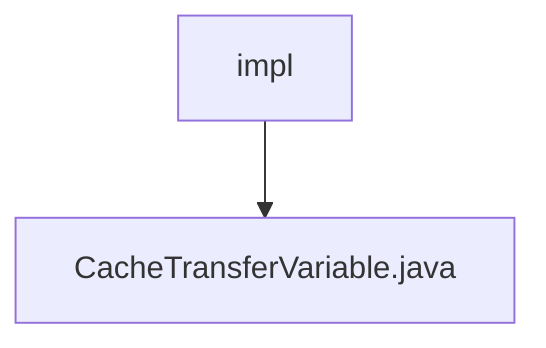

# Basic Information

|      |      |
|------|------|
| Name | impl |
| Language | .java |
| Code Path | WeFe/mpc/mpc-pir/mpc-pir-server/src/main/java/com/welab/wefe/mpc/pir/server/trasfer/impl |
| Package Name | docs.mpc.mpc-pir.mpc-pir-server.src.main.java.com.welab.wefe.mpc.pir.server.trasfer.impl |
| Brief Description | The `CacheTransferVariable` class implements the private information retrieval transfer interface, providing cache operation functionalities, including handling random numbers, results, and validity checks, with support for timeout-based waiting to retrieve cached values. |

# Description

The code defines a class named `CacheTransferVariable` that implements the `PrivateInformationRetrievalTransferVariable` interface. Its primary function is to handle data transmission related to private information retrieval through cache operations. The class contains four main methods: `processHauckRandom` for saving random numbers and first access timestamps; `processResult` for storing encrypted results; `processHauckRandomLegal` to verify the legality of random numbers; and `processClientRandom` to retrieve client-generated random numbers. The internal method `getValue` implements a cache value retrieval logic with a timeout mechanism, returning an empty string if no value is obtained within 120 seconds. All operations are executed via the `mCacheOperation` instance, with the class using a singleton pattern to obtain the cache operation instance.

### Package Internal Structure View

This flowchart illustrates the hierarchical relationship of Path 2, where "impl" is a subdirectory under the "transfer" directory, containing a Java file named "CacheTransferVariable.java." The entire structure is concise and clear, demonstrating the file's specific location and ownership within the project.

# File List

| Name   | Type  | Description |
|-------|------|-------------|
| [CacheTransferVariable.java](CacheTransferVariable.md) | file | The CacheTransferVariable class implements the private information retrieval transfer interface, providing cache operation functionalities, including handling random numbers, results, and validity checks, with support for timeout-based waiting to retrieve cached values. |

