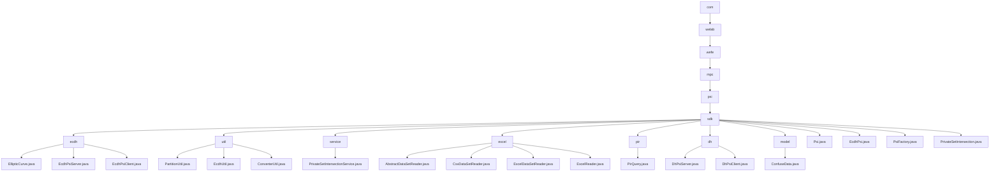

# Basic Information

|      |      |
|------|------|
| Name | com |
| Language | .java |
| Code Path | WeFe/mpc/mpc-psi/mpc-psi-sdk/src/main/java/com |
| Package Name | docs.mpc.mpc-psi.mpc-psi-sdk.src.main.java.com |
| Brief Description | This SDK implements multi-party Private Set Intersection (PSI) functionality, supporting ECDH and DH encryption protocols. It includes server/client components, data preprocessing tools, and a factory pattern. The core workflow consists of key generation, data encryption, and result comparison, with performance optimized through multithreading, making it suitable for secure data matching scenarios. |

# Description

## Overview  
This module is a Privacy-Preserving Set Intersection (PSI) toolkit within Secure Multi-Party Computation (MPC), with core responsibilities including private data matching based on Elliptic Curve Cryptography (ECDH) and Diffie-Hellman (DH) protocols, data preprocessing, and result querying. The module adopts a layered design: the underlying layer provides cryptographic foundational capabilities (e.g., point multiplication operations for ECDH-PSI), the middle layer implements data partitioning/format conversion (e.g., PartitionUtil for sharding), and the upper layer encapsulates service interfaces (e.g., PrivateSetIntersectionService). Key data structures encompass elliptic curve parameters, encrypted mapping tables, sharded collections, and obfuscated data models, with dependencies limited to the Java standard library and cryptographic algorithm libraries. For instance, EcdhPsi employs hashToCurve for data encryption, while PsiFactory uses the factory pattern to create protocol instances.

## Key Business Scenarios  
The module supports three typical scenarios: 1) Secure user matching (ECDH-PSI bidirectional encrypted set intersection); 2) Batch data preprocessing (sharding → conversion → encryption pipeline); 3) Private information retrieval (Naor-Pinkas oblivious transfer). The complete workflow follows the "key generation → data encryption → set intersection" model, akin to multi-party key negotiation. For example, DhPsiServer uses concurrent hash tables to accelerate ciphertext comparison, while PirQuery achieves anonymous queries through Diffie-Hellman exchange. Interaction patterns include client-server architecture (e.g., EcdhPsiClient) and factory patterns (PsiFactory), with APIs covering key operations, dataset encryption, and paginated result merging, making it suitable for cross-institutional secure data computation scenarios.

### Package Internal Structure View

This flowchart illustrates the Java code hierarchy of the MPC-PSI-SDK module in the WeFe project. Starting from the root node "com", it expands level by level to "welab", "wefe", "mpc", "psi", and finally to the "sdk" directory. The "sdk" directory contains multiple submodules (such as "ecdh", "util", "service", etc.) and core class files (e.g., "Psi.java"). Each submodule further includes specific implementation classes, for example, the "ecdh" module contains elliptic curve-related classes, and the "util" module contains utility classes. The overall structure clearly demonstrates the functional module division and dependencies of the SDK.

# File List

| Name   | Type  | Description |
|-------|------|-------------|
| [welab](welab/_module.md) | package | This SDK implements multi-party Private Set Intersection (PSI) functionality, supporting ECDH and DH encryption protocols. It includes server/client components, data preprocessing tools, and a factory pattern. The core workflow consists of key generation, data encryption, and result comparison, with performance optimized through multithreading, making it suitable for secure data matching scenarios. |

