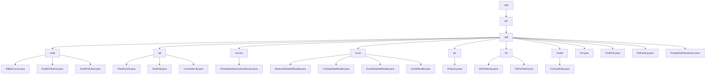

# Basic Information

|      |      |
|------|------|
| Name | mpc |
| Language | .java |
| Code Path | WeFe/mpc/mpc-psi/mpc-psi-sdk/src/main/java/com/welab/wefe/mpc |
| Package Name | docs.mpc.mpc-psi.mpc-psi-sdk.src.main.java.com.welab.wefe.mpc |
| Brief Description | This SDK implements multi-party Private Set Intersection (PSI) functionality, supporting ECDH and DH encryption protocols. It includes server/client components, data preprocessing tools, and a factory pattern. The core workflow consists of key generation, data encryption, and result comparison, with performance optimized through multithreading, making it suitable for secure data matching scenarios. |

# Description

## Overview  
This module is a Private Set Intersection (PSI) toolkit within Secure Multi-party Computation (MPC), with core responsibilities including private data matching based on Elliptic Curve Cryptography (ECDH) and Diffie-Hellman (DH) protocols, data preprocessing, and result querying. The module adopts a layered design: the underlying layer provides cryptographic foundational capabilities (e.g., point multiplication operations for ECDH-PSI), the middle layer implements data partitioning/format conversion (e.g., PartitionUtil for sharding), and the upper layer encapsulates service interfaces (e.g., PrivateSetIntersectionService). Key data structures encompass elliptic curve parameters, encrypted mapping tables, partitioned sets, and obfuscated data models, with dependencies limited to the Java standard library and cryptographic algorithm libraries. For instance, EcdhPsi employs hashToCurve for data encryption, while PsiFactory uses the factory pattern to create protocol instances.

## Core Business Scenarios  
The module supports three typical scenarios: 1) Secure user matching (ECDH-PSI bidirectional encrypted intersection); 2) Batch data preprocessing (sharding → conversion → encryption pipeline); 3) Private Information Retrieval (Naor-Pinkas oblivious transfer). The complete workflow follows the "key generation → data encryption → result intersection" model, akin to multi-party key negotiation. For example, DhPsiServer utilizes concurrent hash tables to accelerate ciphertext comparison, while PirQuery achieves anonymous queries through Diffie-Hellman exchange. Interaction modes include client-server architecture (e.g., EcdhPsiClient) and factory pattern (PsiFactory), with APIs covering key operations, dataset encryption, and paginated result merging, making it suitable for cross-institutional secure data computation scenarios.

### Package Internal Structure View

This flowchart illustrates the complete hierarchical structure of the WeFe MPC PSI SDK, starting from the root directory 'mpc' and expanding to subdirectories such as 'psi' and 'sdk', ultimately displaying all key implementation class files. The diagram clearly presents core components including the ECDH encryption module, utility classes (util), service interfaces (service), Excel processing module (excel), and their interrelationships. It comprises 25 nodes, comprehensively covering the functional module division of the PSI SDK.

# File List

| Name   | Type  | Description |
|-------|------|-------------|
| [psi](psi/_module.md) | package | This SDK implements multi-party Private Set Intersection (PSI) functionality, supporting ECDH and DH encryption protocols. It includes server/client components, data preprocessing tools, and a factory pattern. The core workflow consists of key generation, data encryption, and result comparison, with performance optimized through multithreading, making it suitable for secure data matching scenarios. |

