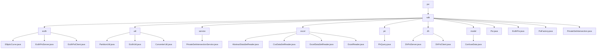

# Basic Information

|      |      |
|------|------|
| Name | psi |
| Language | .java |
| Code Path | WeFe/mpc/mpc-psi/mpc-psi-sdk/src/main/java/com/welab/wefe/mpc/psi |
| Package Name | docs.mpc.mpc-psi.mpc-psi-sdk.src.main.java.com.welab.wefe.mpc.psi |
| Brief Description | This SDK implements multi-party Private Set Intersection (PSI) functionality, supporting ECDH and DH encryption protocols. It includes server/client components, data preprocessing tools, and a factory pattern. The core workflow consists of key generation, data encryption, and result comparison, with performance optimized through multithreading, making it suitable for secure data matching scenarios. |

# Description

## Overview  
This module is a Privacy-Preserving Set Intersection (PSI) toolkit within Secure Multi-Party Computation (MPC), with core responsibilities including private data matching based on Elliptic Curve Cryptography (ECDH) and Diffie-Hellman (DH) protocols, data preprocessing, and result querying. The module adopts a layered design: the底层 provides cryptographic foundational capabilities (e.g., point multiplication operations for ECDH-PSI), the中层 implements data partitioning/format conversion (e.g., PartitionUtil for sharding), and the上层 encapsulates service interfaces (e.g., PrivateSetIntersectionService). Key data structures encompass elliptic curve parameters, encrypted mapping tables, partitioned sets, and obfuscated data models, with dependencies limited to the Java standard library and cryptographic algorithm libraries. For instance, EcdhPsi employs hashToCurve for data encryption, while PsiFactory uses the factory pattern to create protocol instances.

## Key Business Scenarios  
The module supports three typical scenarios: 1) Secure user matching (ECDH-PSI bidirectional encrypted set intersection); 2) Batch data preprocessing (pipelined sharding → conversion → encryption); 3) Private information retrieval (Naor-Pinkas oblivious transfer). The complete workflow follows the "key generation → data encryption → set intersection" paradigm, akin to multi-party key negotiation. For example, DhPsiServer utilizes concurrent hash tables to accelerate ciphertext comparison, while PirQuery achieves anonymous queries via Diffie-Hellman exchange. Interaction modes include client-server architecture (e.g., EcdhPsiClient) and factory pattern (PsiFactory), with APIs covering key operations, dataset encryption, and paginated result merging, making it suitable for cross-institutional secure data computation scenarios.

### Package Internal Structure View

This flowchart illustrates the core structure of the MPC-PSI-SDK project, with psi as the root node extending to the main sdk module. The sdk module comprises multiple submodules: the ecdh encryption module, util toolkit, service layer, excel data processing, pir (private information retrieval), dh key exchange, and model data models. Each submodule further contains specific implementation class files, forming a clear hierarchical relationship that comprehensively presents the main components and file organization structure of the project.

# File List

| Name   | Type  | Description |
|-------|------|-------------|
| [sdk](sdk/_module.md) | package | This SDK implements multi-party Private Set Intersection (PSI) functionality, supporting ECDH and DH encryption protocols. It includes server/client components, data preprocessing tools, and a factory pattern. The core workflow consists of key generation, data encryption, and result comparison, with performance optimized through multithreading, making it suitable for secure data matching scenarios. |

