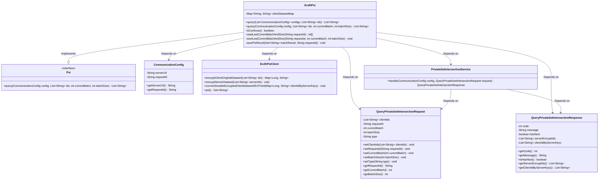
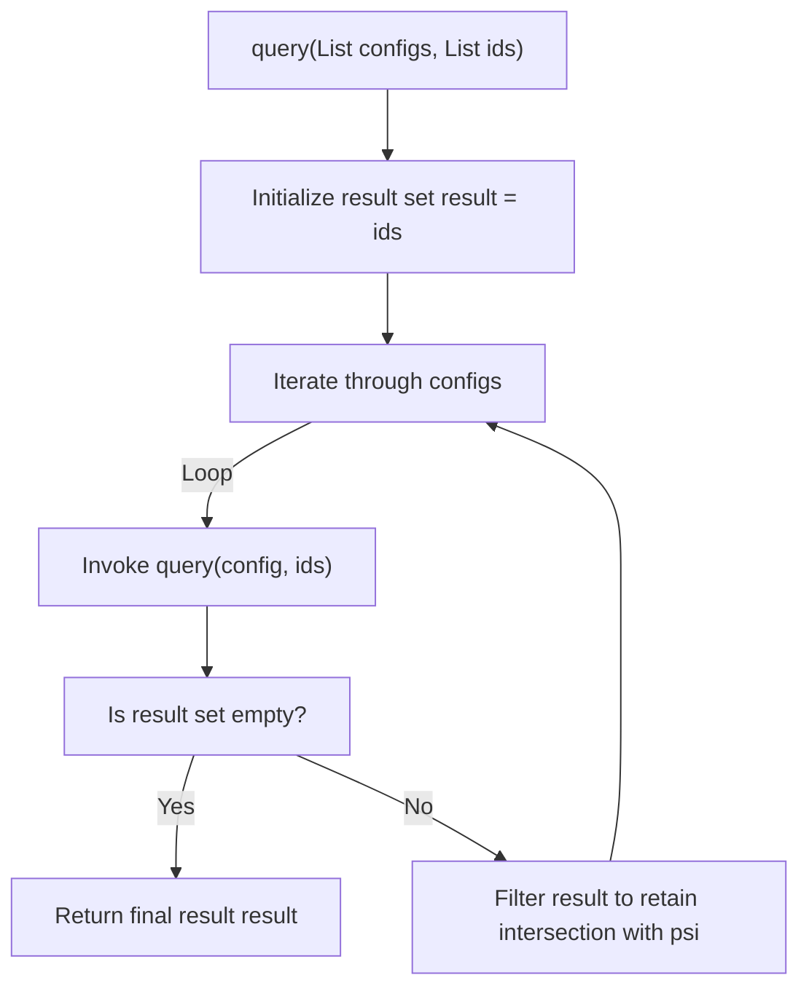
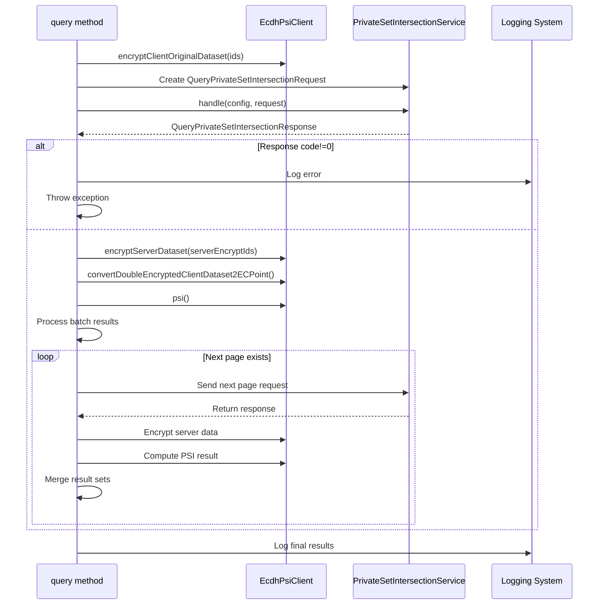

# Basic Information

|      |      |
|------|------|
| Name | EcdhPsi |
| Language | .java |
| Code Path | WeFe/mpc/mpc-psi/mpc-psi-sdk/src/main/java/com/welab/wefe/mpc/psi/sdk/EcdhPsi.java |
| Package Name | com.welab.wefe.mpc.psi.sdk |
| Dependencies | ['java.util.ArrayList', 'java.util.List', 'java.util.Map', 'java.util.Set', 'java.util.stream.Collectors', 'org.apache.commons.collections4.CollectionUtils', 'com.alibaba.fastjson.JSONObject', 'com.welab.wefe.mpc.config.CommunicationConfig', 'com.welab.wefe.mpc.psi.request.QueryPrivateSetIntersectionRequest', 'com.welab.wefe.mpc.psi.request.QueryPrivateSetIntersectionResponse', 'com.welab.wefe.mpc.psi.sdk.ecdh.EcdhPsiClient', 'com.welab.wefe.mpc.psi.sdk.service.PrivateSetIntersectionService', 'com.welab.wefe.mpc.psi.sdk.util.EcdhUtil', 'cn.hutool.core.collection.CollectionUtil', 'cn.hutool.core.util.StrUtil'] |
| Brief Description | The EcdhPsi class implements multi-party private set intersection, which involves encrypting local IDs using ECDH and interacting with the server, processing data in batches, and returning the intersection results. |

# Description

The EcdhPsi class implements multi-party private set intersection functionality. It primarily provides two methods: the query method supports performing ID set intersection with multiple servers by iterating through the configuration list to progressively narrow down the result set; another query method implements the interaction flow with a single server, including data encryption, batch request processing, and result merging. This method employs the ECDH encryption scheme to protect data privacy, supports resumable transfers, optimizes performance through batch processing, and logs detailed execution traces. The core workflow involves client-side data encryption, server interaction, dual-encrypted data conversion, and result comparison, ultimately returning the intersection result of both parties' ID sets.

# Class Summary

| Name   | Type  | Description |
|-------|------|-------------|
| EcdhPsi | class | The EcdhPsi class implements multi-party private set intersection functionality, protecting data privacy through the ECDH encryption algorithm, supporting batch processing of large datasets, and ultimately returning the intersection results. |

## Class EcdhPsi

|      |      |
|------|------|
| Access Modifier | public |
| Type | class |
| Name | EcdhPsi |
| Description | The EcdhPsi class implements multi-party private set intersection functionality, protecting data privacy through the ECDH encryption algorithm, supporting batch processing of large datasets, and ultimately returning the intersection results. |

### UML Class Diagram

This code implements an ECDH (Elliptic Curve Diffie-Hellman) based Private Set Intersection (PSI) functionality. The EcdhPsi class inherits from the Psi interface and provides two methods: multi-party intersection and single query. The main workflow includes: client data encryption, interaction with the server to obtain encrypted results, decryption, and intersection calculation. Key classes involved include communication configuration, PSI client, request/response objects, and service handler classes, enabling efficient processing of large datasets through multiple batch operations.

### Internal Method Call Graph

The flowchart depicts the invocation processes of two main methods in the EcdhPsi class. The query method first initializes the result set, then iterates through the server configuration list, invoking single-server queries for each configuration while progressively filtering intersections, ultimately returning the multi-party ID intersection result. The sequence diagram details the encryption interaction process during single-server queries, including client data encryption, server request handling, response validation, and result merging—key steps that demonstrate the implementation flow of the ECDH-based Private Set Intersection protocol in secure multi-party computation.

### Field List

| Name  | Type  | Description |
|-------|-------|------|

### Method List

| Name  | Type  | Description |
|-------|-------|------|
| query | List<String> | This method takes a configuration list and an ID list, iterates through the configurations to query the corresponding IDs for each configuration, progressively filters out the IDs common to all configurations, and finally returns the intersection result. |
| query | List<String> | This method implements ECDH-based Private Set Intersection (PSI) functionality, handling encrypted data matching between client and server, supporting batch queries with merged results. After validating inputs, it encrypts data, sends requests, processes responses, and loops until no subsequent batches remain, while preserving intermediate results and the final matched set. |

