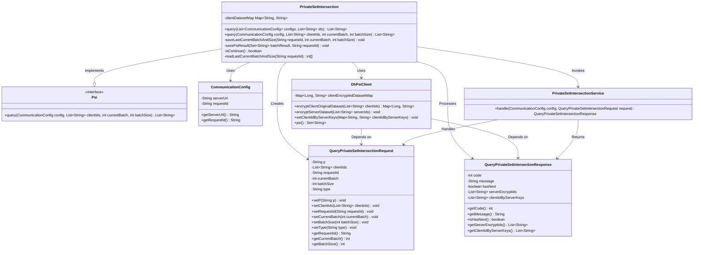
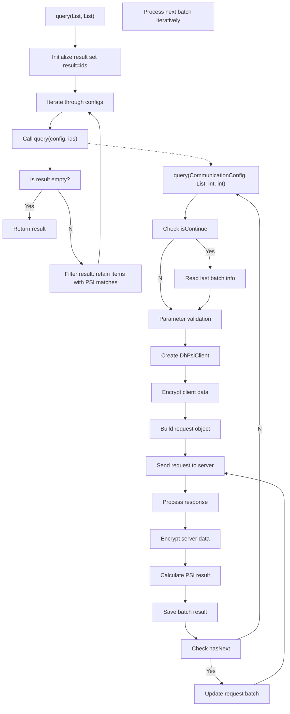

# Basic Information

|      |      |
|------|------|
| Name | PrivateSetIntersection |
| Language | .java |
| Code Path | WeFe/mpc/mpc-psi/mpc-psi-sdk/src/main/java/com/welab/wefe/mpc/psi/sdk/PrivateSetIntersection.java |
| Package Name | com.welab.wefe.mpc.psi.sdk |
| Dependencies | ['java.util.ArrayList', 'java.util.List', 'java.util.Map', 'java.util.Set', 'java.util.stream.Collectors', 'org.apache.commons.collections4.CollectionUtils', 'com.welab.wefe.mpc.config.CommunicationConfig', 'com.welab.wefe.mpc.psi.request.QueryPrivateSetIntersectionRequest', 'com.welab.wefe.mpc.psi.request.QueryPrivateSetIntersectionResponse', 'com.welab.wefe.mpc.psi.sdk.dh.DhPsiClient', 'com.welab.wefe.mpc.psi.sdk.service.PrivateSetIntersectionService', 'com.welab.wefe.mpc.psi.sdk.util.EcdhUtil', 'cn.hutool.core.collection.CollectionUtil', 'cn.hutool.core.util.StrUtil'] |
| Brief Description | The PrivateSetIntersection class implements multi-party ID intersection functionality, ensuring data privacy through encryption and batch processing, while supporting resumable transfers and result storage. |

# Description

The `PrivateSetIntersection` class inherits from `Psi` and implements multi-party intersection functionality. The `query` method accepts a list of server configurations and a local ID set, computing the intersection through iterative processing. The specific workflow includes: initializing the result set, iterating through server configurations, invoking single-server query methods, and progressively filtering the intersection.  

The single-server query method handles batch requests, encrypts client data using the DH-PSI protocol, sends requests to the server, processes responses, decrypts results, and stores batch outcomes. It supports resumable transfers, logging batch information and processing time. Ultimately, it returns the intersection results from all batches.

# Class Summary

| Name   | Type  | Description |
|-------|------|-------------|
| PrivateSetIntersection | class | The PrivateSetIntersection class implements multi-party private set intersection, ensuring data security through encryption and batch processing, supporting resumable transfers, and returning the intersection results. |

## Class PrivateSetIntersection

|      |      |
|------|------|
| Access Modifier | public |
| Type | class |
| Name | PrivateSetIntersection |
| Description | The PrivateSetIntersection class implements multi-party private set intersection, ensuring data security through encryption and batch processing, supporting resumable transfers, and returning the intersection results. |

### UML Class Diagram

This code implements a multi-party Private Set Intersection (PSI) functionality, enabling secure computation of data intersections through the Diffie-Hellman key exchange protocol. The `PrivateSetIntersection` class inherits from the `Psi` interface and primarily includes two query methods: one for handling multi-party queries and another for single queries. During single queries, it creates a `DhPsiClient` to encrypt data and interacts with the server via `PrivateSetIntersectionService` to process batch queries and save intermediate results. The entire workflow involves encrypted dataset processing, server communication, and result consolidation, ensuring intersection computation of multi-party data without exposing raw data.

### Internal Method Call Graph

The flowchart describes two core methods of the PrivateSetIntersection class. The main query method iterates through configuration lists, obtains PSI results by invoking another query method, and progressively filters them. The detailed query method handles individual PSI requests, including parameter validation, data encryption, request construction, server interaction, result decryption, and batch processing. The entire process implements multi-party private set intersection functionality, supports batch processing of large datasets, and maintains intermediate states.

### Field List

| Name  | Type  | Description |
|-------|-------|------|

### Method List

| Name  | Type  | Description |
|-------|-------|------|
| query | List<String> | The method receives a communication configuration list and an ID list, iterates through the configurations to query matching IDs one by one, and finally returns the intersection of IDs that match all configurations. If the result set becomes empty during the process, it terminates early. |
| query | List<String> | This method implements private set intersection queries based on the DH algorithm. The main workflow includes: validating parameters, encrypting client data, sending requests to the server, and processing response results. If subsequent batches exist, the process loops until completion. Finally, it returns the intersection results and saves batch information. |

