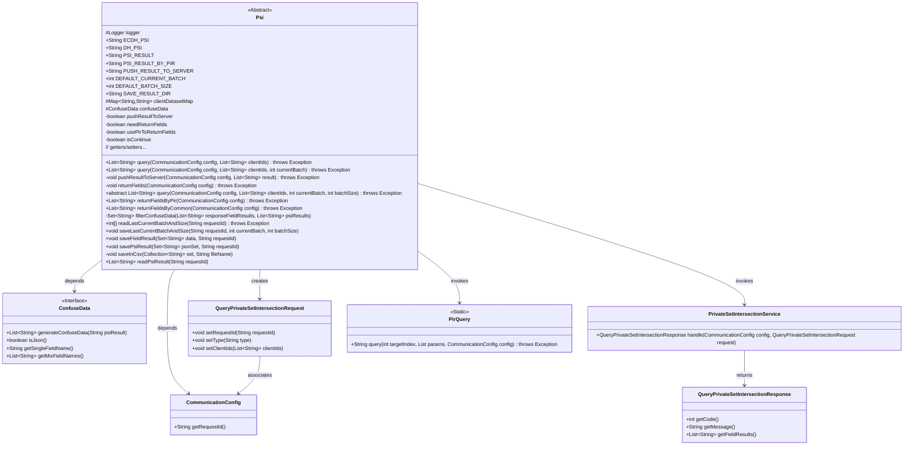
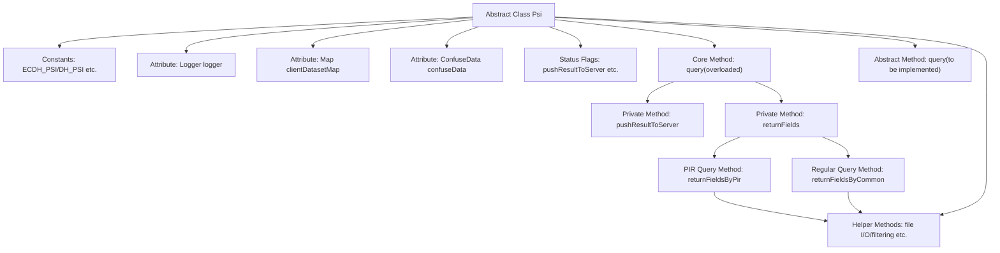
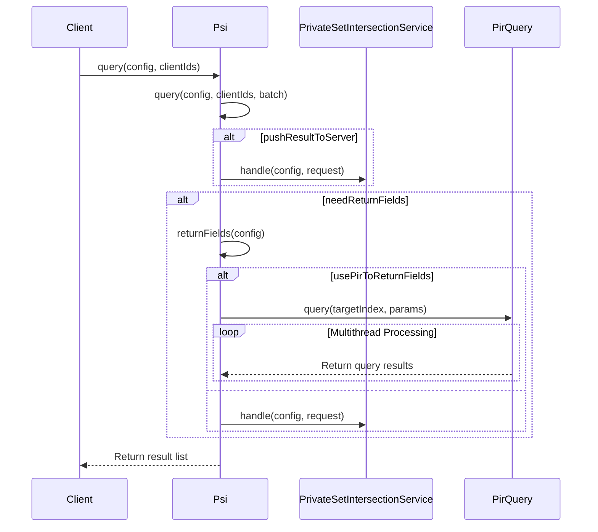

# Basic Information

|      |      |
|------|------|
| Name | Psi |
| Language | .java |
| Code Path | WeFe/mpc/mpc-psi/mpc-psi-sdk/src/main/java/com/welab/wefe/mpc/psi/sdk/Psi.java |
| Package Name | com.welab.wefe.mpc.psi.sdk |
| Dependencies | ['java.nio.charset.Charset', 'java.nio.file.Paths', 'java.util.ArrayList', 'java.util.Collection', 'java.util.Collections', 'java.util.HashMap', 'java.util.HashSet', 'java.util.Iterator', 'java.util.LinkedHashMap', 'java.util.LinkedList', 'java.util.List', 'java.util.Map', 'java.util.Random', 'java.util.Set', 'java.util.concurrent.ConcurrentHashMap', 'java.util.concurrent.ExecutorService', 'java.util.concurrent.Executors', 'java.util.concurrent.TimeUnit', 'org.apache.commons.collections4.CollectionUtils', 'org.apache.commons.lang3.StringUtils', 'org.slf4j.Logger', 'org.slf4j.LoggerFactory', 'com.alibaba.fastjson.JSONObject', 'com.welab.wefe.mpc.config.CommunicationConfig', 'com.welab.wefe.mpc.psi.request.QueryPrivateSetIntersectionRequest', 'com.welab.wefe.mpc.psi.request.QueryPrivateSetIntersectionResponse', 'com.welab.wefe.mpc.psi.sdk.model.ConfuseData', 'com.welab.wefe.mpc.psi.sdk.pir.PirQuery', 'com.welab.wefe.mpc.psi.sdk.service.PrivateSetIntersectionService', 'cn.hutool.core.io.FileUtil'] |
| Brief Description | The abstract class Psi implements Private Set Intersection (PSI) functionality, supporting ECDH and DH algorithms. It provides querying, result pushing, data obfuscation, and multi-threaded processing, with the capability to save results to local files. |

# Description

This is an abstract class `Psi` designed to implement Private Set Intersection (PSI) functionality. The class defines various PSI operation type constants, such as `ECDH_PSI`, `DH_PSI`, etc., and includes default configuration parameters like batch size and result save path. Its primary features include querying the intersection between client ID sets and server ID sets, supporting result push to the server, and returning result labels via standard methods or Private Information Retrieval (PIR). The class provides methods for saving and reading results, with support for obfuscated data processing and CSV format export. Configuration parameters control behaviors such as whether to push results, return labels, or use PIR.

# Class Summary

| Name   | Type  | Description |
|-------|------|-------------|
| Psi | class | The abstract class Psi implements Private Set Intersection functionality, supporting ECDH and DH algorithms. It allows configuration for result pushing, field returning, and data obfuscation, while providing methods for querying, result saving, and reading. |

## Class Psi

|      |      |
|------|------|
| Access Modifier | public abstract |
| Type | class |
| Name | Psi |
| Description | The abstract class Psi implements Private Set Intersection functionality, supporting ECDH and DH algorithms. It allows configuration for result pushing, field returning, and data obfuscation, while providing methods for querying, result saving, and reading. |

### UML Class Diagram

This code implements an abstract class Psi for handling Private Set Intersection (PSI) operations. Key functionalities include query processing, result pushing, field returning (supporting both conventional and PIR-based private information retrieval methods), data obfuscation processing, and result file I/O operations. The class interacts with servers via CommunicationConfig, processes data obfuscation using ConfuseData, and supports multi-threaded PIR queries. The design follows the Template Method pattern, where subclasses implement core query logic while the parent class provides auxiliary functions like result processing and file operations.

### Internal Method Call Graph

This flowchart illustrates the core structure of the PSI (Private Set Intersection) abstract class, including constant definitions, status flags, core query methods, and helper methods. The sequence diagram demonstrates the complete query flow: after the client initiates a request, it determines whether to push results to the server based on configuration and retrieves return fields via PIR or regular methods. Key points include multithreaded PIR query processing and result filtering mechanisms, reflecting the core logic of privacy-preserving set intersection computation. The file operations module handles the persistence of intermediate results and final data.

### Field List

| Name  | Type  | Description |
|-------|-------|------|
| usePirToReturnFields = true | boolean | The code defines a boolean variable `usePirToReturnFields`, with an initial value of `true`, which controls whether to use PIR to return fields. |
| pushResultToServer = false | boolean | The private boolean variable pushResultToServer has an initial value of false, indicating that results are not pushed to the server by default. |
| PSI_RESULT = "PSI_RESULT" | String | Define a static constant string PSI_RESULT with the value "PSI_RESULT". |
| logger = LoggerFactory.getLogger(this.getClass()) | Logger | Declare a protected final logger initialized with the current class name. |
| DEFAULT_CURRENT_BATCH = 0 | int | Define the static constant DEFAULT_CURRENT_BATCH with a default value of 0. |
| PSI_RESULT_BY_PIR = "PSI_RESULT_BY_PIR" | String | This is a Java constant definition named PSI_RESULT_BY_PIR, with the value being the string "PSI_RESULT_BY_PIR". |
| needReturnFields = false | boolean | The variable `needReturnFields` is of boolean type, with a default value of `false`, used to control whether fields need to be returned. |
| DEFAULT_BATCH_SIZE = -1 | int | The static constant DEFAULT_BATCH_SIZE has a default value of -1, indicating that the batch size is unspecified. |
| ECDH_PSI = "ECDH_PSI" | String | Define the constant string ECDH_PSI with the value "ECDH_PSI". |
| confuseData | ConfuseData | Declared a protected ConfuseData type variable named confuseData. |
| SAVE_RESULT_DIR = System.getProperty("user.dir") | String | Define a static constant SAVE_RESULT_DIR with the value being the path of the current working directory. |
| isContinue | boolean | The boolean variable isContinue is used to control whether the process continues. |
| clientDatasetMap = new LinkedHashMap<>() | Map<String, String> | Define a protected LinkedHashMap variable named clientDatasetMap with both key and value types as String. |
| DH_PSI = "DH_PSI" | String | Defined a public static constant string DH_PSI with the value "DH_PSI". |
| PUSH_RESULT_TO_SERVER = "PUSH_RESULT_TO_SERVER" | String | Define a static constant string PUSH_RESULT_TO_SERVER with the value "PUSH_RESULT_TO_SERVER". |

### Method List

| Name  | Type  | Description |
|-------|-------|------|
| isNeedReturnFields | boolean | This is a Java method that returns a boolean value `needReturnFields`, used to determine whether fields need to be returned. |
| query | List<String> | This is a Java method that queries by passing in configurations and a list of client IDs, using the current batch processing by default, and may throw exceptions. |
| query | List<String> | Java Method: Query client ID lists based on configuration, supports batch processing, optionally pushes results to the server and returns specified fields, ultimately returning the query results. |
| readPsiResult | List<String> | This method reads the result file of the specified request ID, removes duplicate lines, and returns a list of strings. The file content is read using UTF-8 encoding. |
| setClientDatasetMap | void | Method for setting client dataset mapping, which assigns the input string key-value pairs to the class variable clientDatasetMap. |
| returnFieldsByPir | List<String> | The method returns a list of fields based on the configuration. If no fields need to be returned, it returns an empty list. After reading the PSI results, it uses multithreading to generate obfuscated data and executes the PIR query, ultimately saving the results and returning them. The execution time is recorded. |
| returnFieldsByCommon | List<String> | Deprecated method returnFieldsByCommon: Check if fields need to be returned, construct PSI request, read PSI results and generate obfuscated data, merge and shuffle the order, call PSI service to process the request, filter obfuscated data, save results, and return the field list. |
| readLastCurrentBatchAndSize | int[] | Read the batch file content of the specified request ID and parse it into an array of two integers. If the file is empty or has an incorrect format, an exception will be thrown. |
| savePsiResult | void | The method appends the jsonSet data encoded in UTF-8 to the requestId file in the specified directory, while simultaneously saving the same data as a CSV file in the requestId.csv format. |
| getClientDatasetMap | Map<String, String> | Methods for obtaining client dataset mappings, returning a collection of key-value pairs. |
| saveFieldResult | void | The method `saveFieldResult` takes a string collection `data` and a request ID `requestId` as input, appends the data to a file named with `requestId`, and saves it in CSV format using UTF-8 encoding. |
| getConfuseData | ConfuseData | Methods to obtain obfuscated data, returning a confuseData object. |
| returnFields | void | The method returns fields using either stealth query or normal approach based on configuration. |
| setConfuseData | void | The method to set the confusion data assigns the passed `confuseData` to the property of the same name in the current object. |
| filterConfuseData | Set<String> | Method for filtering obfuscated data: If no obfuscated data exists, return the response field result set; if the data is in JSON format, match the response with the PSI results by concatenating field values; otherwise, check whether a single field value exists in the PSI results and return the set of matched items. |
| setNeedReturnFields | void | This method is used to set whether fields need to be returned, controlled by a boolean parameter. |
| query | List<String> | Abstract method `query`, which takes configuration, client ID list, current batch, and batch size as input, returns a list of strings, and may throw exceptions. |
| saveLastCurrentBatchAndSize | void | The method saveLastCurrentBatchAndSize writes the current batch and size to a file separated by "###", with the filename containing the requestId and encoded in UTF-8. |
| saveInCsv | void | Save collection data as a CSV file, process JSON or plain strings, and log exceptions. |
| pushResultToServer | void | The private method `pushResultToServer` sends the results to the server. If the configuration disables pushing or the results are empty, it returns directly. Otherwise, it constructs the request and invokes the service for processing, throwing an exception upon failure. |
| isContinue | boolean | The method isContinue returns the state of the boolean value isContinue. |
| setContinue | void | This is a Java method used to set the value of the boolean member variable `isContinue`. The method accepts a boolean parameter `isContinue` and assigns it to the member variable of the same name in the current object. |
| isUsePirToReturnFields | boolean | This method returns a boolean value indicating whether to use the PIR return field. |
| setUsePirToReturnFields | void | The method to set whether to use PIR return fields, with a boolean parameter. |
| isPushResultToServer | boolean | The method returns the boolean value pushResultToServer's status. |
| setPushResultToServer | void | Boolean method to set whether to push the results to the server. |

