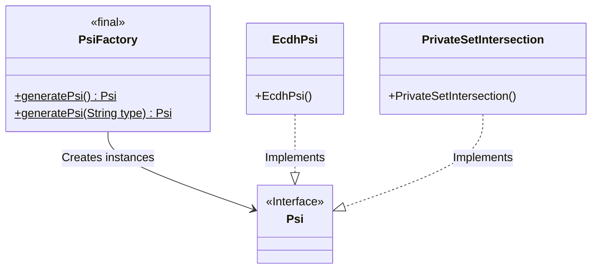
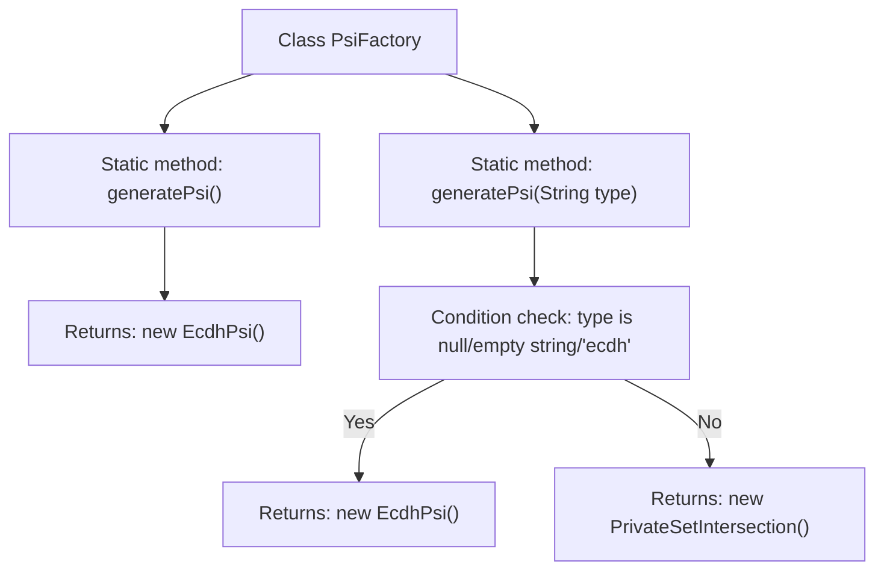

# Basic Information

|      |      |
|------|------|
| Name | PsiFactory |
| Language | .java |
| Code Path | WeFe/mpc/mpc-psi/mpc-psi-sdk/src/main/java/com/welab/wefe/mpc/psi/sdk/PsiFactory.java |
| Package Name | com.welab.wefe.mpc.psi.sdk |
| Dependencies | [] |
| Brief Description | The PsiFactory class provides two static methods to generate Psi instances: the no-argument generatePsi() defaults to returning EcdhPsi, while the parameterized generatePsi(String type) returns either an EcdhPsi or PrivateSetIntersection instance based on the argument. |

# Description

PsiFactory is a factory class that provides two static methods to generate Psi objects. The parameterless method `generatePsi()` defaults to returning an instance of `EcdhPsi`. The parameterized method `generatePsi(String type)` determines the return type based on the input parameter: it returns `EcdhPsi` when the parameter is null, an empty string, or "ecdh", and returns `PrivateSetIntersection` in other cases. This class implements a simple factory pattern, encapsulating the object creation logic.

# Class Summary

| Name   | Type  | Description |
|-------|------|-------------|
| PsiFactory | class | The PsiFactory class provides two static methods for generating Psi instances: the parameterless method defaults to returning an EcdhPsi instance, while the parameterized method returns either an EcdhPsi or PrivateSetIntersection instance based on the input type. |

## Class PsiFactory

|      |      |
|------|------|
| Access Modifier | public |
| Type | class |
| Name | PsiFactory |
| Description | The PsiFactory class provides two static methods for generating Psi instances: the parameterless method defaults to returning an EcdhPsi instance, while the parameterized method returns either an EcdhPsi or PrivateSetIntersection instance based on the input type. |

### UML Class Diagram

This class diagram illustrates the factory pattern implementation for PSI (Private Set Intersection). PsiFactory serves as the factory class, providing two static methods to generate different types of PSI instances: by default producing EcdhPsi, or selecting between EcdhPsi and PrivateSetIntersection based on input parameters. Both concrete implementation classes adhere to the Psi interface, demonstrating the factory pattern's characteristic of decoupling creation logic from concrete implementations. The diagram clearly presents the hierarchy and dependency relationships between factory methods, interfaces, and implementation classes.

### Internal Method Call Graph

This flowchart illustrates the logic of two static methods in the PsiFactory class. The parameterless method directly returns an EcdhPsi instance; the parameterized method first checks the type parameter, returning EcdhPsi if the parameter is null/empty string or "ecdh", otherwise returning a PrivateSetIntersection instance. The diagram clearly presents conditional branching and different construction paths, demonstrating the factory pattern's characteristic of dynamically generating different implementation classes based on input.

### Field List

| Name  | Type  | Description |
|-------|-------|------|

### Method List

| Name  | Type  | Description |
|-------|-------|------|
| generatePsi | Psi | Static methods generate PSI instances based on input types: if the type is empty, blank, or "ecdh," return EcdhPsi; otherwise, return PrivateSetIntersection. |
| generatePsi | Psi | Static method for generating ECDH PSI instances. |

