# Basic Information

|      |      |
|------|------|
| Name | sdk |
| Language | .java |
| Code Path | WeFe/mpc/mpc-psi/mpc-psi-sdk/src/main/java/com/welab/wefe/mpc/psi/sdk |
| Package Name | docs.mpc.mpc-psi.mpc-psi-sdk.src.main.java.com.welab.wefe.mpc.psi.sdk |
| Brief Description | This SDK implements multi-party Private Set Intersection (PSI) functionality, supporting ECDH and DH encryption protocols. It includes server/client components, data preprocessing tools, and a factory pattern. The core workflow consists of key generation, data encryption, and result comparison, with performance optimized through multithreading, making it suitable for secure data matching scenarios. |

# Description

## Overview  
This module is a Private Set Intersection (PSI) toolkit in Secure Multi-party Computation (MPC), with core responsibilities including private data matching based on Elliptic Curve Cryptography (ECDH) and Diffie-Hellman (DH) protocols, data preprocessing, and result querying. The module adopts a layered design: the underlying layer provides cryptographic foundational capabilities (e.g., point multiplication operations in ECDH-PSI), the middle layer implements data partitioning/format conversion (e.g., PartitionUtil for sharding), and the upper layer encapsulates service interfaces (e.g., PrivateSetIntersectionService). Key data structures encompass elliptic curve parameters, encrypted mapping tables, sharded collections, and obfuscated data models, with dependencies limited to the Java standard library and cryptographic algorithm libraries. For instance, EcdhPsi employs hashToCurve for data encryption, while PsiFactory uses the factory pattern to create protocol instances.

## Key Business Scenarios  
The module supports three typical scenarios: 1) Secure user matching (ECDH-PSI bidirectional encrypted intersection); 2) Batch data preprocessing (sharding → conversion → encryption pipeline); 3) Private Information Retrieval (Naor-Pinkas oblivious transfer). The complete workflow follows the "key generation → data encryption → result intersection" model, akin to multi-party key negotiation. For example, DhPsiServer uses concurrent hash tables to accelerate ciphertext comparison, while PirQuery achieves anonymous queries through Diffie-Hellman exchange. Interaction modes include client-server architecture (e.g., EcdhPsiClient) and factory pattern (PsiFactory), with APIs covering key operations, dataset encryption, and paginated result merging, suitable for cross-institutional secure data computation scenarios.

### Package Internal Structure View

```mermaid
graph TD
    sdk --> ecdh
    sdk --> util
    sdk --> service
    sdk --> excel
    sdk --> pir
    sdk --> dh
    sdk --> model
    sdk --> Psi.java
    sdk --> EcdhPsi.java
    sdk --> PsiFactory.java
    sdk --> PrivateSetIntersection.java
    ecdh --> EllipticCurve.java
    ecdh --> EcdhPsiServer.java
    ecdh --> EcdhPsiClient.java
    util --> PartitionUtil.java
    util --> EcdhUtil.java
    util --> ConverterUtil.java
    service --> PrivateSetIntersectionService.java
    excel --> AbstractDataSetReader.java
    excel --> CsvDataSetReader.java
    excel --> ExcelDataSetReader.java
    excel --> ExcelReader.java
    pir --> PirQuery.java
    dh --> DhPsiServer.java
    dh --> DhPsiClient.java
    model --> ConfuseData.java
```

This flowchart illustrates the core structure of the MPC-PSI-SDK project, with `sdk` as the root node encompassing 8 submodules including `ecdh`, `util`, and `service`. Each submodule contains specific implementation classes, such as elliptic curve-related classes under the `ecdh` module and partition utility classes under the `util` module. The diagram presents a multi-layered modular architecture of the SDK, where each module has distinct responsibilities, collectively supporting private set intersection functionality.

# File List

| Name   | Type  | Description |
|-------|------|-------------|
| [model](model/_module.md) | package | The ConfuseData class is used to generate obfuscated data, containing field names, JSON identifiers, and generation functions, providing relevant getter and setter methods. |
| [Psi.java](Psi.md) | file | The abstract class Psi implements Private Set Intersection (PSI) functionality, supporting ECDH and DH algorithms. It provides query operations, result pushing, data obfuscation, and multi-threaded processing, with the capability to save results to local files. |
| [EcdhPsi.java](EcdhPsi.md) | file | The EcdhPsi class implements multi-party private set intersection, utilizing ECDH encryption for local IDs and interacting with the server, processing data in batches and returning the intersection results. |
| [PsiFactory.java](PsiFactory.md) | file | The PsiFactory class provides two static methods to generate Psi instances: the parameterless generatePsi() defaults to returning EcdhPsi, while the parameterized generatePsi(String type) returns either an EcdhPsi or PrivateSetIntersection instance based on the argument. |
| [PrivateSetIntersection.java](PrivateSetIntersection.md) | file | The PrivateSetIntersection class implements multi-party ID intersection functionality, ensuring data privacy through encryption and batch processing, while supporting resumable transfers and result saving. |
| [dh](dh/_module.md) | package | The DhPsiServer class implements the Diffie-Hellman-based server-side PSI, supporting multi-threaded encryption of datasets and maintaining private keys and large prime numbers. The DhPsiClient class implements client-side PSI, including key generation, ID encryption, and PSI computation, using thread pools and concurrent hash tables to ensure security. |
| [pir](pir/_module.md) | package | The PirQuery class implements private information retrieval using the Naor-Pinkas OT method, generating random keys to process query requests, and employs Diffie-Hellman encryption along with AES decryption to return the target index result. |
| [excel](excel/_module.md) | package | AbstractDataSetReader is an abstract base class for reading datasets, incorporating column header processing and row reading logic. CsvDataSetReader and ExcelDataSetReader implement CSV and Excel file reading respectively, both inheriting from AbstractDataSetReader. ExcelReader provides Excel file parsing functionality, supporting multiple data formats and resource management. |
| [service](service/_module.md) | package | The PrivateSetIntersectionService class provides private set intersection query, PIR result processing, and NaorPinkas result query functionalities. It invokes the query method based on configuration and request parameters to return responses. |
| [util](util/_module.md) | package | PartitionUtil provides sharding methods for Map/Set/List. EcdhUtil offers data format conversion methods with support for multithreaded processing. ConverterUtil enables bidirectional conversion between strings and BigInteger/ECPoint. |
| [ecdh](ecdh/_module.md) | package | The `EllipticCurve` class defines elliptic curve parameters and operation methods, supporting point multiplication, hash mapping, and verification. `EcdhPsiServer` implements server-side PSI, including private key generation, dataset encryption, and multi-threaded processing. `EcdhPsiClient` implements client-side PSI, supporting private key generation, data encryption, and ECDH protocol intersection. Both utilize the `prime256v1` curve and multi-threading optimization. |

