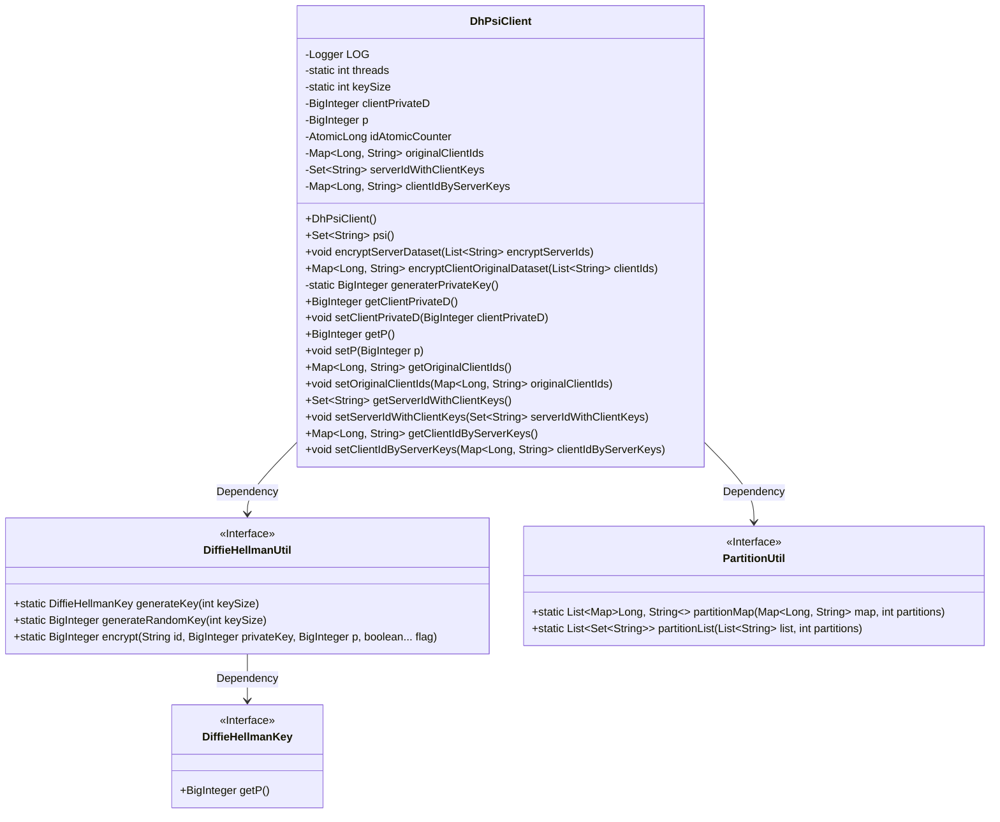
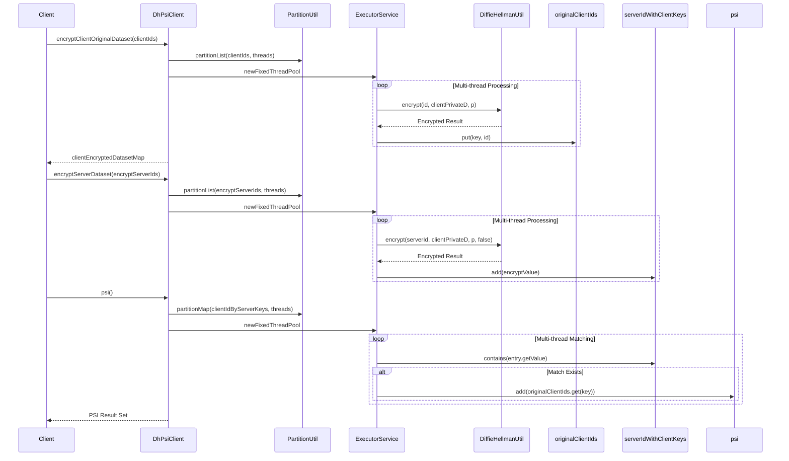

# Basic Information

|      |      |
|------|------|
| Name | DhPsiClient |
| Language | .java |
| Code Path | WeFe/mpc/mpc-psi/mpc-psi-sdk/src/main/java/com/welab/wefe/mpc/psi/sdk/dh/DhPsiClient.java |
| Package Name | com.welab.wefe.mpc.psi.sdk.dh |
| Dependencies | ['java.math.BigInteger', 'java.util.List', 'java.util.Map', 'java.util.Set', 'java.util.concurrent.ConcurrentHashMap', 'java.util.concurrent.ExecutorService', 'java.util.concurrent.Executors', 'java.util.concurrent.TimeUnit', 'java.util.concurrent.atomic.AtomicLong', 'org.slf4j.Logger', 'org.slf4j.LoggerFactory', 'com.welab.wefe.mpc.key.DiffieHellmanKey', 'com.welab.wefe.mpc.psi.sdk.util.PartitionUtil', 'com.welab.wefe.mpc.util.DiffieHellmanUtil'] |
| Brief Description | The DhPsiClient class implements the Diffie-Hellman-based PSI protocol, encompassing key generation, client/server data encryption, and intersection computation functionalities, with support for multi-threaded processing. |

# Description

The DhPsiClient class implements a privacy-preserving set intersection (PSI) client based on Diffie-Hellman key exchange. It consists of four core steps: private key generation, client ID encryption, server ID encryption, and PSI computation. The class utilizes a thread pool for parallel data processing, ensures thread safety through ConcurrentHashMap, and maintains mapping relationships such as original IDs and encrypted IDs. Key attributes include a 1024-bit key size, prime number p, and client private key, providing a complete PSI protocol implementation workflow.

# Class Summary

| Name   | Type  | Description |
|-------|------|-------------|
| DhPsiClient | class | The DhPsiClient class implements Diffie-Hellman-based private set intersection functionality, including client ID encryption, server ID encryption, and PSI computation, with support for multi-threaded processing. |

## Class DhPsiClient

|      |      |
|------|------|
| Access Modifier | public |
| Type | class |
| Name | DhPsiClient |
| Description | The DhPsiClient class implements Diffie-Hellman-based private set intersection functionality, including client ID encryption, server ID encryption, and PSI computation, with support for multi-threaded processing. |

### UML Class Diagram

Class diagram description: The DhPsiClient class implements the client-side logic for Privacy-Preserving Set Intersection (PSI) based on the Diffie-Hellman protocol, including key generation, dataset encryption, and PSI computation. It utilizes the DiffieHellmanUtil utility class for cryptographic operations and PartitionUtil for data partitioning. Core private fields include client private key, prime number p, atomic counter, and three dataset mapping tables, providing multithreaded encryption and PSI computation capabilities.

### Internal Method Call Graph

```mermaid
graph TD
    A["Class DhPsiClient"]
    B["Property: Logger LOG"]
    C["Property: int threads"]
    D["Property: int keySize"]
    E["Property: BigInteger clientPrivateD"]
    F["Property: BigInteger p"]
    G["Property: AtomicLong idAtomicCounter"]
    H["Property: Map<Long, String> originalClientIds"]
    I["Property: Set<String> serverIdWithClientKeys"]
    J["Property: Map<Long, String> clientIdByServerKeys"]
    K["Constructor: DhPsiClient()"]
    L["Method: Set<String> psi()"]
    M["Method: void encryptServerDataset(List<String>)"]
    N["Method: Map<Long, String> encryptClientOriginalDataset(List<String>)"]
    O["Method: BigInteger generaterPrivateKey()"]
    P["Getter/Setter Methods"]

    A --> B
    A --> C
    A --> D
    A --> E
    A --> F
    A --> G
    A --> H
    A --> I
    A --> J
    A --> K
    A --> L
    A --> M
    A --> N
    A --> O
    A --> P
```

The flowchart illustrates the structure of the DhPsiClient class, including private properties, constructors, and core methods. This class implements the PSI (Private Set Intersection) protocol based on Diffie-Hellman key exchange, efficiently handling data encryption and matching through multi-threading. The sequence diagram details three core steps: client ID encryption, server ID encryption, and PSI computation, demonstrating the interaction flow of multi-threaded partitioning and Diffie-Hellman encryption. The entire design emphasizes thread safety and performance optimization, making it suitable for secure intersection scenarios involving large-scale datasets.

### Field List

| Name  | Type  | Description |
|-------|-------|------|
| threads = Math.max(Runtime.getRuntime().availableProcessors(), 8) | int | Set the thread count to the greater value between the number of CPU cores and 8. |
| originalClientIds | Map<Long, String> | Stores a mapping of long integer keys to string values, used to record the original client IDs. |
| LOG = LoggerFactory.getLogger(DhPsiClient.class) | Logger | The DhPsiClient class defines a static immutable logger LOG. |
| p | BigInteger | Declare a private big integer variable p. |
| serverIdWithClientKeys | Set<String> | The storage contains a collection of server IDs that include client keys. |
| clientIdByServerKeys | Map<Long, String> | Mapping between storage server keys and client IDs. |
| idAtomicCounter | AtomicLong | Private atomic long integer counter idAtomicCounter. |
| clientPrivateD | BigInteger | Client-side private key D value, used for encryption or signing. |
| keySize = 1024 | int | Define a private static integer variable keySize with an initial value of 1024. |

### Method List

| Name  | Type  | Description |
|-------|-------|------|
| getServerIdWithClientKeys | Set<String> | Retrieve the set of server IDs containing client keys. |
| getP | BigInteger | The method returns the value of the private variable p of type BigInteger. |
| setClientPrivateD | void | This is a Java method used to set the value of the client's private key D, assigning the passed BigInteger type parameter to the class's member variable clientPrivateD. |
| getOriginalClientIds | Map<Long, String> | Get the original client ID mapping table, returning a Map with keys as long integers and values as strings. |
| setOriginalClientIds | void | Set the original client ID mapping with parameters as key-value pairs, where the key is of type long and the value is of type string. |
| setP | void | Methods for setting the p-value, with parameters of type BigInteger. |
| psi | Set<String> | This method uses multithreading to compare data between the client and server, returning a set of matched client IDs. It processes data in shards and leverages a thread pool for parallel execution, ultimately waiting for all tasks to complete. |
| encryptServerDataset | void | This method employs multi-threading to encrypt the server-side ID list, utilizing the Diffie-Hellman algorithm to generate and store encrypted values. A thread pool processes partitioned data and shuts down upon completion. |
| encryptClientOriginalDataset | Map<Long, String> | The method employs multi-threading to encrypt client IDs, generating key-value pair mappings. By partitioning the ID list and utilizing the Diffie-Hellman algorithm for encryption, it ultimately returns the encrypted dataset. |
| generaterPrivateKey | BigInteger | Method to generate a private key: Call the random key generation function of DiffieHellmanUtil and specify the key length. |
| getClientPrivateD | BigInteger | Methods to obtain the client's private key D value. |
| setServerIdWithClientKeys | void | Method for setting server ID and client key collection. |
| getClientIdByServerKeys | Map<Long, String> | This method returns a mapping table with keys as long integers and values as strings, representing the correspondence between server keys and client IDs. |
| setClientIdByServerKeys | void | The method setClientIdByServerKeys is used to set the mapping relationship between client IDs and server keys, with the parameter being of type Map. |

