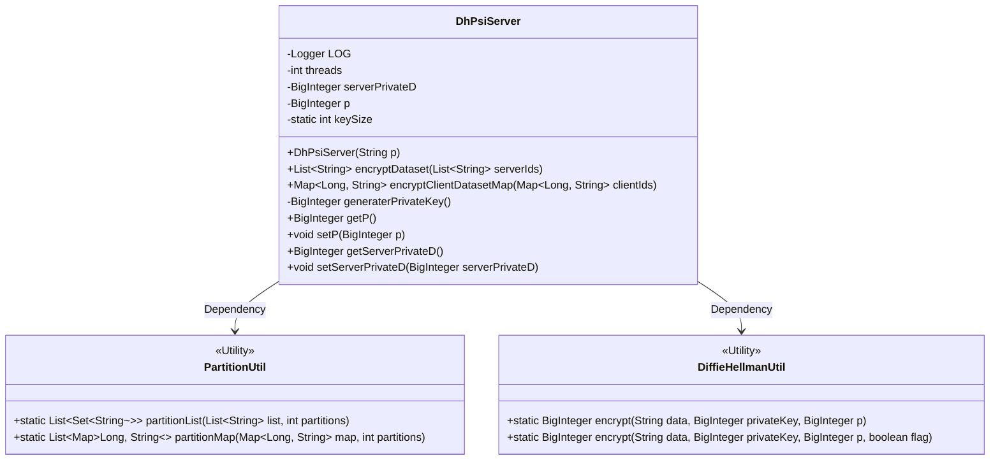
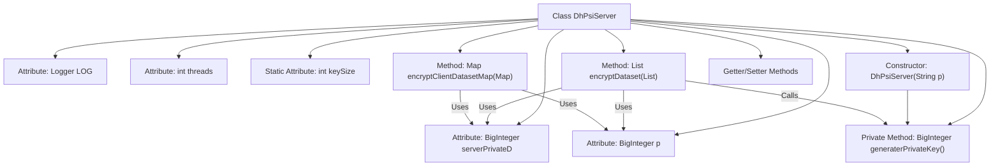

# Basic Information

|      |      |
|------|------|
| Name | DhPsiServer |
| Language | .java |
| Code Path | WeFe/mpc/mpc-psi/mpc-psi-sdk/src/main/java/com/welab/wefe/mpc/psi/sdk/dh/DhPsiServer.java |
| Package Name | com.welab.wefe.mpc.psi.sdk.dh |
| Dependencies | ['java.math.BigInteger', 'java.util.List', 'java.util.Map', 'java.util.Random', 'java.util.Set', 'java.util.concurrent.ConcurrentHashMap', 'java.util.concurrent.CopyOnWriteArrayList', 'java.util.concurrent.ExecutorService', 'java.util.concurrent.Executors', 'java.util.concurrent.TimeUnit', 'org.slf4j.Logger', 'org.slf4j.LoggerFactory', 'com.welab.wefe.mpc.psi.sdk.util.PartitionUtil', 'com.welab.wefe.mpc.util.DiffieHellmanUtil'] |
| Brief Description | The DhPsiServer class implements the server-side functionality of the Diffie-Hellman-based PSI protocol, including dataset encryption, client data encryption, and key generation methods, with support for multi-threaded processing. |

# Description

The DhPsiServer class implements server-side PSI functionality based on the Diffie-Hellman protocol. Its core features include: using a thread pool for parallel data encryption processing, with the default thread count set to the greater of the CPU core count or 8; generating a 1024-bit random private key via the generaterPrivateKey method; encrypting the server dataset through the encryptDataset method, which returns a list of hexadecimal strings; and encrypting the client dataset via the encryptClientDatasetMap method, which returns a concurrent hash table containing ID mappings. The class maintains two critical parameters: the server's private key serverPrivateD and a large prime number p, both stored as BigInteger and provided with getter/setter methods. All encryption operations are performed through the DiffieHellmanUtil utility class, employing a partitioned parallel processing strategy to enhance performance.

# Class Summary

| Name   | Type  | Description |
|-------|------|-------------|
| DhPsiServer | class | The DhPsiServer class implements the server-side functionality of the Diffie-Hellman-based PSI protocol, including methods for generating private keys, encrypting local datasets and client datasets, with support for multi-threaded processing. |

## Class DhPsiServer

|      |      |
|------|------|
| Access Modifier | public |
| Type | class |
| Name | DhPsiServer |
| Description | The DhPsiServer class implements the server-side functionality of the Diffie-Hellman-based PSI protocol, including methods for generating private keys, encrypting local datasets and client datasets, with support for multi-threaded processing. |

### UML Class Diagram

Class diagram description: The DhPsiServer class implements server-side logic for PSI (Private Set Intersection) based on the Diffie-Hellman key exchange protocol, including core functionalities such as dataset encryption and client data encryption. It utilizes PartitionUtil for data partitioning and DiffieHellmanUtil for encryption operations. The class contains critical implementations like thread pool management and large number arithmetic, with private members including server private key and prime number p, providing comprehensive control over the encryption workflow.

### Internal Method Call Graph

Flowchart Description: This flowchart illustrates the structure of the DhPsiServer class and its key method invocation relationships. The class contains 5 attributes (LOG, threads, serverPrivateD, p, keySize) and 4 core methods (constructor, encryptDataset, encryptClientDatasetMap, generaterPrivateKey). The key workflow shows the constructor invoking the private key generator, while both encryption methods rely on the private key and prime number p for Diffie-Hellman encryption operations, employing thread pools for parallel processing of data partitions. All encryption operations ultimately delegate core cryptographic computations to the DiffieHellmanUtil utility class.

### Field List

| Name  | Type  | Description |
|-------|-------|------|
| p | BigInteger | Declare a private big integer variable p. |
| LOG = LoggerFactory.getLogger(DhPsiServer.class) | Logger | The DhPsiServer class defines a static immutable logger instance named LOG. |
| keySize = 1024 | int | Defined a private static integer variable keySize with an initial value of 1024. |
| serverPrivateD | BigInteger | The server's private key D value, of type BigInteger, is used for encryption or signing. |
| threads = Math.max(Runtime.getRuntime().availableProcessors(), 8) | int | Set the number of threads to the greater value between the CPU core count and 8. |

### Method List

| Name  | Type  | Description |
|-------|-------|------|
| setServerPrivateD | void | This is a Java method used to set the value of the server's private key D, assigning the passed BigInteger type parameter to the class's member variable serverPrivateD. |
| encryptDataset | List<String> | The method employs multi-threading to encrypt the dataset by partitioning the input ID list for parallel encryption, utilizing the Diffie-Hellman algorithm, and ultimately returning the collection of encrypted results. |
| generaterPrivateKey | BigInteger | Generate a random large integer of specified length as a private key. |
| getP | BigInteger | The method returns the value of the private variable p of type BigInteger. |
| encryptClientDatasetMap | Map<Long, String> | The method employs multi-threading to encrypt client datasets, partitioning the input Map for parallel processing, and utilizes the Diffie-Hellman algorithm to encrypt values, ultimately returning the encrypted ConcurrentHashMap. |
| setP | void | Set the value of the large integer p. |
| getServerPrivateD | BigInteger | The method to obtain the server's private key D, returning a BigInteger type value. |

