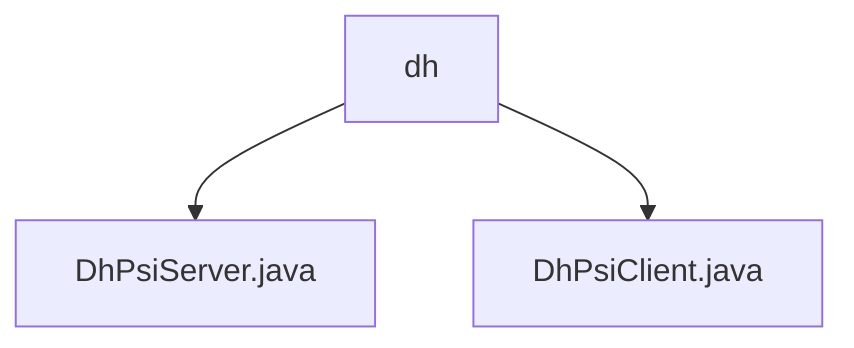

# Basic Information

|      |      |
|------|------|
| Name | dh |
| Language | .java |
| Code Path | WeFe/mpc/mpc-psi/mpc-psi-sdk/src/main/java/com/welab/wefe/mpc/psi/sdk/dh |
| Package Name | docs.mpc.mpc-psi.mpc-psi-sdk.src.main.java.com.welab.wefe.mpc.psi.sdk.dh |
| Brief Description | The DhPsiServer class implements the Diffie-Hellman-based server-side PSI, supporting multi-threaded encryption of datasets and maintaining private keys and large prime numbers. The DhPsiClient class implements client-side PSI, including key generation, ID encryption, and PSI computation, using thread pools and concurrent hash tables to ensure security. |

# Description

## Overview  
This module implements Private Set Intersection (PSI) functionality based on the Diffie-Hellman protocol, comprising server-side (DhPsiServer) and client-side (DhPsiClient) components. Core responsibilities include parallelized data encryption (e.g., processing datasets using thread pools), key management (e.g., generating 1024-bit private keys), and execution of the PSI protocol flow. Key data structures include private keys/large prime numbers stored as BigInteger and ID mappings maintained via ConcurrentHashMap. Dependencies involve multithreaded concurrency control, the Diffie-Hellman encryption algorithm, and key exchange patterns similar to those in secure multi-party computation.  

## Primary Business Scenarios  
The typical workflow consists of two phases: server-side encryption (e.g., encryptDataset generating hexadecimal ciphertext) and client-side interaction (e.g., encryptClientDatasetMap establishing ID mappings). A partitioned parallelization strategy is employed to enhance performance, such as dynamically adapting thread counts to CPU core numbers. The complete PSI protocol involves key generation, bidirectional encryption, and result comparison, with thread-safe designs (e.g., concurrent hash tables) ensuring data consistency. API types encompass key operations, dataset encryption, and PSI computation, suitable for cross-institutional secure data matching scenarios.

### Package Internal Structure View

This flowchart illustrates the DH protocol-related code structure under the MPC-PSI-SDK module in the WeFe project. The root node is the dh directory, which contains two Java implementation files: DhPsiServer.java (server-side logic) and DhPsiClient.java (client-side logic). Together, they constitute the implementation of privacy-preserving set intersection functionality based on the DH algorithm.

# File List

| Name   | Type  | Description |
|-------|------|-------------|
| [DhPsiServer.java](DhPsiServer.md) | file | The DhPsiServer class implements the server-side functionality of the Diffie-Hellman-based PSI protocol, including dataset encryption, client data encryption, and key generation methods, with support for multi-threaded processing. |
| [DhPsiClient.java](DhPsiClient.md) | file | The DhPsiClient class implements the Diffie-Hellman-based PSI protocol, encompassing key generation, client/server data encryption, and intersection computation functionalities, with support for multi-threaded processing. |

