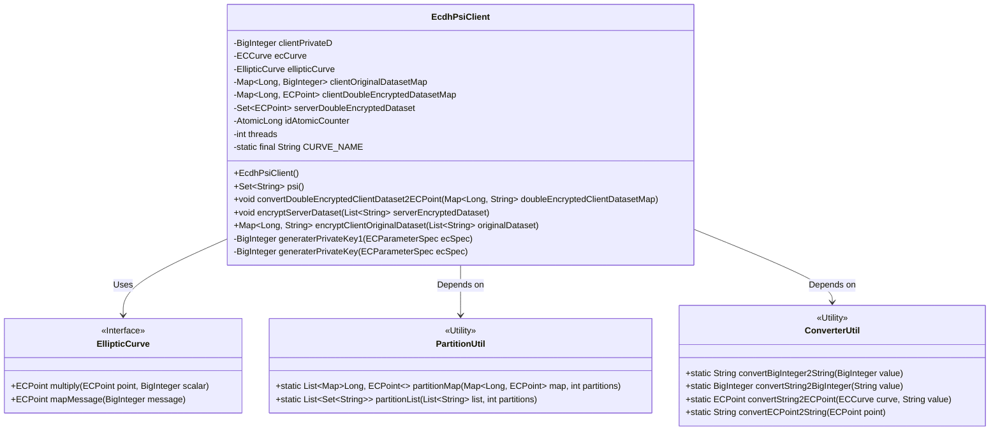

# Basic Information

|      |      |
|------|------|
| Name | EcdhPsiClient |
| Language | .java |
| Code Path | WeFe/mpc/mpc-psi/mpc-psi-sdk/src/main/java/com/welab/wefe/mpc/psi/sdk/ecdh/EcdhPsiClient.java |
| Package Name | com.welab.wefe.mpc.psi.sdk.ecdh |
| Dependencies | ['java.math.BigInteger', 'java.security.InvalidAlgorithmParameterException', 'java.security.KeyPair', 'java.security.KeyPairGenerator', 'java.security.NoSuchAlgorithmException', 'java.security.NoSuchProviderException', 'java.security.SecureRandom', 'java.security.Security', 'java.util.List', 'java.util.Map', 'java.util.Set', 'java.util.concurrent.ConcurrentHashMap', 'java.util.concurrent.ExecutorService', 'java.util.concurrent.Executors', 'java.util.concurrent.TimeUnit', 'java.util.concurrent.atomic.AtomicLong', 'org.bouncycastle.jce.ECNamedCurveTable', 'org.bouncycastle.jce.interfaces.ECPrivateKey', 'org.bouncycastle.jce.provider.BouncyCastleProvider', 'org.bouncycastle.jce.spec.ECParameterSpec', 'org.bouncycastle.math.ec.ECCurve', 'org.bouncycastle.math.ec.ECPoint', 'org.slf4j.Logger', 'org.slf4j.LoggerFactory', 'com.welab.wefe.mpc.psi.sdk.util.ConverterUtil', 'com.welab.wefe.mpc.psi.sdk.util.PartitionUtil'] |
| Brief Description | The EcdhPsiClient class implements an elliptic curve-based PSI protocol, encompassing functionalities such as private key generation, dataset encryption, and intersection computation, with support for multi-threaded processing. |

# Description

EcdhPsiClient is an implementation class for client-side PSI (Private Set Intersection) based on elliptic curve cryptography. This class utilizes the prime256v1 elliptic curve and includes client private keys, elliptic curve parameters, and three core dataset mapping tables. Its primary functionalities consist of: generating private keys, encrypting original datasets, encrypting server-side datasets, converting doubly encrypted datasets into elliptic curve points, and executing PSI intersection operations. It employs multithreading for data processing, with the default thread count set to the greater value between the CPU core count or 8. Secure two-party PSI computation is achieved through the ECDH protocol, ultimately returning the intersection results.

# Class Summary

| Name   | Type  | Description |
|-------|------|-------------|
| EcdhPsiClient | class | The EcdhPsiClient class implements an elliptic curve-based PSI protocol client, encompassing key generation, dataset encryption transformation, and intersection computation functionalities, with support for multi-threaded processing. |

## Class EcdhPsiClient

|      |      |
|------|------|
| Access Modifier | public |
| Type | class |
| Name | EcdhPsiClient |
| Description | The EcdhPsiClient class implements an elliptic curve-based PSI protocol client, encompassing key generation, dataset encryption transformation, and intersection computation functionalities, with support for multi-threaded processing. |

### UML Class Diagram

Class diagram description:
The EcdhPsiClient class implements an elliptic curve cryptography-based Private Set Intersection (PSI) client, encompassing core functionalities such as key generation, data encryption, and set intersection. It relies on the EllipticCurve interface for elliptic curve operations, utilizes PartitionUtil for data partitioning, and employs ConverterUtil for data type conversion. The class maintains multiple concurrent collections to store data at different processing stages and adopts a multi-threading approach to enhance processing efficiency.

### Internal Method Call Graph

```mermaid
graph TD
    A["Class EcdhPsiClient"]
    B["Attribute: Logger LOG"]
    C["Attribute: BigInteger clientPrivateD"]
    D["Attribute: ECCurve ecCurve"]
    E["Attribute: EllipticCurve ellipticCurve"]
    F["Attribute: Map<Long,BigInteger> clientOriginalDatasetMap"]
    G["Attribute: Map<Long,ECPoint> clientDoubleEncryptedDatasetMap"]
    H["Attribute: Set<ECPoint> serverDoubleEncryptedDataset"]
    I["Attribute: AtomicLong idAtomicCounter"]
    J["Attribute: int threads"]
    K["Constructor: EcdhPsiClient()"]
    L["Method: Set<String> psi()"]
    M["Method: convertDoubleEncryptedClientDataset2ECPoint(Map<Long,String>)"]
    N["Method: encryptServerDataset(List<String>)"]
    O["Method: encryptClientOriginalDataset(List<String>)"]
    P["Private Method: generaterPrivateKey1(ECParameterSpec)"]
    Q["Private Method: generaterPrivateKey(ECParameterSpec)"]

    A --> B
    A --> C
    A --> D
    A --> E
    A --> F
    A --> G
    A --> H
    A --> I
    A --> J
    A --> K
    A --> L
    A --> M
    A --> N
    A --> O
    A -.-> P
    A -.-> Q
```

This code implements an ECDH (Elliptic Curve Diffie-Hellman) based PSI (Private Set Intersection) client, primarily used for securely computing the intersection of two sets without leaking additional information. The flowchart illustrates the main structure and key methods of the class: including the initialization constructor, the core PSI intersection method psi(), the data conversion method convertDoubleEncryptedClientDataset2ECPoint(), the server dataset encryption method encryptServerDataset(), the client original dataset encryption method encryptClientOriginalDataset(), and two private key generation methods. The class processes large datasets using multithreading, ensures thread safety with ConcurrentHashMap, and implements the complete PSI protocol workflow.

### Field List

| Name  | Type  | Description |
|-------|-------|------|
| LOG = LoggerFactory.getLogger(EcdhPsiClient.class) | Logger | Define a private static log constant LOG for the EcdhPsiClient class. |
| clientPrivateD | BigInteger | Client private key D, of type BigInteger. |
| CURVE_NAME = "prime256v1" | String | Defined a private static constant string CURVE_NAME with the value "prime256v1", which is the name of the elliptic curve. |
| ecCurve | ECCurve | Private member variable of type ECCurve, representing an elliptic curve. |
| clientDoubleEncryptedDatasetMap | Map<Long, ECPoint> | Private mapping, with keys as long integers and values as elliptic curve points, storing the client's double-encrypted dataset. |
| serverDoubleEncryptedDataset | Set<ECPoint> | Private collection, storing double-encrypted data points on the server. |
| clientOriginalDatasetMap | Map<Long, BigInteger> | Stores the mapping of the client's original dataset, with keys as long integers and values as big integers. |
| threads = Math.max(Runtime.getRuntime().availableProcessors(), 8) | int | Set the number of threads to the greater value between the CPU core count and 8. |
| idAtomicCounter | AtomicLong | Atomic long integer counter for thread-safe ID generation. |
| ellipticCurve | EllipticCurve | Elliptic Curve Private Member Variables |

### Method List

| Name  | Type  | Description |
|-------|-------|------|
| convertDoubleEncryptedClientDataset2ECPoint | void | The method converts the doubly encrypted client dataset into elliptic curve points. If the target mapping is not empty, it returns directly. It iterates through the input mapping, uses a utility class to convert strings into elliptic curve points, and stores them in the target mapping. Start and end logs are recorded. |
| generaterPrivateKey | BigInteger | Generate EC private key: Based on EC parameter specifications, use a secure random number to create a random number k less than N as the private key. |
| encryptServerDataset | void | The client uses multi-threading to encrypt the server dataset, converting strings into elliptic curve points and multiplying them by the private key, with the results stored in a concurrent collection. |
| encryptClientOriginalDataset | Map<Long, String> | The method employs multi-threading to encrypt the client's original dataset, partitioning the data for concurrent processing, converting it into BigInteger and utilizing elliptic curve encryption, ultimately returning the encrypted dataset mapping. |
| psi | Set<String> | This method employs multi-threading to perform Private Set Intersection (PSI) between client and server datasets, where the client data is partitioned and matched in parallel against the server's encrypted data, ultimately returning the intersection result. |
| generaterPrivateKey1 | BigInteger | Deprecated method generaterPrivateKey1: Generates an EC private key using BouncyCastle and returns the key value as a BigInteger type. Includes exception handling and logging. |

