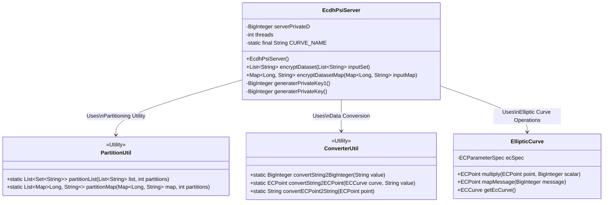
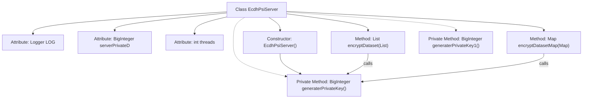
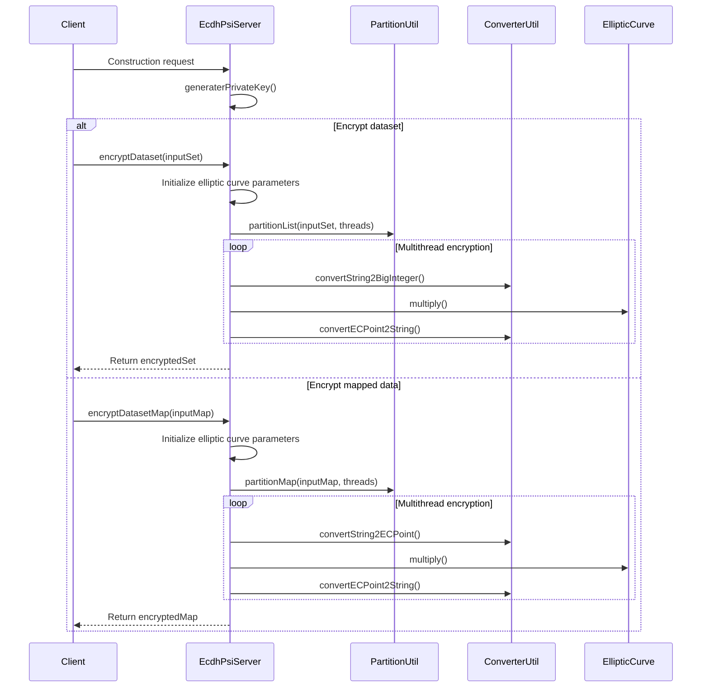

# Basic Information

|      |      |
|------|------|
| Name | EcdhPsiServer |
| Language | .java |
| Code Path | WeFe/mpc/mpc-psi/mpc-psi-sdk/src/main/java/com/welab/wefe/mpc/psi/sdk/ecdh/EcdhPsiServer.java |
| Package Name | com.welab.wefe.mpc.psi.sdk.ecdh |
| Dependencies | ['java.math.BigInteger', 'java.security.InvalidAlgorithmParameterException', 'java.security.KeyPair', 'java.security.KeyPairGenerator', 'java.security.NoSuchAlgorithmException', 'java.security.NoSuchProviderException', 'java.security.SecureRandom', 'java.security.Security', 'java.util.List', 'java.util.Map', 'java.util.Set', 'java.util.concurrent.ConcurrentHashMap', 'java.util.concurrent.CopyOnWriteArrayList', 'java.util.concurrent.ExecutorService', 'java.util.concurrent.Executors', 'java.util.concurrent.TimeUnit', 'org.bouncycastle.jce.ECNamedCurveTable', 'org.bouncycastle.jce.interfaces.ECPrivateKey', 'org.bouncycastle.jce.provider.BouncyCastleProvider', 'org.bouncycastle.jce.spec.ECParameterSpec', 'org.bouncycastle.math.ec.ECCurve', 'org.bouncycastle.math.ec.ECPoint', 'org.slf4j.Logger', 'org.slf4j.LoggerFactory', 'com.welab.wefe.mpc.psi.sdk.util.ConverterUtil', 'com.welab.wefe.mpc.psi.sdk.util.PartitionUtil'] |
| Brief Description | The EcdhPsiServer class implements the server-side logic for elliptic curve-based Private Set Intersection, featuring dataset encryption, client data encryption, and private key generation, with multithreading optimization for performance enhancement. |

# Description

The `EcdhPsiServer` class implements server-side private set intersection functionality based on elliptic curve cryptography. This class contains three core methods: `generaterPrivateKey` generates a random private key; `encryptDataset` encrypts the local dataset using the private key by converting strings to elliptic curve points and multiplying them with the private key; `encryptDatasetMap` performs similar encryption operations on client input data. The encryption process employs multi-threaded parallel processing, with the default thread count being the greater value between CPU core count and 8. It uses `prime256v1` elliptic curve parameters and includes complete thread pool management and error handling mechanisms. The deprecated `generaterPrivateKey1` method demonstrates the legacy key generation approach.

# Class Summary

| Name   | Type  | Description |
|-------|------|-------------|
| EcdhPsiServer | class | The EcdhPsiServer class implements the server-side logic for elliptic curve-based Private Set Intersection (PSI), encompassing private key generation, dataset encryption, and client data encryption functionalities, with multithreading employed to optimize performance. |

## Class EcdhPsiServer

|      |      |
|------|------|
| Access Modifier | public |
| Type | class |
| Name | EcdhPsiServer |
| Description | The EcdhPsiServer class implements the server-side logic for elliptic curve-based Private Set Intersection (PSI), encompassing private key generation, dataset encryption, and client data encryption functionalities, with multithreading employed to optimize performance. |

### UML Class Diagram

This diagram illustrates the core structure of the ECDH-PSI (Elliptic Curve Diffie-Hellman Private Set Intersection) server. The EcdhPsiServer implements private data comparison through elliptic curve encryption, featuring key generation, dataset encryption, and client data encryption capabilities. It relies on three utility classes: PartitionUtil for data sharding and parallel processing, ConverterUtil for data type conversion, and EllipticCurve which encapsulates elliptic curve mathematical operations. The system employs thread pools for parallel processing to support large-scale dataset encryption, utilizing ECPoint for elliptic curve-based encrypted point operations.

### Internal Method Call Graph

The flowchart illustrates the structure of the EcdhPsiServer class, including its attributes, constructor, and main functional methods. The sequence diagram details two encryption processes: dataset encryption and mapped data encryption, both employing multithreading and invoking the same private key generation and elliptic curve encryption operations. The entire workflow demonstrates the server-side implementation of the ECDH-based PSI protocol, utilizing thread pools for parallel data processing before returning encrypted results.

### Field List

| Name  | Type  | Description |
|-------|-------|------|
| threads = Math.max(Runtime.getRuntime().availableProcessors(), 8) | int | Set the number of threads to the greater value between the CPU core count and 8. |
| CURVE_NAME = "prime256v1" | String | Define the constant CURVE_NAME with the value "prime256v1" as the elliptic curve name. |
| LOG = LoggerFactory.getLogger(EcdhPsiServer.class) | Logger | The EcdhPsiServer class defines a static immutable logger instance named LOG. |
| serverPrivateD | BigInteger | Server private key D value, BigInteger type. |

### Method List

| Name  | Type  | Description |
|-------|-------|------|
| encryptDataset | List<String> | The method `encryptDataset` utilizes multi-threading and elliptic curve encryption algorithms to encrypt the input dataset, returning the encrypted dataset. |
| encryptDatasetMap | Map<Long, String> | This method employs the elliptic curve encryption algorithm to encrypt string values in the input Map in parallel. After initializing the elliptic curve parameters, the input Map is partitioned and processed with multiple threads. Each thread converts strings into elliptic curve points and encrypts them using a private key, then merges the results to return the encrypted Map. |
| generaterPrivateKey1 | BigInteger | Deprecated method generaterPrivateKey1, use BouncyCastle to generate EC private key based on prime256v1 curve, throwing runtime error on exception. |
| generaterPrivateKey | BigInteger | Generate an ECDSA private key: Use the prime256v1 curve to create a large integer k smaller than the curve order n based on a secure random number. |

