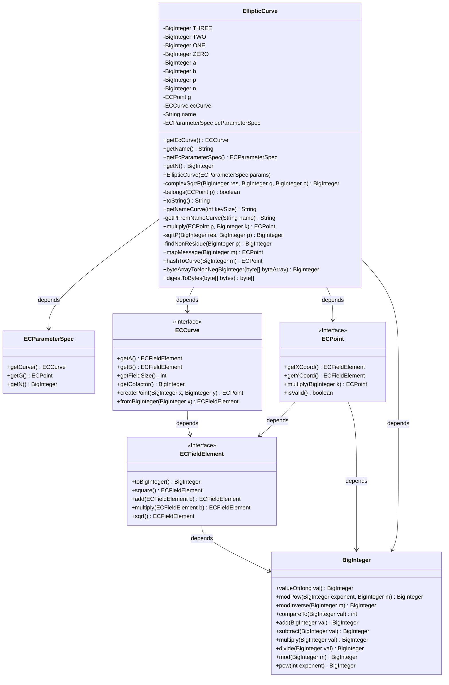
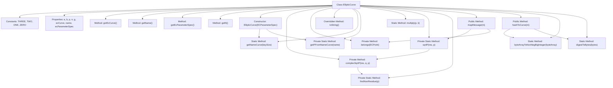

# Basic Information

|      |      |
|------|------|
| Name | EllipticCurve |
| Language | .java |
| Code Path | WeFe/mpc/mpc-psi/mpc-psi-sdk/src/main/java/com/welab/wefe/mpc/psi/sdk/ecdh/EllipticCurve.java |
| Package Name | com.welab.wefe.mpc.psi.sdk.ecdh |
| Dependencies | ['java.math.BigInteger', 'java.security.MessageDigest', 'java.util.Objects', 'org.bouncycastle.jce.spec.ECParameterSpec', 'org.bouncycastle.math.ec.ECCurve', 'org.bouncycastle.math.ec.ECFieldElement', 'org.bouncycastle.math.ec.ECPoint'] |
| Brief Description | Elliptic curve class, which includes functions such as parameter initialization, point mapping, hash conversion, and modular square root calculation, supporting multiple standard curves. |

# Description

The code defines an elliptic curve class `EllipticCurve`, which includes attributes such as curve parameters `a`, `b`, `p`, `n`, and base point `G`. It provides a constructor method to initialize curve parameters and supports retrieving the curve name, parameter specifications, and order `n`. The class implements point multiplication operations and functionality for mapping messages to curve points, including two methods: `mapMessage` computes coordinate points through trial calculation, while `hashToCurve` generates valid points via hashing. It also offers helper methods such as modulo `p` square root calculation and non-quadratic residue lookup, as well as a `belongs` method to verify whether a point lies on the curve. The class defines mappings between common elliptic curve names and their parameters, supporting curve selection for key sizes ranging from 160 to 521 bits.

# Class Summary

| Name   | Type  | Description |
|-------|------|-------------|
| EllipticCurve | class | Elliptic curve class, including parameter initialization, point mapping, hash conversion, and mathematical operations, supporting various standard curves such as secp160r2, secp256v1, etc. |

## Class EllipticCurve

|      |      |
|------|------|
| Access Modifier | public |
| Type | class |
| Name | EllipticCurve |
| Description | Elliptic curve class, including parameter initialization, point mapping, hash conversion, and mathematical operations, supporting various standard curves such as secp160r2, secp256v1, etc. |

### UML Class Diagram

This code defines an elliptic curve class `EllipticCurve` for handling elliptic curve cryptography operations. The class contains multiple private BigInteger constants, along with elliptic curve parameters such as a, b, p, and n. Key functionalities include initializing curve parameters via ECParameterSpec, calculating square roots, checking if a point belongs to the curve, mapping messages to curve points, and hashing to the curve. The class has dependency relationships with interfaces like ECPoint, ECCurve, and ECFieldElement, collectively implementing elliptic curve cryptography functionality. The code also includes multiple utility methods for handling large integer operations and curve parameter conversions.

### Internal Method Call Graph

This code implements an elliptic curve class (EllipticCurve) containing basic parameters and operations of elliptic curves. Key functionalities include: initializing curve parameters via ECParameterSpec, computing modular square roots, verifying if a point belongs to the curve, mapping messages to curve points, and hashing to curve points. The class defines multiple static utility methods for handling big integer arithmetic and curve parameter conversion, with core algorithms involving modular arithmetic and elliptic curve point operations. The flowchart illustrates invocation relationships between class members, particularly how the two core methods mapMessage and hashToCurve rely on other helper methods to achieve their functionality.

### Field List

| Name  | Type  | Description |
|-------|-------|------|
| b | BigInteger | Declare a private big integer variable b. |
| g | ECPoint | Private declaration of elliptic curve point g. |
| a | BigInteger | The private large integer variable a. |
| ZERO = BigInteger.valueOf(0) | BigInteger | Define a static constant ZERO with a value of BigInteger type 0. |
| n | BigInteger | The private large integer variable n. |
| p | BigInteger | Declare a private big integer variable p. |
| ecParameterSpec | ECParameterSpec | Private elliptic curve parameter specification variable ecParameterSpec. |
| ecCurve | ECCurve | Elliptic curve cryptography curve objects. |
| TWO = BigInteger.valueOf(2) | BigInteger | Defined a private static immutable BigInteger constant TWO with a value of 2. |
| THREE = BigInteger.valueOf(3) | BigInteger | Define an immutable constant THREE with a value of 3 as a BigInteger type. |
| name | String | private String variable name |
| ONE = BigInteger.valueOf(1) | BigInteger | Defined a private static constant ONE with a value of BigInteger type 1. |

### Method List

| Name  | Type  | Description |
|-------|-------|------|
| getNameCurve | String | Return the corresponding elliptic curve name based on the key length, or throw an exception if unsupported. Supports 160/224/256/384/512/521. |
| toString | String | Elliptic curve parameters: A, B, P, N, G. |
| getN | BigInteger | Methods to obtain the value of n of type BigInteger. |
| getEcParameterSpec | ECParameterSpec | Get the current elliptic curve parameter specification object. |
| digestToBytes | byte[] | Convert the input byte array to a string, then compute its MD5 hash value, and return the hashed byte array. A runtime exception is thrown in case of errors. |
| getEcCurve | ECCurve | The method getEcCurve returns the value of the ecCurve property of the current object. |
| getName | String | This method returns the name attribute value of the object. |
| multiply | ECPoint | The static method `multiply` takes an `ECPoint` and a `BigInteger` as parameters, calls the `multiply` method of `ECPoint`, and returns the result. |
| mapMessage | ECPoint | This method maps the message m to a point on the elliptic curve. Through k cyclic attempts, it calculates the x and y values and verifies whether y is a quadratic residue modulo p. If a valid point is found, it is returned; otherwise, an exception is thrown. |
| sqrtP | BigInteger | This method calculates the modular square root: if the q-th power of res modulo p is not equal to 1, call complexSqrtP; otherwise, return the (q+1)/2-th power of res modulo p. q is initially set to (p-1)/2 and continuously divided by 2 until it becomes odd. |
| findNonResidue | BigInteger | This method increments the test integer a to find a number that satisfies the quadratic non-residue condition modulo p, and returns null if no such number is found. |
| belongs | boolean | Check whether point p is on the elliptic curve by verifying if y² ≡ x³ + a·x + b (mod p) holds true. |
| getPFromNameCurve | String | Return the corresponding parameter P value based on the curve name, and throw an exception for unsupported curves. |
| byteArrayToNonNegBigInteger | BigInteger | Convert a byte array to a non-negative big integer using the BigInteger constructor and specifying the sign as positive. |
| complexSqrtP | BigInteger | This method calculates the complex square root modulo p by identifying a non-residue number a, adjusting the exponent t and q, and finally combining the inverse element with the modular exponentiation result to obtain the root value. |
| hashToCurve | ECPoint | Hashing a message to generate an elliptic curve point: Iteratively hash the message, attempt to construct x and y coordinates, and return the cleared cofactor point after validating its validity. |

