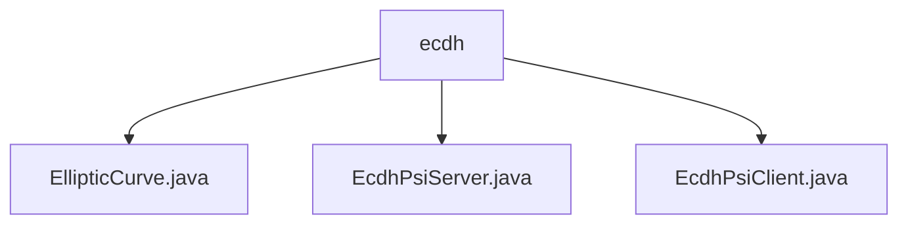

# Basic Information

|      |      |
|------|------|
| Name | ecdh |
| Language | .java |
| Code Path | WeFe/mpc/mpc-psi/mpc-psi-sdk/src/main/java/com/welab/wefe/mpc/psi/sdk/ecdh |
| Package Name | docs.mpc.mpc-psi.mpc-psi-sdk.src.main.java.com.welab.wefe.mpc.psi.sdk.ecdh |
| Brief Description | The `EllipticCurve` class defines elliptic curve parameters and operation methods, supporting point multiplication, hash mapping, and verification. `EcdhPsiServer` implements server-side PSI, including private key generation, dataset encryption, and multi-threaded processing. `EcdhPsiClient` implements client-side PSI, supporting private key generation, data encryption, and ECDH protocol intersection. Both utilize the `prime256v1` curve and multi-threading optimization. |

# Description

## Overview  
This module implements Private Set Intersection (PSI) functionality based on Elliptic Curve Diffie-Hellman (ECDH), encompassing curve parameter management, point operations, and core encryption/decryption logic. The `EllipticCurve` class encapsulates standard curve parameters such as secp256r1 (prime256v1) and provides fundamental operations like point multiplication and hash-to-curve mapping, functioning similarly to a cryptographic toolkit. The `EcdhPsiServer` and `EcdhPsiClient` classes implement the PSI protocol flow for the server and client sides, respectively, leveraging multi-threaded parallel processing for dataset encryption and intersection computation. For instance, the client maps data to curve points via `hashToCurve`, while the server uses `generaterPrivateKey` to generate ephemeral keys for encryption.  

Key data structures include elliptic curve parameters (a/b/p/n/G) and encrypted dataset mapping tables. External dependencies are limited to the Java standard library and standard elliptic curve parameters. The module supports key sizes ranging from 160 to 521 bits, with a default 256-bit curve, and dynamically adjusts thread pool size based on CPU core count. For example, the deprecated `generaterPrivateKey1` method retains backward compatibility.  

## Core Use Cases  
The complete PSI workflow consists of three phases: 1) Both parties generate ephemeral private keys; 2) The client encrypts local data and sends it, while the server encrypts both datasets; 3) Exchanging doubly encrypted results to compute the intersection. Mirroring key agreement patterns, bidirectional encryption is achieved via ECDH. For example, the `encryptDatasetMap` method converts strings to curve points before performing scalar multiplication.  

Typical applications include secure user matching, such as computing intersections without exposing raw data. The interaction follows a "client-server" architecture, with APIs covering key generation (e.g., `generaterPrivateKey`), dataset encryption (e.g., `encryptDataset`), and intersection computation. Thread pools optimize large-scale data processing, with a default thread count of `max(CPU cores, 8)`. The module validates point validity via the `belongs` method to ensure protocol security.

### Package Internal Structure View

This flowchart illustrates three Java files under the ecdh directory: EllipticCurve.java, EcdhPsiServer.java, and EcdhPsiClient.java. These files collectively implement Elliptic Curve Diffie-Hellman (ECDH) based Private Set Intersection (PSI) functionality, comprising the elliptic curve base class, server-side and client-side implementations, forming a complete ECDH-PSI functional module.

# File List

| Name   | Type  | Description |
|-------|------|-------------|
| [EllipticCurve.java](EllipticCurve.md) | file | Elliptic curve class, includes functionalities such as parameter initialization, point mapping, hash conversion, and modular square root calculation, supporting multiple standard curves. |
| [EcdhPsiServer.java](EcdhPsiServer.md) | file | The EcdhPsiServer class implements the server-side logic for privacy-preserving set intersection based on elliptic curve cryptography, featuring dataset encryption, client data encryption, and private key generation, with multithreading optimization for performance. |
| [EcdhPsiClient.java](EcdhPsiClient.md) | file | The EcdhPsiClient class implements an elliptic curve-based PSI protocol, encompassing functionalities such as private key generation, dataset encryption, and intersection computation, with support for multi-threaded processing. |

