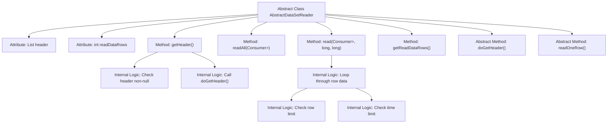

# Basic Information

|      |      |
|------|------|
| Name | AbstractDataSetReader |
| Language | .java |
| Code Path | WeFe/mpc/mpc-psi/mpc-psi-sdk/src/main/java/com/welab/wefe/mpc/psi/sdk/excel/AbstractDataSetReader.java |
| Package Name | com.welab.wefe.mpc.psi.sdk.excel |
| Dependencies | ['java.io.Closeable', 'java.util.LinkedHashMap', 'java.util.List', 'java.util.Map', 'java.util.function.Consumer'] |
| Brief Description | The abstract class AbstractDataSetReader implements the Closeable interface, providing functionality for reading datasets. It includes methods for retrieving headers and reading data rows, with support for row count and time limits. |

# Description

AbstractDataSetReader is an abstract class that implements the Closeable interface for reading datasets. It includes a protected field `header` to store column header information and `readDataRows` to track the number of rows read. The `getHeader` method retrieves column headers, invoking the abstract method `doGetHeader` if headers are not yet loaded. The `readAll` method reads all data rows, processing each row via a Consumer. The `read` method supports limiting the maximum number of rows and reading time, internally calling the abstract method `readOneRow` for row-by-row reading. Subclasses must implement `doGetHeader` and `readOneRow` to define specific data reading logic.

# Class Summary

| Name   | Type  | Description |
|-------|------|-------------|
| AbstractDataSetReader | class | The abstract class AbstractDataSetReader implements the Closeable interface, providing functionality for reading datasets. It includes methods such as retrieving headers and reading data rows, with support for row count and time limits. Subclasses are required to implement the specific reading logic. |


## Class AbstractDataSetReader

|      |      |
|------|------|
| Access Modifier | public abstract |
| Type | class |
| Name | AbstractDataSetReader |
| Description | The abstract class AbstractDataSetReader implements the Closeable interface, providing functionality for reading datasets. It includes methods such as retrieving headers and reading data rows, with support for row count and time limits. Subclasses are required to implement the specific reading logic. |


### UML Class Diagram

```mermaid
classDiagram
    class AbstractDataSetReader {
        <<abstract>>
        -List~String~ header
        -int readDataRows
        +getHeader() List~String~
        +readAll(Consumer~Map~String,Object~~ dataRowConsumer)
        +read(Consumer~Map~String,Object~~ dataRowConsumer, long maxReadRows, long maxReadTimeInMs)
        +getReadDataRows() int
        #doGetHeader() List~String~
        #readOneRow() LinkedHashMap~String,Object~
    }
    AbstractDataSetReader ..|> Closeable : implements

    interface Closeable {
        <<Interface>>
        +close()
    }
```

This code defines an abstract class `AbstractDataSetReader` that implements the `Closeable` interface, primarily used for reading datasets. The class provides functionality to retrieve headers (`getHeader`), read data rows (`readAll` and `read`), and track the number of rows read (`readDataRows`). The methods `doGetHeader` and `readOneRow` are abstract, requiring subclasses to implement specific data reading logic. The class design employs the Template Method pattern, where abstract methods allow subclasses to handle data reading details while the parent class controls the overall reading process. This class supports features for limiting the number of rows read and reading time, making it suitable for processing large-scale datasets.


### Internal Method Call Graph



This flowchart illustrates the structure and method invocation relationships of the AbstractDataSetReader abstract class. The class contains 2 attributes and 5 methods, including 2 abstract methods. Core logic focuses on the data reading process, encompassing header retrieval and row data iteration, where the read method implements dual constraint checks (row count and time). The abstract methods doGetHeader and readOneRow require subclass implementations for specific data source operations.

### Field List

| Name  | Type  | Description |
|-------|-------|------|
| readDataRows = 0 | int | The variable readDataRows records the number of data rows that have been read, and its type is protected integer. |
| header | List<String> | Declare a protected variable named header of type string list. |

### Method List

| Name  | Type  | Description |
|-------|-------|------|
| readAll | void | Define the method `readAll`, which accepts a `Consumer` parameter for processing `Map` data, calls the `read` method with `-1` as the parameter, and may throw an exception. |
| getHeader | List<String> | This method retrieves the header list and returns it directly if it already exists; otherwise, it calls doGetHeader() to fetch the headers. If the operation fails, an exception is thrown; if successful, the result is cached and returned. |
| read | void | The method reads data line by line, passing each line to the consumer for processing. It supports limiting the number of lines read and the time duration, stopping the read operation when the limits are exceeded. |
| getReadDataRows | int | This is a Java method that returns the value of the integer variable readDataRows. |
| doGetHeader | List<String> | Abstract method, returns a list of strings, may throw exceptions. |
| readOneRow | LinkedHashMap<String, Object> | Abstract method readOneRow, returns LinkedHashMap<String, Object>, may throw exceptions. |


