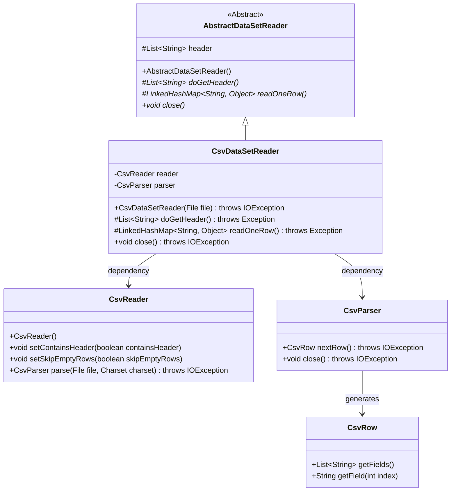
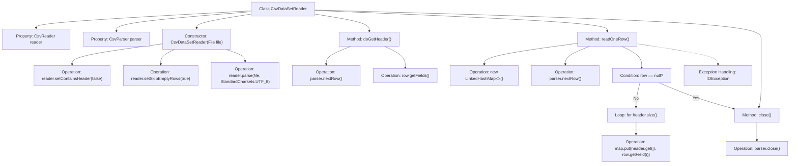

# Basic Information

|      |      |
|------|------|
| Name | CsvDataSetReader |
| Language | .java |
| Code Path | WeFe/mpc/mpc-psi/mpc-psi-sdk/src/main/java/com/welab/wefe/mpc/psi/sdk/excel/CsvDataSetReader.java |
| Package Name | com.welab.wefe.mpc.psi.sdk.excel |
| Dependencies | ['de.siegmar.fastcsv.reader.CsvParser', 'de.siegmar.fastcsv.reader.CsvReader', 'de.siegmar.fastcsv.reader.CsvRow', 'java.io.File', 'java.io.IOException', 'java.nio.charset.StandardCharsets', 'java.util.LinkedHashMap', 'java.util.List'] |
| Brief Description | The CsvDataSetReader class inherits from AbstractDataSetReader, parses CSV files via CsvReader, supports headerless files and skipping empty lines, provides functionality for reading headers and row-by-row data, and finally closes the parser. |

# Description

The `CsvDataSetReader` class inherits from `AbstractDataSetReader` and is used to read data from CSV files. During initialization, it configures the `CsvReader` to exclude headers and skip empty lines, parsing the file using UTF-8 encoding. The `doGetHeader` method retrieves the first row as the header, while the `readOneRow` method reads data line by line and maps it into key-value pairs, with keys being header fields and values being corresponding data. It returns `null` or throws an exception upon completion or error. The `close` method shuts down the parser to release resources.

# Class Summary

| Name   | Type  | Description |
|-------|------|-------------|
| CsvDataSetReader | class | The CsvDataSetReader class inherits from AbstractDataSetReader, parses CSV files via CsvReader, provides functionality for retrieving headers and reading data row by row, and finally closes the parser. |

## Class CsvDataSetReader

|      |      |
|------|------|
| Access Modifier | public |
| Type | class |
| Name | CsvDataSetReader |
| Description | The CsvDataSetReader class inherits from AbstractDataSetReader, parses CSV files via CsvReader, provides functionality for retrieving headers and reading data row by row, and finally closes the parser. |

### UML Class Diagram

Class diagram description: This diagram illustrates the class structure of a CSV dataset reader. CsvDataSetReader inherits from the abstract class AbstractDataSetReader and implements core functionality for reading CSV files. It relies on CsvReader for basic parsing operations and processes data row by row through CsvParser. The CsvRow class encapsulates the logic for accessing single-row data fields. The overall design follows the Template Method pattern, where the parent class defines the algorithm skeleton and child classes implement specific steps.

### Internal Method Call Graph

This flowchart illustrates the structure of the CsvDataSetReader class and its key method invocation relationships. Starting from the constructor initializing the reader and parser, it shows how doGetHeader() reads the CSV file header, readOneRow() processes data row by row, and finally closes the parser via close(). It highlights the null row check, field mapping, and exception handling logic in readOneRow(), demonstrating the complete CSV data reading workflow and error handling mechanism.

### Field List

| Name  | Type  | Description |
|-------|-------|------|
| reader = new CsvReader() | CsvReader | Declare a private CsvReader object named reader and instantiate it. |
| parser | CsvParser | The private member variable `parser`, of type `CsvParser`. |

### Method List

| Name  | Type  | Description |
|-------|-------|------|
| close | void | This method overrides close(), invokes parser.close(), and may throw an IOException. |
| doGetHeader | List<String> | Rewrite the doGetHeader method to retrieve the next line of data from the CSV parser and return a list of fields. |
| readOneRow | LinkedHashMap<String, Object> | This method reads a row of data from a CSV file and converts it into a key-value pair mapping. If the read operation fails or the data ends, it returns null; if successful, it returns a LinkedHashMap containing the header and corresponding values. An error message is thrown in case of exceptions. |

