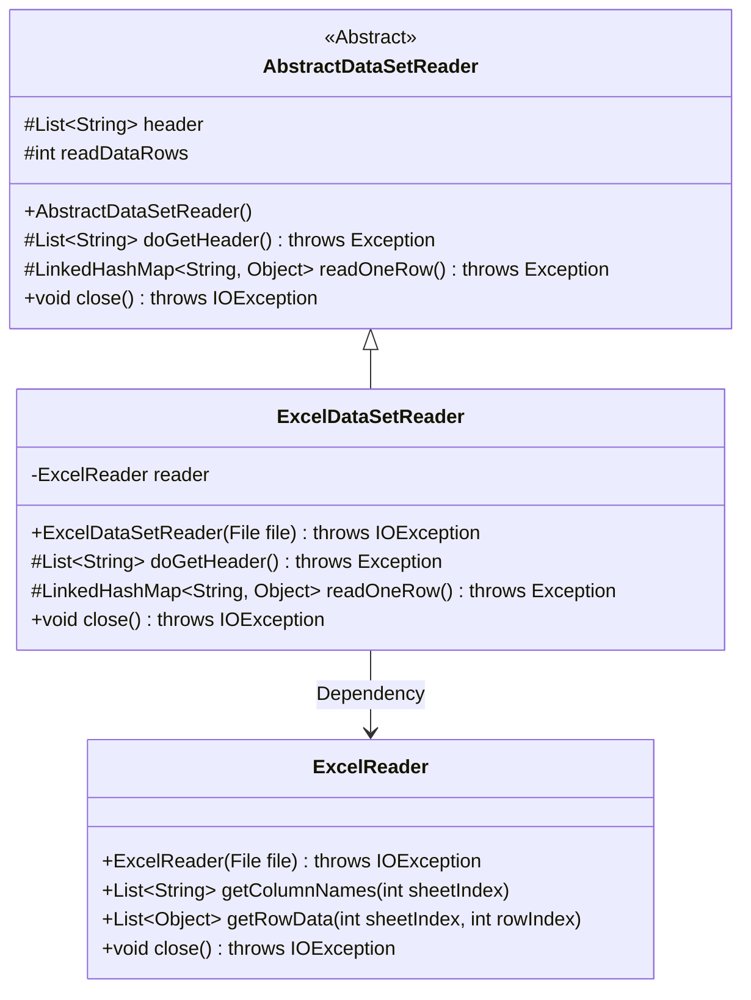
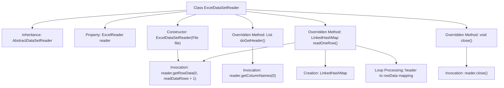

# Basic Information

|      |      |
|------|------|
| Name | ExcelDataSetReader |
| Language | .java |
| Code Path | WeFe/mpc/mpc-psi/mpc-psi-sdk/src/main/java/com/welab/wefe/mpc/psi/sdk/excel/ExcelDataSetReader.java |
| Package Name | com.welab.wefe.mpc.psi.sdk.excel |
| Dependencies | ['java.io.File', 'java.io.IOException', 'java.util.LinkedHashMap', 'java.util.List'] |
| Brief Description | Excel dataset reading class, inherits from an abstract class, reads files via ExcelReader, and provides functionality for retrieving headers, reading data row by row, and closing resources. |

# Description

The ExcelDataSetReader is a class that inherits from AbstractDataSetReader, designed for reading data from Excel files. It processes file input through an ExcelReader instance, providing functionalities such as retrieving headers, reading data row by row, and closing resources. When fetching headers, it reads the column names from the first row. For reading row data, it maps each row's content into key-value pairs corresponding to the headers, filling missing columns with NULL. Finally, resources are released via the close method.

# Class Summary

| Name   | Type  | Description |
|-------|------|-------------|
| ExcelDataSetReader | class | The `ExcelDataSetReader` class inherits from `AbstractDataSetReader`, reads file data via `ExcelReader`, and provides functionalities for retrieving headers, reading data row by row, and closing resources. |

## Class ExcelDataSetReader

|      |      |
|------|------|
| Access Modifier | public |
| Type | class |
| Name | ExcelDataSetReader |
| Description | The `ExcelDataSetReader` class inherits from `AbstractDataSetReader`, reads file data via `ExcelReader`, and provides functionalities for retrieving headers, reading data row by row, and closing resources. |

### UML Class Diagram

This code demonstrates an implementation of an Excel dataset reader. The ExcelDataSetReader inherits from the abstract class AbstractDataSetReader and utilizes ExcelReader to read Excel file contents. Key functionalities include retrieving headers (doGetHeader), reading data row by row (readOneRow), and closing resources (close). The class diagram clearly illustrates the inheritance and dependency relationships, with ExcelDataSetReader as the concrete implementation class relying on ExcelReader for underlying Excel file operations. The abstract base class defines core data structures and abstract methods, while the subclass implements specific Excel file processing logic.

### Internal Method Call Graph

This flowchart illustrates the inheritance relationship and core method invocation chain of the ExcelDataSetReader class. As a subclass of AbstractDataSetReader, it implements Excel file operations through ExcelReader, including constructor initialization and three overridden methods (get headers, read single row data, close resources). The readOneRow() method involves key steps such as data row reading, null value handling, and LinkedHashMap construction. Each method interacts with the underlying ExcelReader through the reader instance, forming a complete Excel data reading workflow.

### Field List

| Name  | Type  | Description |
|-------|-------|------|
| reader | ExcelReader | Private Excel reader instance. |

### Method List

| Name  | Type  | Description |
|-------|-------|------|
| doGetHeader | List<String> | Method override, returns the list of column names from the first row of the table. |
| readOneRow | LinkedHashMap<String, Object> | The method `readOneRow` reads a single row of data. If the data is empty, it returns `null`; otherwise, it maps the data to the table headers as key-value pairs, padding missing fields with `NULL`. |
| close | void | Java method overriding, calling reader.close() to release resources, may throw IOException. |

