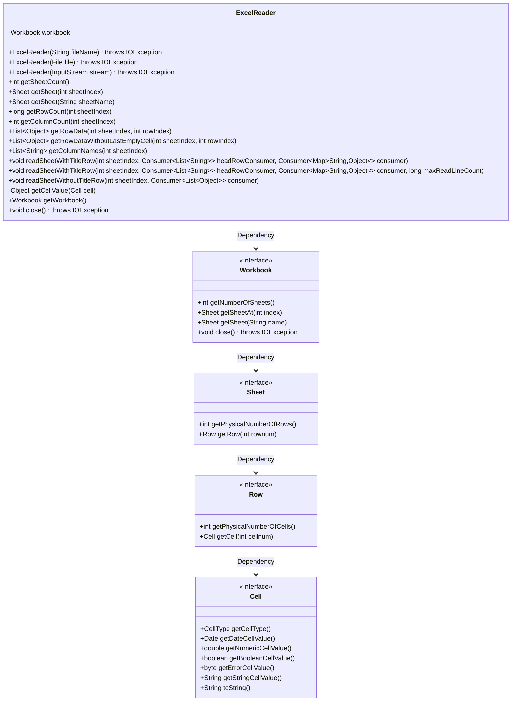
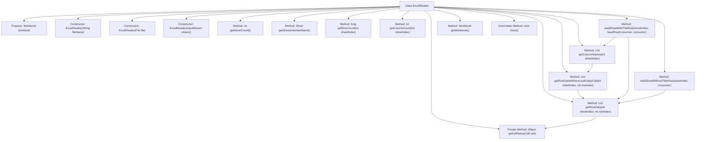
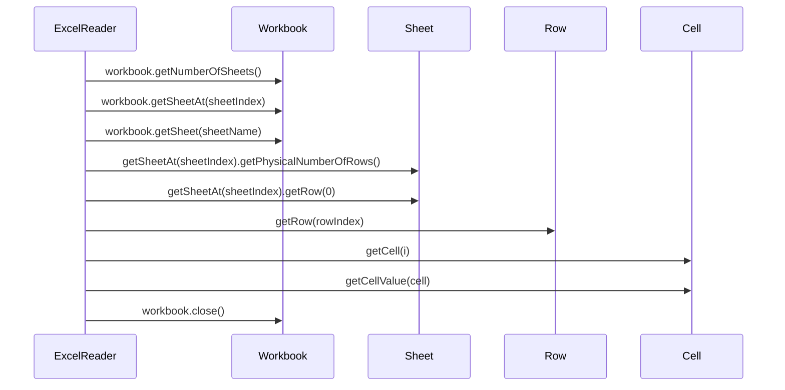

# Basic Information

|      |      |
|------|------|
| Name | ExcelReader |
| Language | .java |
| Code Path | WeFe/mpc/mpc-psi/mpc-psi-sdk/src/main/java/com/welab/wefe/mpc/psi/sdk/excel/ExcelReader.java |
| Package Name | com.welab.wefe.mpc.psi.sdk.excel |
| Dependencies | ['com.alibaba.fastjson.util.TypeUtils', 'org.apache.commons.lang3.StringUtils', 'org.apache.poi.ss.usermodel', 'java.io.Closeable', 'java.io.File', 'java.io.IOException', 'java.io.InputStream', 'java.util.ArrayList', 'java.util.LinkedHashMap', 'java.util.List', 'java.util.Map', 'java.util.function.Consumer', 'java.util.stream.Collectors'] |
| Brief Description | The `ExcelReader` class is designed for reading Excel files, supporting multiple construction methods. It provides functionalities such as obtaining the number of worksheets, rows, columns, and row data. It can handle data traversal with or without header rows and implements the `Closeable` interface to release resources. |

# Description

ExcelReader is a class that implements the Closeable interface, designed for reading data from Excel files. It supports initializing the workbook via a file name, file object, or input stream. Key functionalities include obtaining the number of worksheets, retrieving a specified worksheet, getting row and column counts, reading row data (with support for excluding trailing empty columns), fetching column headers, and iterating through worksheet data with or without headers. The internal method getCellValue handles various cell data types (numeric, date, boolean, string, etc.). The class also provides a method to close the workbook, ensuring resource release.

# Class Summary

| Name   | Type  | Description |
|-------|------|-------------|
| ExcelReader | class | The `ExcelReader` class is designed for reading Excel files and supports initialization from a file, filename, or input stream. It provides functionalities to obtain the number of worksheets, count rows and columns, retrieve row data, and iterate through worksheets. It supports reading with or without header rows and automatically handles empty cells and data type conversion. By implementing the `Closeable` interface, it ensures proper resource release. |

## Class ExcelReader

|      |      |
|------|------|
| Access Modifier | public |
| Type | class |
| Name | ExcelReader |
| Description | The `ExcelReader` class is designed for reading Excel files and supports initialization from a file, filename, or input stream. It provides functionalities to obtain the number of worksheets, count rows and columns, retrieve row data, and iterate through worksheets. It supports reading with or without header rows and automatically handles empty cells and data type conversion. By implementing the `Closeable` interface, it ensures proper resource release. |

### UML Class Diagram

Class Diagram Description: This diagram illustrates the structure of the ExcelReader class and its relationships with relevant interfaces. ExcelReader encapsulates Workbook operations, providing multiple constructors and functionalities for reading Excel data, including retrieving worksheet counts, row counts, column counts, and cell values. Through the hierarchical relationships of Workbook, Sheet, Row, and Cell interfaces, it achieves layered parsing of Excel files. The class diagram clearly marks public/private members and method parameter types, demonstrating the complete data processing workflow.

### Internal Method Call Graph

This flowchart illustrates the complete structure of the ExcelReader class, including 3 constructors, 11 core methods, and 1 private method. The class operates Excel files through Workbook objects, with primary functionalities such as retrieving worksheet count, reading row/column data, processing cell values, and traversing tables with title rows. The sequence diagram highlights the call chain between core methods, such as getRowData() obtaining data through layered calls to Sheet/Row/Cell objects, while close() directly operates Workbook to release resources. The class design supports multiple data sources (file/stream) and flexible data processing approaches (with/without title rows).

### Field List

| Name  | Type  | Description |
|-------|-------|------|
| workbook | Workbook | Private Workbook object. |

### Method List

| Name  | Type  | Description |
|-------|-------|------|
| getRowData | List<Object> | This method extracts data from a specified worksheet row in an Excel workbook and returns a list containing all cell values from that row. Returns null if the row does not exist. |
| getSheet | Sheet | Get the worksheet with the specified name. |
| getSheetCount | int | Get the number of worksheets in the workbook. |
| readSheetWithTitleRow | void | Read data from an Excel sheet, process the header row and each row of data, with support for a maximum row limit. The header row is processed via headRowConsumer, and each row of data is converted into a Map before being processed by the consumer. |
| getRowDataWithoutLastEmptyCell | List<Object> | This method retrieves the specified worksheet row data and removes trailing empty cells, returning the processed list. |
| getSheet | Sheet | Get the worksheet at the specified index and return the Sheet object. |
| readSheetWithTitleRow | void | The method `readSheetWithTitleRow` reads the worksheet at the specified index, processes the header row and data rows, and supports custom row count limits. Parameters include the worksheet index, header row processing function, and data row processing function, with all rows processed by default. |
| getWorkbook | Workbook | Methods to obtain the current workbook object. |
| getColumnNames | List<String> | The method `getColumnNames` retrieves the list of header column names for the specified sheet index, converts the data from the first row into strings, and returns the result after filtering out trailing empty cells. |
| readSheetWithoutTitleRow | void | Read data from the specified worksheet (without header row), process it row by row, and pass it to the consumer. |
| getRowCount | long | Methods to get the row count of a specified worksheet, returning the actual number of rows. |
| getColumnCount | int | This method returns the number of cells in the first row of the specified worksheet index, which is the column count. |
| getCellValue | Object | The method `getCellValue` returns the corresponding value based on the cell type: empty cells return `null`; for formula or numeric types, it checks if the value is a date, otherwise returns an integer or floating-point number; boolean, error, and string types return their respective values; blank cells return `null`; others return the value in string form. |
| close | void | This method overrides close(), invokes workbook.close(), and may throw an IOException. |

