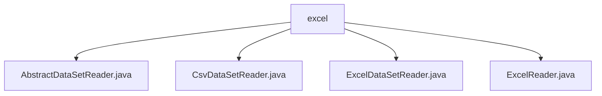

# Basic Information

|      |      |
|------|------|
| Name | excel |
| Language | .java |
| Code Path | WeFe/mpc/mpc-psi/mpc-psi-sdk/src/main/java/com/welab/wefe/mpc/psi/sdk/excel |
| Package Name | docs.mpc.mpc-psi.mpc-psi-sdk.src.main.java.com.welab.wefe.mpc.psi.sdk.excel |
| Brief Description | AbstractDataSetReader is an abstract base class for reading datasets, incorporating column header processing and row reading logic. CsvDataSetReader and ExcelDataSetReader implement CSV and Excel file reading respectively, both inheriting from AbstractDataSetReader. ExcelReader provides Excel file parsing functionality, supporting multiple data formats and resource management. |

# Description

## Overview  
The core responsibility of this module is to provide a unified dataset reading framework that supports parsing files in CSV and Excel formats. It adopts an abstract class + concrete implementation pattern, where `AbstractDataSetReader` defines basic interface specifications (e.g., fetching headers, row-by-row reading), while subclasses `CsvDataSetReader` and `ExcelDataSetReader` implement parsing for their respective formats, resembling the adapter pattern. Key data structures include `header` (storing column headers) and `readDataRows` (recording the number of rows read). External dependencies are limited to file I/O and Excel parsing libraries. For example, `CsvReader` handles CSV encoding, and `ExcelReader` parses cell types.  

## Key Business Scenarios  
The module is suitable for batch data import scenarios, such as data preprocessing before secure multi-party computation. A typical workflow includes: initializing the reader → loading headers → consuming data row by row → releasing resources. The interaction mode uniformly processes row data through `Consumer` callbacks, supporting limits on the number of rows read or processing time. For instance, `ExcelDataSetReader` maps each row to a header-keyed value pair, padding missing columns with NULL. Integration examples include CSV UTF-8 parsing and Excel multi-sheet traversal, both adhering to the "open-read-close" paradigm to ensure resource safety.

### Package Internal Structure View

This flowchart illustrates the structure of the Excel data processing module in the PSI SDK of the WeFe project. The root node "excel" contains four Java files, where AbstractDataSetReader is the abstract base class, CsvDataSetReader and ExcelDataSetReader are concrete implementation classes, and ExcelReader provides basic Excel reading functionality. Together, these classes form the data reading capability of the PSI SDK.

# File List

| Name   | Type  | Description |
|-------|------|-------------|
| [AbstractDataSetReader.java](AbstractDataSetReader.md) | file | The abstract class AbstractDataSetReader implements the Closeable interface, providing functionality for reading datasets. It includes methods for retrieving headers and reading data rows, with support for row count and time limits. |
| [CsvDataSetReader.java](CsvDataSetReader.md) | file | The CsvDataSetReader class inherits from AbstractDataSetReader, parses CSV files via CsvReader, supports headerless mode and skipping empty lines, provides functionality for reading headers and row-by-row data, and finally closes the parser. |
| [ExcelDataSetReader.java](ExcelDataSetReader.md) | file | Excel dataset reading class, inherits from an abstract class, reads files via ExcelReader, and provides functionalities for retrieving headers, reading data row by row, and closing resources. |
| [ExcelReader.java](ExcelReader.md) | file | The ExcelReader class is used to read Excel files, supporting multiple construction methods. It provides functionalities such as obtaining the number of worksheets, rows, columns, and row data, and can handle data traversal with or without header rows. Additionally, it implements the Closeable interface to release resources. |

