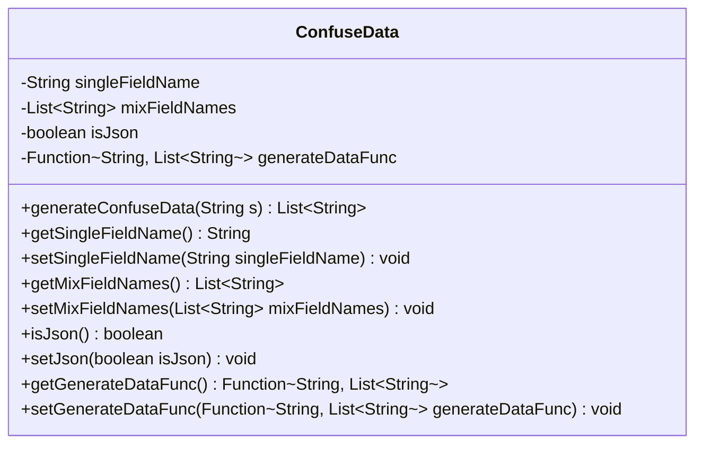

# Basic Information

|      |      |
|------|------|
| Name | ConfuseData |
| Language | .java |
| Code Path | WeFe/mpc/mpc-psi/mpc-psi-sdk/src/main/java/com/welab/wefe/mpc/psi/sdk/model/ConfuseData.java |
| Package Name | com.welab.wefe.mpc.psi.sdk.model |
| Dependencies | ['java.util.ArrayList', 'java.util.List', 'java.util.function.Function'] |
| Brief Description | The ConfuseData class is used to generate obfuscated data, containing field names, JSON identifiers, and generation functions, providing relevant getter and setter methods. |

# Description

The `ConfuseData` class is used to generate obfuscated data and contains four main attributes: `singleFieldName` stores a single field name, `mixFieldNames` stores a list of mixed field names, `isJson` indicates whether the format is JSON, and `generateDataFunc` is the function for generating data. It provides the `generateConfuseData` method, which uses a preset function to generate a list of data based on the input string, returning an empty list if no function is available. The class includes getter and setter methods for each attribute.

# Class Summary

| Name   | Type  | Description |
|-------|------|-------------|
| ConfuseData | class | The ConfuseData class is used to generate obfuscated data, including single field names, mixed field name lists, JSON identifiers, and data generation functions. It provides getter and setter methods. |

## Class ConfuseData

|      |      |
|------|------|
| Access Modifier | public |
| Type | class |
| Name | ConfuseData |
| Description | The ConfuseData class is used to generate obfuscated data, including single field names, mixed field name lists, JSON identifiers, and data generation functions. It provides getter and setter methods. |

### UML Class Diagram

This code defines a class named ConfuseData, primarily used for generating obfuscated data. The class contains four private fields: singleFieldName (String type), mixFieldNames (List of Strings), isJson (boolean type), and generateDataFunc (functional interface). It provides getter and setter methods for these fields, as well as a core method generateConfuseData, which generates a list of obfuscated data through the functional interface based on the input string parameter. The overall design reflects the principles of data encapsulation and functional programming.

### Internal Method Call Graph

```mermaid
graph TD
    A["Class ConfuseData"]
    B["Attribute: String singleFieldName"]
    C["Attribute: List<String> mixFieldNames"]
    D["Attribute: boolean isJson"]
    E["Attribute: Function<String, List<String>> generateDataFunc"]
    F["Method: generateConfuseData(String s)"]
    G["Method: getSingleFieldName()"]
    H["Method: setSingleFieldName(String)"]
    I["Method: getMixFieldNames()"]
    J["Method: setMixFieldNames(List<String>)"]
    K["Method: isJson()"]
    L["Method: setJson(boolean)"]
    M["Method: getGenerateDataFunc()"]
    N["Method: setGenerateDataFunc(Function)"]

    A --> B
    A --> C
    A --> D
    A --> E
    A --> F
    A --> G
    A --> H
    A --> I
    A --> J
    A --> K
    A --> L
    A --> M
    A --> N
```

This flowchart illustrates the structure and functionality of the ConfuseData class. The class contains four private attributes: singleFieldName, mixFieldNames, isJson, and generateDataFunc, which store a single field name, a list of mixed field names, a JSON flag, and a data generation function respectively. The class provides eight public methods, including the main method generateConfuseData for generating confused data, along with getter and setter methods for each attribute. The generateConfuseData method determines whether to call the function to generate data or return an empty list based on whether generateDataFunc is set.

### Field List

| Name  | Type  | Description |
|-------|-------|------|
| singleFieldName | String | Private string type variable singleFieldName. |
| isJson = false | boolean | The variable `isJson` indicates whether the format is JSON, with an initial value of `false`. |
| mixFieldNames = new ArrayList<>() | List<String> | Declare a private string list variable mixFieldNames, initialized as an empty ArrayList. |
| generateDataFunc | Function<String, List<String>> | Define the function variable generateDataFunc, which takes a String as input and outputs a List<String>. |

### Method List

| Name  | Type  | Description |
|-------|-------|------|
| generateConfuseData | List<String> | The method generates obfuscated data based on the input string. If the generation function exists, it is called; otherwise, an empty list is returned. |
| setMixFieldNames | void | Method for setting mixed field name list, which assigns the input parameters to the member variables of the class with the same names. |
| setSingleFieldName | void | Method for setting a single field name, which assigns the input parameter to the class member variable. |
| getMixFieldNames | List<String> | Method to obtain the list of mixed field names, returns the `mixFieldNames` variable. |
| getSingleFieldName | String | Methods for obtaining a single field name, returns the value of the variable singleFieldName. |
| isJson | boolean | The method isJson returns a boolean value isJson, indicating whether it is in JSON format. |
| setJson | void | This is a Java method used to set the value of the boolean member variable `isJson`. The method is named `setJson` and accepts a boolean parameter `isJson`. |
| getGenerateDataFunc | Function<String, List<String>> | The method returns a function that generates data, taking a string as input and outputting a list of strings. |
| setGenerateDataFunc | void | This method is used to set the data generation function, accepting a function that returns a list of strings as a parameter. |

