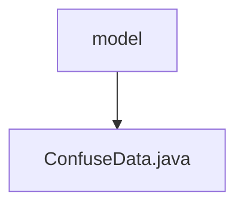

# Basic Information

|      |      |
|------|------|
| Name | model |
| Language | .java |
| Code Path | WeFe/mpc/mpc-psi/mpc-psi-sdk/src/main/java/com/welab/wefe/mpc/psi/sdk/model |
| Package Name | docs.mpc.mpc-psi.mpc-psi-sdk.src.main.java.com.welab.wefe.mpc.psi.sdk.model |
| Brief Description | The ConfuseData class is used to generate obfuscated data, containing field names, JSON identifiers, and generation functions, providing relevant getter and setter methods. |

# Description

The `ConfuseData` class is used to generate obfuscated data and contains four main attributes: `singleFieldName` stores a single field name, `mixFieldNames` stores a list of mixed field names, `isJson` indicates whether the format is JSON, and `generateDataFunc` is the function for generating data. It provides the `generateConfuseData` method, which uses a preset function to generate a list of data based on the input string, returning an empty list if no function is available. The class includes getter and setter methods for each attribute.

### Package Internal Structure View

This flowchart illustrates the hierarchical relationship within the model directory of the PSI SDK in the WeFe project. The root node "model" represents the model directory, which contains a Java file named "ConfuseData.java". This is a simple single-layer structure that describes the positional relationship of the data confusion model within the project.

# File List

| Name   | Type  | Description |
|-------|------|-------------|
| [ConfuseData.java](ConfuseData.md) | file | The ConfuseData class is used to generate obfuscated data, containing field names, JSON identifiers, and generation functions, providing relevant getter and setter methods. |

