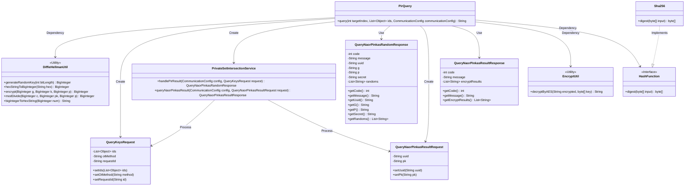

# Basic Information

|      |      |
|------|------|
| Name | PirQuery |
| Language | .java |
| Code Path | WeFe/mpc/mpc-psi/mpc-psi-sdk/src/main/java/com/welab/wefe/mpc/psi/sdk/pir/PirQuery.java |
| Package Name | com.welab.wefe.mpc.psi.sdk.pir |
| Dependencies | ['java.math.BigInteger', 'java.util.List', 'java.util.UUID', 'com.welab.wefe.mpc.commom.Constants', 'com.welab.wefe.mpc.config.CommunicationConfig', 'com.welab.wefe.mpc.pir.protocol.ro.hf.HashFunction', 'com.welab.wefe.mpc.pir.protocol.ro.hf.Sha256', 'com.welab.wefe.mpc.pir.request.QueryKeysRequest', 'com.welab.wefe.mpc.pir.request.naor.QueryNaorPinkasRandomResponse', 'com.welab.wefe.mpc.pir.request.naor.QueryNaorPinkasResultRequest', 'com.welab.wefe.mpc.pir.request.naor.QueryNaorPinkasResultResponse', 'com.welab.wefe.mpc.psi.sdk.service.PrivateSetIntersectionService', 'com.welab.wefe.mpc.util.DiffieHellmanUtil', 'com.welab.wefe.mpc.util.EncryptUtil'] |
| Brief Description | The PirQuery class implements private information retrieval using the NaorPinkas OT method, generating random keys to process query requests and employing Diffie-Hellman encryption along with AES decryption to return the target index result. |

# Description

The `query` method in the `PirQuery` class implements private information retrieval functionality based on the Naor-Pinkas oblivious transfer protocol. This method takes the target index, a list of IDs, and communication configuration parameters as input. It first generates a random key `k`, constructs a random query request, and retrieves the response. After validating the response, it extracts the UUID, Diffie-Hellman parameters `g`, `p`, and `secret`. It then computes the public key `pk`, processes the parameters related to the target index, and constructs the result query request. Upon receiving the response, it uses SHA256 hashing and AES decryption to ultimately return the decrypted result corresponding to the target index. The entire process involves Diffie-Hellman key exchange, hash computation, and symmetric encryption operations.

# Class Summary

| Name   | Type  | Description |
|-------|------|-------------|
| PirQuery | class | The PirQuery class implements private information retrieval functionality, securely querying target index data through Diffie-Hellman key exchange and AES encryption. It includes steps such as random request generation, key computation, and result decryption. |

## Class PirQuery

|      |      |
|------|------|
| Access Modifier | public |
| Type | class |
| Name | PirQuery |
| Description | The PirQuery class implements private information retrieval functionality, securely querying target index data through Diffie-Hellman key exchange and AES encryption. It includes steps such as random request generation, key computation, and result decryption. |

### UML Class Diagram

This code demonstrates the implementation flow of a Private Information Retrieval (PIR) query, primarily involving Diffie-Hellman key exchange, Naor-Pinkas oblivious transfer protocol, and AES encryption/decryption processes. The core class PirQuery coordinates multiple utility and service classes to complete secure queries, including key generation, encryption computation, request handling, and result decryption. The class diagram clearly illustrates dependencies between components, particularly interactions between encryption utility classes and service classes, as well as the inheritance relationship between the HashFunction interface and its implementation class Sha256. The overall design reflects a modular secure computation workflow.

### Internal Method Call Graph

This flowchart illustrates the complete PIR query process: First, generate a random key and create an initial request, then validate the status code after obtaining the response via the service. If successful, parse the parameters and calculate the encrypted value, adjust parameters based on the target index, and initiate the final query request. Finally, generate an AES key to decrypt the result at the specified index. The entire process involves two service calls and multiple encryption operations, rigorously handling error conditions and conditional branches.

### Field List

| Name  | Type  | Description |
|-------|-------|------|

### Method List

| Name  | Type  | Description |
|-------|-------|------|
| query | String | This method queries the target index data through the Naor-Pinkas oblivious transfer protocol, generates a random key to process the request, and decrypts the returned result after verifying the response. |

