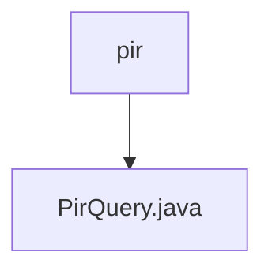

# Basic Information

|      |      |
|------|------|
| Name | pir |
| Language | .java |
| Code Path | WeFe/mpc/mpc-psi/mpc-psi-sdk/src/main/java/com/welab/wefe/mpc/psi/sdk/pir |
| Package Name | docs.mpc.mpc-psi.mpc-psi-sdk.src.main.java.com.welab.wefe.mpc.psi.sdk.pir |
| Brief Description | The PirQuery class implements private information retrieval using the Naor-Pinkas OT method, generating random keys to process query requests, and employs Diffie-Hellman encryption along with AES decryption to return the target index result. |

# Description

The `query` method in the `PirQuery` class implements private information retrieval based on the Naor-Pinkas oblivious transfer protocol. This method takes the target index, a list of IDs, and communication configuration parameters as input. It first generates a random key `k`, constructs a random query request, and retrieves the response. After validating the response, it extracts the UUID, Diffie-Hellman parameters `g`, `p`, and `secret`. It then computes the public key `pk`, processes the parameters related to the target index, and constructs the final query request. Upon receiving the response, it uses SHA256 hashing and AES decryption to ultimately return the decrypted result corresponding to the target index. The entire process involves Diffie-Hellman key exchange, hash computation, and symmetric encryption operations.

### Package Internal Structure View

This flowchart illustrates the simple structure of the PIR (Private Information Retrieval) module in the mpc-psi-sdk project. The root node "pir" represents the final directory in the path, which contains a Java file "PirQuery.java". This file is likely the core class implementing PIR query functionality. Such a concise structure suggests that the module is functionally focused, potentially designed for privacy-preserving data query operations.

# File List

| Name   | Type  | Description |
|-------|------|-------------|
| [PirQuery.java](PirQuery.md) | file | The PirQuery class implements private information retrieval using the Naor-Pinkas OT method, generating random keys to process query requests, and employs Diffie-Hellman encryption along with AES decryption to return the target index results. |

