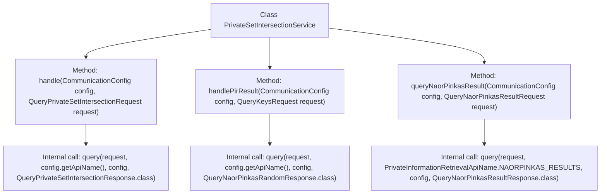

# Basic Information

|      |      |
|------|------|
| Name | PrivateSetIntersectionService |
| Language | .java |
| Code Path | WeFe/mpc/mpc-psi/mpc-psi-sdk/src/main/java/com/welab/wefe/mpc/psi/sdk/service/PrivateSetIntersectionService.java |
| Package Name | com.welab.wefe.mpc.psi.sdk.service |
| Dependencies | ['com.welab.wefe.mpc.config.CommunicationConfig', 'com.welab.wefe.mpc.pir.PrivateInformationRetrievalApiName', 'com.welab.wefe.mpc.pir.request.QueryKeysRequest', 'com.welab.wefe.mpc.pir.request.naor.QueryNaorPinkasRandomResponse', 'com.welab.wefe.mpc.pir.request.naor.QueryNaorPinkasResultRequest', 'com.welab.wefe.mpc.pir.request.naor.QueryNaorPinkasResultResponse', 'com.welab.wefe.mpc.psi.request.QueryPrivateSetIntersectionRequest', 'com.welab.wefe.mpc.psi.request.QueryPrivateSetIntersectionResponse', 'com.welab.wefe.mpc.trasfer.AbstractHttpTransferVariable'] |
| Brief Description | The PrivateSetIntersectionService class provides private set intersection query, PIR result processing, and NaorPinkas result query functionalities. It invokes the query method based on configuration and request parameters to return responses. |

# Description

The `PrivateSetIntersectionService` class inherits from `AbstractHttpTransferVariable` and provides private set intersection query services. It includes three methods: `handle` processes private set intersection query requests and returns a `QueryPrivateSetIntersectionResponse`; `handlePirResult` processes PIR result query requests and returns a `QueryNaorPinkasRandomResponse`; `queryNaorPinkasResult` queries Naor-Pinkas algorithm results and returns a `QueryNaorPinkasResultResponse`. All methods implement query functionality based on the `CommunicationConfig` configuration and corresponding request objects.

# Class Summary

| Name   | Type  | Description |
|-------|------|-------------|
| PrivateSetIntersectionService | class | The PrivateSetIntersectionService class handles private set intersection queries and Naor-Pinkas random queries, providing three methods to process different requests and return corresponding results. |

## Class PrivateSetIntersectionService

|      |      |
|------|------|
| Access Modifier | public |
| Type | class |
| Name | PrivateSetIntersectionService |
| Description | The PrivateSetIntersectionService class handles private set intersection queries and Naor-Pinkas random queries, providing three methods to process different requests and return corresponding results. |

### UML Class Diagram

```mermaid
classDiagram
    class AbstractHttpTransferVariable {
        <<Abstract>>
    }
    class PrivateSetIntersectionService {
        +QueryPrivateSetIntersectionResponse handle(CommunicationConfig config, QueryPrivateSetIntersectionRequest request)
        +QueryNaorPinkasRandomResponse handlePirResult(CommunicationConfig config, QueryKeysRequest request)
        +QueryNaorPinkasResultResponse queryNaorPinkasResult(CommunicationConfig config, QueryNaorPinkasResultRequest request)
    }
    class CommunicationConfig {
        +String getApiName()
    }
    class QueryPrivateSetIntersectionRequest
    class QueryPrivateSetIntersectionResponse
    class QueryKeysRequest
    class QueryNaorPinkasRandomResponse
    class QueryNaorPinkasResultRequest
    class QueryNaorPinkasResultResponse
    class PrivateInformationRetrievalApiName {
        <<Enumeration>>
        NAORPINKAS_RESULTS
    }

    PrivateSetIntersectionService --|> AbstractHttpTransferVariable : Inheritance
    PrivateSetIntersectionService --> CommunicationConfig : Dependency
    PrivateSetIntersectionService --> QueryPrivateSetIntersectionRequest : Dependency
    PrivateSetIntersectionService --> QueryPrivateSetIntersectionResponse : Dependency
    PrivateSetIntersectionService --> QueryKeysRequest : Dependency
    PrivateSetIntersectionService --> QueryNaorPinkasRandomResponse : Dependency
    PrivateSetIntersectionService --> QueryNaorPinkasResultRequest : Dependency
    PrivateSetIntersectionService --> QueryNaorPinkasResultResponse : Dependency
    PrivateSetIntersectionService --> PrivateInformationRetrievalApiName : Dependency
```

This code demonstrates a private set intersection service class that inherits from an abstract HTTP transfer variable class, providing three distinct query processing methods. The class utilizes CommunicationConfig to retrieve API configurations, handles different types of requests, and returns corresponding response objects including standard set intersection queries, PIR result queries, and Naor-Pinkas algorithm result queries. The design reflects support for multiple private information retrieval protocols through a generalized query method that enables unified request processing.

### Internal Method Call Graph

This flowchart illustrates the three main methods of the PrivateSetIntersectionService class and their internal call relationships. Each public method (handle, handlePirResult, queryNaorPinkasResult) invokes the underlying query method but with different parameter types and return types. The queryNaorPinkasResult method uses a specific API name constant NAORPINKAS_RESULTS, while the other two methods obtain the API name through the config object. All methods follow a similar invocation pattern, demonstrating code reusability and consistency.

### Field List

| Name  | Type  | Description |
|-------|-------|------|

### Method List

| Name  | Type  | Description |
|-------|-------|------|
| handlePirResult | QueryNaorPinkasRandomResponse | Methods for processing PIR query results, which receive configurations and request parameters, invoke the query interface, and return randomized responses. |
| handle | QueryPrivateSetIntersectionResponse | Process the private set intersection query request and return the response. Call the query method, passing in the request, API name, configuration, and response class. |
| queryNaorPinkasResult | QueryNaorPinkasResultResponse | This method queries the NaorPinkas result by given configuration and request parameters, and returns the query response. |

