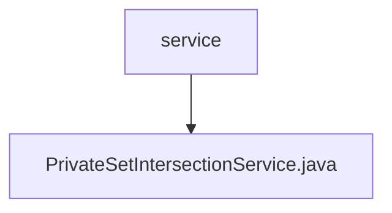

# Basic Information

|      |      |
|------|------|
| Name | service |
| Language | .java |
| Code Path | WeFe/mpc/mpc-psi/mpc-psi-sdk/src/main/java/com/welab/wefe/mpc/psi/sdk/service |
| Package Name | docs.mpc.mpc-psi.mpc-psi-sdk.src.main.java.com.welab.wefe.mpc.psi.sdk.service |
| Brief Description | The PrivateSetIntersectionService class provides private set intersection query, PIR result processing, and NaorPinkas result query functionalities. It invokes the query method based on configuration and request parameters to return responses. |

# Description

The `PrivateSetIntersectionService` class inherits from `AbstractHttpTransferVariable` and provides private set intersection query services. It includes three methods: `handle` processes private set intersection query requests and returns a `QueryPrivateSetIntersectionResponse`; `handlePirResult` processes PIR result query requests and returns a `QueryNaorPinkasRandomResponse`; `queryNaorPinkasResult` queries the Naor-Pinkas algorithm results and returns a `QueryNaorPinkasResultResponse`. All methods implement query functionality based on the `CommunicationConfig` configuration and corresponding request objects.

### Package Internal Structure View

This flowchart illustrates the hierarchical relationship between the service directory and the PrivateSetIntersectionService.java file in the mpc-psi-sdk project. The service node, as the parent, contains a specific implementation file PrivateSetIntersectionService.java, reflecting the core service interface implementation structure within the PSI (Private Set Intersection) SDK.

# File List

| Name   | Type  | Description |
|-------|------|-------------|
| [PrivateSetIntersectionService.java](PrivateSetIntersectionService.md) | file | The PrivateSetIntersectionService class provides private set intersection query, PIR result processing, and NaorPinkas result query functionalities. It invokes the query method based on configuration and request parameters to return responses. |

