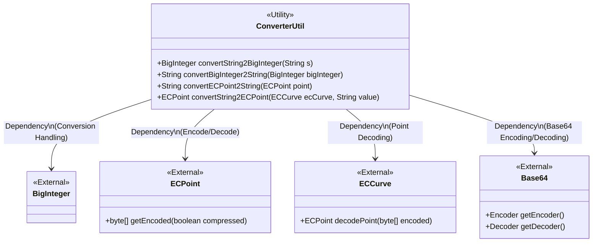
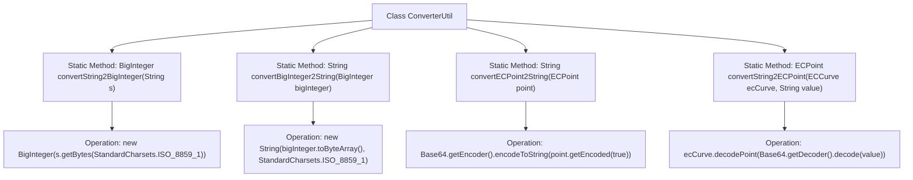

# Basic Information

|      |      |
|------|------|
| Name | ConverterUtil |
| Language | .java |
| Code Path | WeFe/mpc/mpc-psi/mpc-psi-sdk/src/main/java/com/welab/wefe/mpc/psi/sdk/util/ConverterUtil.java |
| Package Name | com.welab.wefe.mpc.psi.sdk.util |
| Dependencies | ['java.math.BigInteger', 'java.nio.charset.StandardCharsets', 'java.util.Base64', 'org.bouncycastle.math.ec.ECCurve', 'org.bouncycastle.math.ec.ECPoint'] |
| Brief Description | The ConverterUtil class provides conversion methods between strings and BigInteger, ECPoint, using ISO_8859_1 encoding and Base64 encoding/decoding. |

# Description

The `ConverterUtil` class provides four static methods for data type conversion. It includes methods for bidirectional conversion between strings and `BigInteger`: `convertString2BigInteger` converts a string to `BigInteger` using ISO-8859-1 encoding, while `convertBigInteger2String` performs the reverse operation. Additionally, it offers methods for converting between elliptic curve points and strings: `convertECPoint2String` encodes an `ECPoint` object into a Base64 string, whereas `convertString2ECPoint` reconstructs an `ECPoint` object by decoding a Base64 string, requiring an `ECCurve` parameter as input. Comments indicate that using ISO-8859-1 encoding as an alternative to Base64 was previously considered.

# Class Summary

| Name   | Type  | Description |
|-------|------|-------------|
| ConverterUtil | class | The ConverterUtil class provides methods for mutual conversion between strings and BigInteger or ECPoint, using ISO_8859_1 encoding and Base64 encoding/decoding. |

## Class ConverterUtil

|      |      |
|------|------|
| Access Modifier | public |
| Type | class |
| Name | ConverterUtil |
| Description | The ConverterUtil class provides methods for mutual conversion between strings and BigInteger or ECPoint, using ISO_8859_1 encoding and Base64 encoding/decoding. |

### UML Class Diagram

This diagram illustrates the relationships between the ConverterUtil utility class and external classes, featuring four static methods for bidirectional conversion between String and BigInteger/ECPoint. Key dependencies include BigInteger's byte processing, ECPoint's compressed encoding, ECCurve's decoding capability, and Base64's encoding/decoding support. All methods employ ISO_8859_1 charset and Base64 standard for data transformation.

### Internal Method Call Graph

This code flowchart illustrates the invocation relationships between four core static methods of the ConverterUtil utility class. The class specializes in conversions between different data types, including bidirectional transformations of String-BigInteger and ECPoint-Base64 strings. Each method implements data format conversion through specific encoding processing (ISO_8859_1 charset or Base64), with ECPoint-related methods additionally involving elliptic curve cryptography point encoding/decoding operations. The flowchart clearly presents the key operational steps within each method and their data flow paths.

### Field List

| Name  | Type  | Description |
|-------|-------|------|

### Method List

| Name  | Type  | Description |
|-------|-------|------|
| convertString2BigInteger | BigInteger | Convert the string into a byte array using ISO-8859-1 encoding and then create a BigInteger object. |
| convertBigInteger2String | String | Convert a BigInteger to an ISO-8859-1 encoded string via a byte array. |
| convertECPoint2String | String | Convert an elliptic curve point to a Base64-encoded string, output in compressed format. |
| convertString2ECPoint | ECPoint | The method converts the string into an elliptic curve point by decoding it with Base64 and then generating an ECPoint object through ECCurve decoding. |

