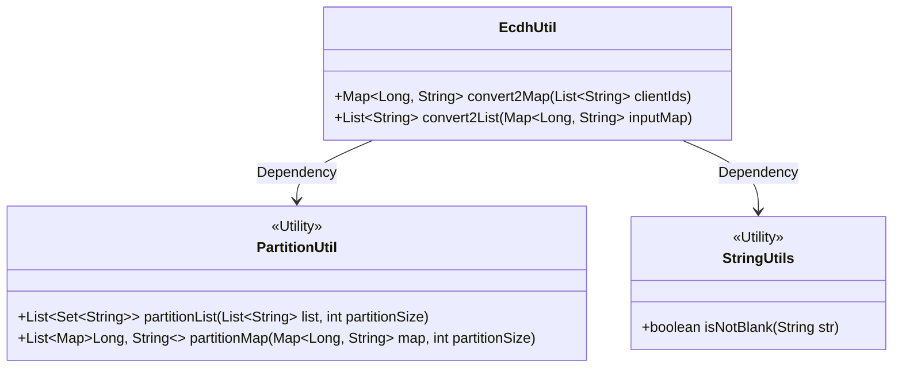
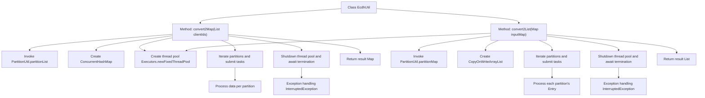

# Basic Information

|      |      |
|------|------|
| Name | EcdhUtil |
| Language | .java |
| Code Path | WeFe/mpc/mpc-psi/mpc-psi-sdk/src/main/java/com/welab/wefe/mpc/psi/sdk/util/EcdhUtil.java |
| Package Name | com.welab.wefe.mpc.psi.sdk.util |
| Dependencies | ['java.util.List', 'java.util.Map', 'java.util.Set', 'java.util.concurrent.ConcurrentHashMap', 'java.util.concurrent.CopyOnWriteArrayList', 'java.util.concurrent.ExecutorService', 'java.util.concurrent.Executors', 'java.util.concurrent.TimeUnit', 'org.apache.commons.lang3.StringUtils'] |
| Brief Description | The EcdhUtil class provides two multithreaded methods: convert2Map converts a list of strings containing # separators into key-value pair mappings, and convert2List converts key-value pair mappings into a list of strings concatenated with #. Both methods utilize partitioning and thread pools to enhance processing efficiency. |

# Description

The EcdhUtil class provides two static methods for data conversion. The convert2Map method converts a list containing strings of a specific format into key-value pair mappings, utilizing multithreading to process partitioned data. The convert2List method transforms key-value pair mappings into a list of strings in a specific format, also employing multithreaded partitioned processing. Both methods use a fixed thread pool, ensure thread pool shutdown upon task completion, and set a 10-minute timeout wait. During conversion, string validity is checked, and data containing delimiters is processed.

# Class Summary

| Name   | Type  | Description |
|-------|------|-------------|
| EcdhUtil | class | The EcdhUtil class provides two methods: convert2Map converts a list of strings containing # separators into key-value pair mappings, and convert2List converts the mappings back into a list of strings. Both methods use multi-threaded partitioning to improve efficiency. |

## Class EcdhUtil

|      |      |
|------|------|
| Access Modifier | public |
| Type | class |
| Name | EcdhUtil |
| Description | The EcdhUtil class provides two methods: convert2Map converts a list of strings containing # separators into key-value pair mappings, and convert2List converts the mappings back into a list of strings. Both methods use multi-threaded partitioning to improve efficiency. |

### UML Class Diagram

This code demonstrates a utility class EcdhUtil, which provides two main methods: convert2Map and convert2List, used for converting between List<String> and Map<Long, String>. Both methods employ multithreading to enhance performance by utilizing PartitionUtil to divide the input data into multiple partitions, then processing each partition in parallel using a thread pool. The code employs ConcurrentHashMap and CopyOnWriteArrayList to ensure thread safety and properly handles thread pool shutdown and exception scenarios. The overall design reflects characteristics of efficiency, thread safety, and fault tolerance.

### Internal Method Call Graph

This flowchart illustrates two core methods of the EcdhUtil class: convert2Map and convert2List. Both methods adopt a multi-threaded partitioned processing pattern, using PartitionUtil to split input data into multiple partitions, creating a thread pool for parallel processing of each partition, and finally merging results. convert2Map transforms a list containing specially formatted strings into a Map, while convert2List performs the reverse operation. Both methods include graceful thread pool shutdown mechanisms and exception handling to ensure resource release and task completion.

### Field List

| Name  | Type  | Description |
|-------|-------|------|

### Method List

| Name  | Type  | Description |
|-------|-------|------|
| convert2List | List<String> | Split the Map into shards and convert them to a List in the format key#value using multithreading, then process with a thread pool and wait for completion. |
| convert2Map | Map<Long, String> | Process the list of strings in parallel with 4 partitions, extract key-value pairs separated by # and convert them into a Map, where the key is the first segment converted to Long after splitting, and the value is the second segment, using a thread pool to ensure efficient processing. |

