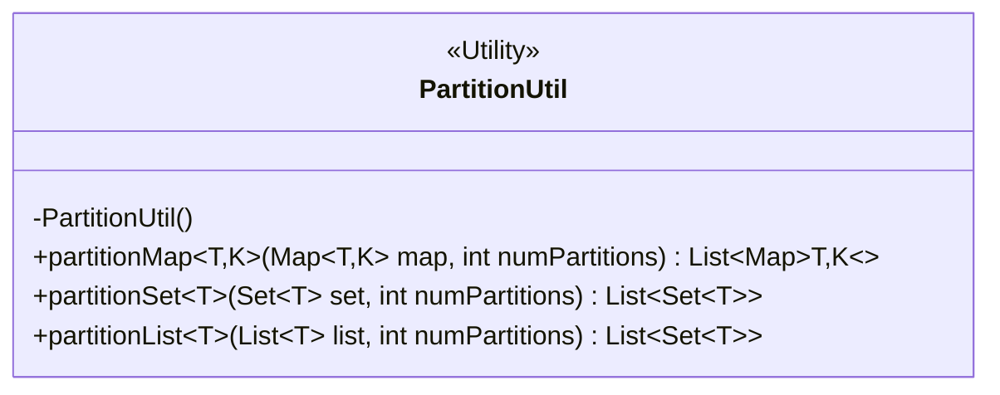
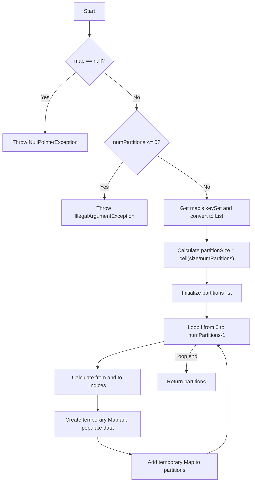
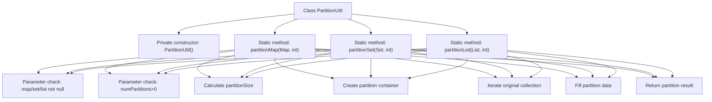

# Basic Information

|      |      |
|------|------|
| Name | PartitionUtil |
| Language | .java |
| Code Path | WeFe/mpc/mpc-psi/mpc-psi-sdk/src/main/java/com/welab/wefe/mpc/psi/sdk/util/PartitionUtil.java |
| Package Name | com.welab.wefe.mpc.psi.sdk.util |
| Dependencies | ['java.util'] |
| Brief Description | The `PartitionUtil` class provides static methods to evenly partition Maps, Sets, or Lists into a specified number of shards, supporting null checks and illegal parameter validation. |

# Description

PartitionUtil is a utility class that provides three partitioning methods: partitionMap splits a Map into multiple sub-Maps based on the specified number of partitions; partitionSet evenly distributes a Set into a specified number of sub-Sets; partitionList evenly distributes a List into a specified number of sub-Sets. All methods verify that the input is non-null and the partition count is greater than 0, achieving uniform partitioning by calculating the partition size and iteratively assigning elements.

# Class Summary

| Name   | Type  | Description |
|-------|------|-------------|
| PartitionUtil | class | The `PartitionUtil` class provides three static methods to evenly partition a `Map`, `Set`, or `List` into a specified number of partitions. The partition count must be greater than 0, and the input cannot be null. |

## Class PartitionUtil

|      |      |
|------|------|
| Access Modifier | public |
| Type | class |
| Name | PartitionUtil |
| Description | The `PartitionUtil` class provides three static methods to evenly partition a `Map`, `Set`, or `List` into a specified number of partitions. The partition count must be greater than 0, and the input cannot be null. |

### UML Class Diagram

PartitionUtil is a utility class that provides static methods for partitioning Maps, Sets, or Lists into a specified number of sub-collections. The class contains three generic methods: partitionMap splits a Map by keys, while partitionSet and partitionList evenly distribute Sets and Lists respectively. All methods validate input parameters and throw exceptions for illegal arguments. The partitioning algorithm employs an equal distribution strategy, calculating each partition's size and iteratively populating data.

### Internal Method Call Graph

This code implements partitioning functionality for three collection types (Map/Set/List), evenly dividing large collections into multiple sub-collections using the numPartitions parameter. Each method includes parameter validation, partition size calculation, partition container initialization, data iteration and filling steps. The flowchart illustrates the class structure and common processing logic between methods, showing that all three partitioning methods follow similar processing flows, differing only in their input collection types.

### Field List

| Name  | Type  | Description |
|-------|-------|------|

### Method List

| Name  | Type  | Description |
|-------|-------|------|
| partitionSet | List<Set<T>> | Split the set evenly into a specified number of subsets, check for null values and partition count validity, and return the subset list. |
| partitionMap | List<Map<T, K>> | The static method `partitionMap` splits the input Map into multiple sub-Maps based on the specified number of partitions. After validating non-null input and partition count effectiveness, it evenly distributes key-value pairs to each partition and returns a list. |
| partitionList | List<Set<T>> | Split the list into multiple collections based on the specified number of partitions, ensuring each collection is as evenly sized as possible. Validate the input—throw an exception for an empty list or a non-positive partition count. |

