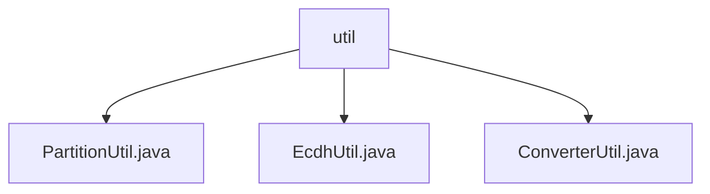

# Basic Information

|      |      |
|------|------|
| Name | util |
| Language | .java |
| Code Path | WeFe/mpc/mpc-psi/mpc-psi-sdk/src/main/java/com/welab/wefe/mpc/psi/sdk/util |
| Package Name | docs.mpc.mpc-psi.mpc-psi-sdk.src.main.java.com.welab.wefe.mpc.psi.sdk.util |
| Brief Description | PartitionUtil provides sharding methods for Map/Set/List. EcdhUtil offers data format conversion methods with support for multithreaded processing. ConverterUtil enables bidirectional conversion between strings and BigInteger/ECPoint. |

# Description

## Overview  
This module serves as the core toolkit of the MPC-PSI SDK, providing functionalities for data partitioning, format conversion, and encrypted data type processing. The interface specifications include three categories: partitioning methods (e.g., `partitionMap`), data conversion methods (e.g., `convert2Map`), and encrypted data type interconversion methods (e.g., `convertECPoint2String`). Key data structures involve Map/Set/List partitioning, key-value pair mapping, and elliptic curve points (ECPoint). External dependencies include Java thread pools, Base64 encoding/decoding, and elliptic curve cryptography libraries. For instance, `PartitionUtil` implements uniform partitioning, `EcdhUtil` handles key-value pair conversion, and `ConverterUtil` supports conversions between BigInteger and ECPoint.  

## Primary Business Scenarios  
The module primarily supports data preprocessing in secure multi-party computation scenarios. The complete workflow includes data partitioning → format conversion → encryption processing, resembling a pipeline model. For example, data is first partitioned via `partitionList`, then converted using `convert2Map`, and finally transformed into ECPoint for encrypted computation. A typical interaction pattern involves multi-threaded partitioned processing, such as `EcdhUtil` leveraging a fixed thread pool to accelerate conversions. The API covers set operations (partitioning), data serialization (Base64), and cryptographic type conversion (ECPoint), forming a comprehensive data preparation chain.

### Package Internal Structure View

This flowchart illustrates the hierarchy of utility classes in the mpc-psi-sdk module of the WeFe project. The root node "util" encompasses three utility class files: PartitionUtil.java handles data partitioning, EcdhUtil.java implements the ECDH encryption algorithm, and ConverterUtil.java provides data conversion functionality. These utility classes collectively support the core implementation of the MPC-PSI-SDK.

# File List

| Name   | Type  | Description |
|-------|------|-------------|
| [PartitionUtil.java](PartitionUtil.md) | file | The `PartitionUtil` class provides static methods to evenly partition Maps, Sets, or Lists into a specified number of partitions, supporting null checks and illegal parameter validation. |
| [EcdhUtil.java](EcdhUtil.md) | file | The EcdhUtil class provides two multithreaded methods: convert2Map converts a list of strings containing # separators into key-value pair mappings, and convert2List converts key-value pair mappings into a list of strings concatenated with #. Both methods utilize partitioning and thread pools to enhance processing efficiency. |
| [ConverterUtil.java](ConverterUtil.md) | file | The ConverterUtil class provides conversion methods between strings and BigInteger, ECPoint, using ISO_8859_1 encoding and Base64 encoding/decoding. |

