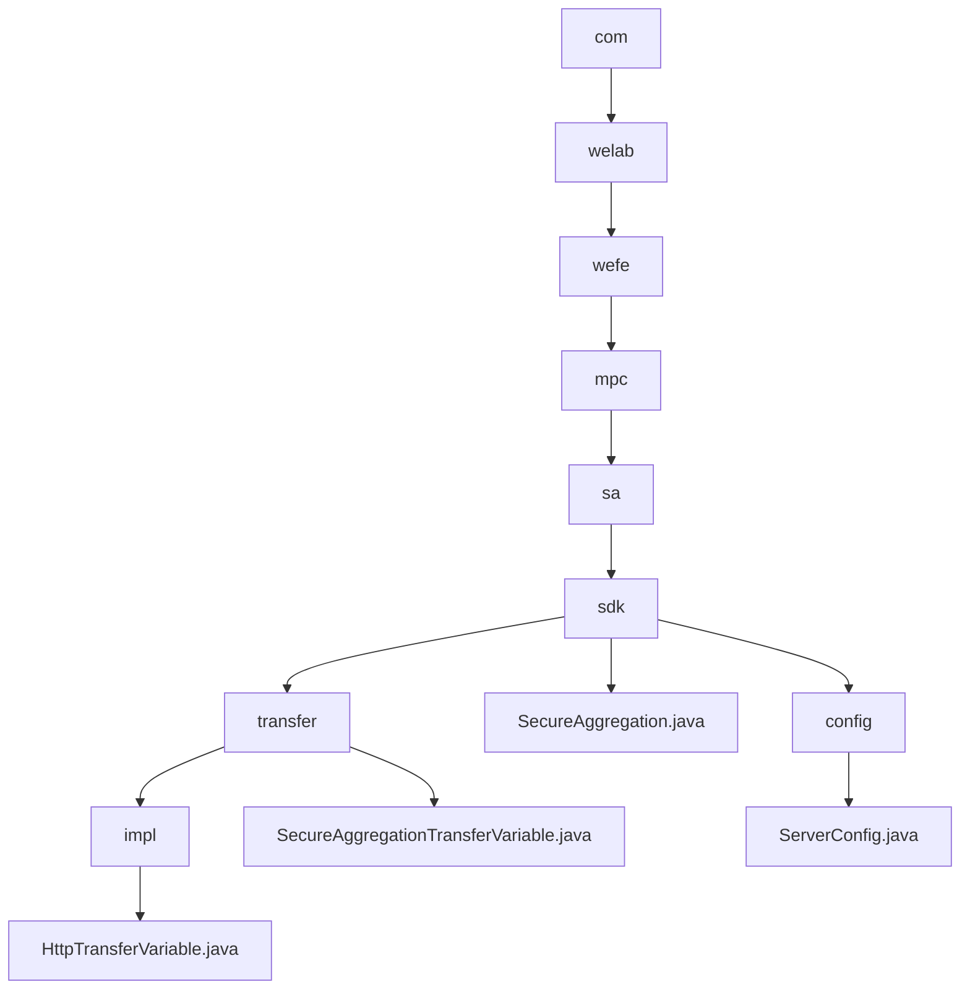

# Basic Information

|      |      |
|------|------|
| Name | com |
| Language | .java |
| Code Path | WeFe/mpc/mpc-sa/mpc-sa-sdk/src/main/java/com |
| Package Name | docs.mpc.mpc-sa.mpc-sa-sdk.src.main.java.com |
| Brief Description | This module enables secure data transmission via the HTTP protocol, supporting Diffie-Hellman key exchange and result queries, making it suitable for scenarios such as federated learning. Core interfaces include key negotiation and result retrieval, which rely on HTTP server configuration. |

# Description

## Overview  
This module implements privacy-preserving data transmission in secure multi-party computation, ensuring communication security through Diffie-Hellman key exchange and HTTP aggregated queries. The unified interface includes `queryDiffieHellmanKey` (key negotiation) and `queryResult` (result retrieval), adopting an RPC-like request-response pattern. Core data structures are `QueryDiffieHellmanKeyRequest/Response` and `QuerySAResultRequest/Response`, with external dependencies limited to HTTP server configuration (e.g., `ServerConfig`). For instance, the `SecureAggregation` class implements secure aggregation via UUID and key management, while `ServerConfig` defines parameters such as service URLs and operation types.  

## Key Business Scenarios  
The typical workflow consists of two phases: first negotiating keys via the Diffie-Hellman protocol, then initiating obfuscated result queries. Interactions employ synchronous HTTP calls, such as the client requesting a public key followed by the server's response. The functionality fully supports scenarios like federated learning, with the `SecureAggregation` class demonstrating a complete implementation: iterating through server configurations to initiate key requests, then collecting and accumulating computation results for return. The API provides query-oriented interfaces, supporting ADD/SUB operations and weight configuration, with exception handling ensuring reliability.

### Package Internal Structure View

This flowchart illustrates the complete hierarchical path from com to ServerConfig.java, comprising a total of 11 nodes. The path starts from the top-level com and progressively delves into directories such as welab, wefe, mpc, sa, ultimately reaching specific Java file nodes. The diagram clearly presents the three branches under the sdk directory: transfer, SecureAggregation.java, and config, along with their respective child node relationships.

# File List

| Name   | Type  | Description |
|-------|------|-------------|
| [welab](welab/_module.md) | package | This module enables secure data transmission via the HTTP protocol, supporting Diffie-Hellman key exchange and result queries, making it suitable for scenarios such as federated learning. Core interfaces include key negotiation and result retrieval, dependent on HTTP server configuration. |

