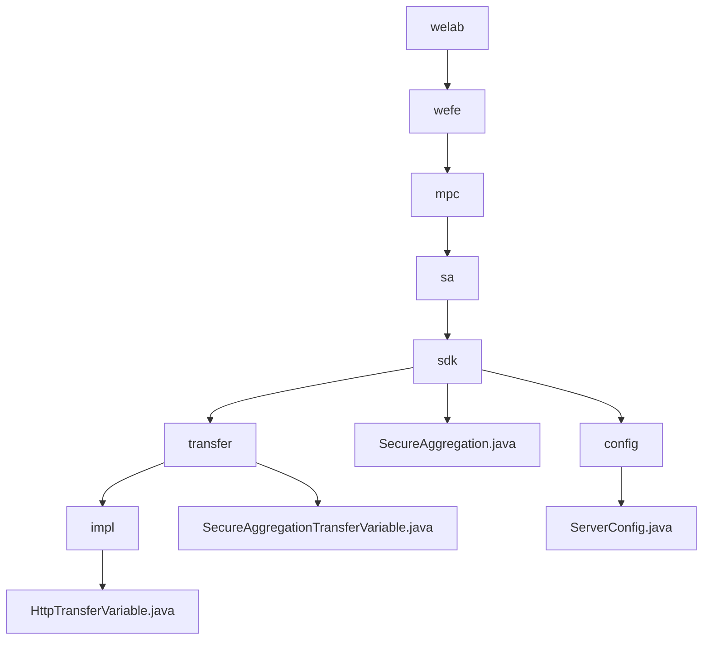

# Basic Information

|      |      |
|------|------|
| Name | welab |
| Language | .java |
| Code Path | WeFe/mpc/mpc-sa/mpc-sa-sdk/src/main/java/com/welab |
| Package Name | docs.mpc.mpc-sa.mpc-sa-sdk.src.main.java.com.welab |
| Brief Description | This module enables secure data transmission via the HTTP protocol, supporting Diffie-Hellman key exchange and result queries, making it suitable for scenarios such as federated learning. Core interfaces include key negotiation and result retrieval, dependent on HTTP server configuration. |

# Description

## Overview  
This module implements privacy-preserving data transmission in secure multi-party computation, ensuring communication security through Diffie-Hellman key exchange and HTTP aggregated queries. The unified interface includes `queryDiffieHellmanKey` (key negotiation) and `queryResult` (result retrieval), adopting an RPC-like request-response pattern. Core data structures are `QueryDiffieHellmanKeyRequest/Response` and `QuerySAResultRequest/Response`, with external dependencies limited to HTTP server configuration (e.g., `ServerConfig`). For instance, the `SecureAggregation` class manages secure aggregation via UUID and key management, while `ServerConfig` defines parameters such as service URLs and operation types.  

## Key Business Scenarios  
The typical workflow consists of two phases: first negotiating keys via the Diffie-Hellman protocol, then initiating obfuscated result queries. Interactions employ synchronous HTTP calls, such as a client requesting a public key followed by a server response. The functionality fully supports scenarios like federated learning, with the `SecureAggregation` class demonstrating a complete implementation: iterating through server configurations to initiate key requests before aggregating and returning computed results. The API provides query-oriented interfaces supporting ADD/SUB operations and weight configuration, with robust exception handling ensuring reliability.

### Package Internal Structure View

This flowchart illustrates the hierarchical structure of the MPC Secure Aggregation SDK in the WeFe project. Starting from the welab root directory, it progressively expands to specific implementation classes and configuration files, including core components such as transfer variable implementations, the main SecureAggregation class, and service configurations. The entire structure presents a clear tree-like dependency relationship with a depth of 7 layers, comprising a total of 10 nodes.

# File List

| Name   | Type  | Description |
|-------|------|-------------|
| [wefe](wefe/_module.md) | package | This module enables secure data transmission via the HTTP protocol, supporting Diffie-Hellman key exchange and result querying, making it suitable for scenarios such as federated learning. Core interfaces include key negotiation and result retrieval, dependent on HTTP server configuration. |

