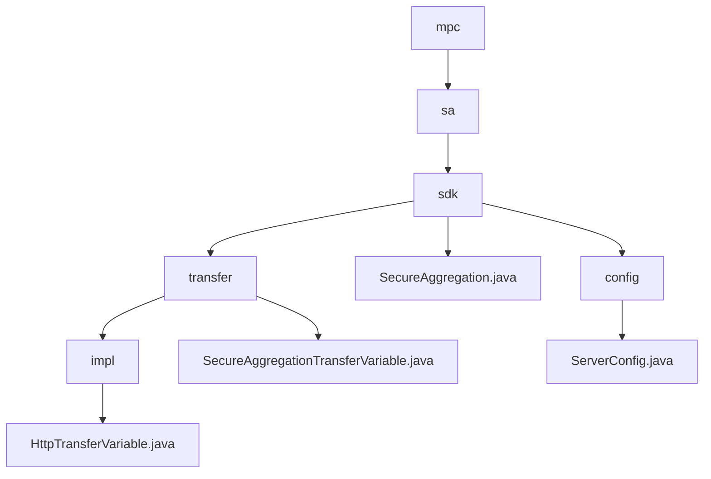

# Basic Information

|      |      |
|------|------|
| Name | mpc |
| Language | .java |
| Code Path | WeFe/mpc/mpc-sa/mpc-sa-sdk/src/main/java/com/welab/wefe/mpc |
| Package Name | docs.mpc.mpc-sa.mpc-sa-sdk.src.main.java.com.welab.wefe.mpc |
| Brief Description | This module enables secure data transmission via the HTTP protocol, supporting Diffie-Hellman key exchange and result querying, making it suitable for scenarios such as federated learning. Core interfaces include key negotiation and result retrieval, which rely on HTTP server configuration. |

# Description

## Overview  
This module implements privacy-preserving data transmission in secure multi-party computation, ensuring communication security through Diffie-Hellman key exchange and HTTP aggregated queries. The unified interface includes `queryDiffieHellmanKey` (key negotiation) and `queryResult` (result retrieval), adopting an RPC-like request-response pattern. Core data structures are `QueryDiffieHellmanKeyRequest/Response` and `QuerySAResultRequest/Response`, with external dependencies limited to HTTP server configuration (e.g., `ServerConfig`). For instance, the `SecureAggregation` class implements secure aggregation via UUID and key management, while `ServerConfig` defines parameters such as service URLs and operation types.  

## Key Business Scenarios  
The typical workflow consists of two phases: first negotiating keys via the Diffie-Hellman protocol, then initiating obfuscated result queries. Interactions employ synchronous HTTP calls, such as client requests for public keys followed by server responses. The functionality fully supports scenarios like federated learning, with the `SecureAggregation` class demonstrating a complete implementation: iterating through server configurations to initiate key requests before collecting and accumulating computed results for return. The API provides query-oriented interfaces, supporting ADD/SUB operations and weight configuration, with exception handling ensuring reliability.

### Package Internal Structure View

This flowchart illustrates the code structure of the MPC Secure Aggregation SDK in the WeFe project. Starting from the mpc root directory, it sequentially expands into the sa module, sdk core components, as well as the transfer layer and config module implementations. The transfer layer includes interface implementation classes and abstract classes, while the config module contains service configuration classes, presenting a clear hierarchical invocation relationship overall.

# File List

| Name   | Type  | Description |
|-------|------|-------------|
| [sa](sa/_module.md) | package | This module enables secure data transmission via the HTTP protocol, supporting Diffie-Hellman key exchange and result querying, making it suitable for scenarios such as federated learning. Core interfaces include key negotiation and result retrieval, dependent on HTTP server configuration. |

