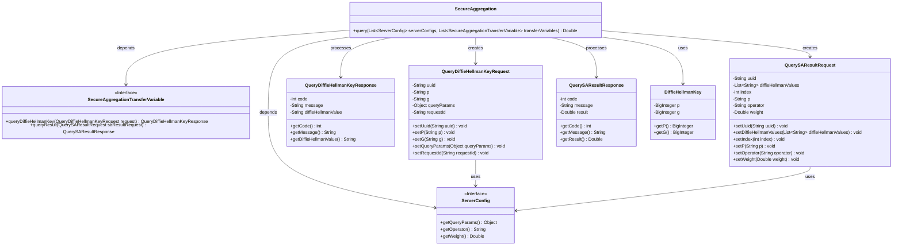
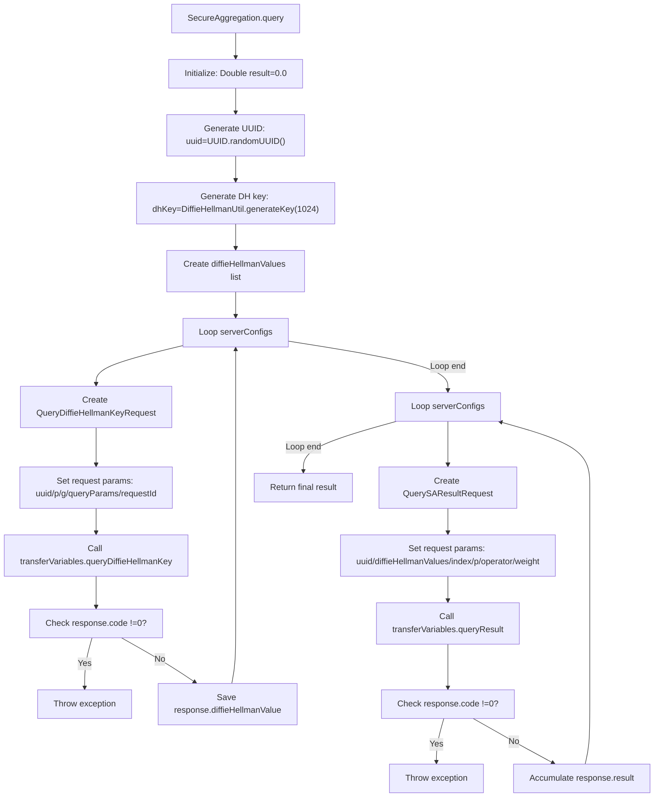

# Basic Information

|      |      |
|------|------|
| Name | SecureAggregation |
| Language | .java |
| Code Path | WeFe/mpc/mpc-sa/mpc-sa-sdk/src/main/java/com/welab/wefe/mpc/sa/sdk/SecureAggregation.java |
| Package Name | com.welab.wefe.mpc.sa.sdk |
| Dependencies | ['com.welab.wefe.mpc.key.DiffieHellmanKey', 'com.welab.wefe.mpc.sa.request.QueryDiffieHellmanKeyRequest', 'com.welab.wefe.mpc.sa.request.QueryDiffieHellmanKeyResponse', 'com.welab.wefe.mpc.sa.request.QuerySAResultRequest', 'com.welab.wefe.mpc.sa.request.QuerySAResultResponse', 'com.welab.wefe.mpc.sa.sdk.config.ServerConfig', 'com.welab.wefe.mpc.sa.sdk.transfer.SecureAggregationTransferVariable', 'com.welab.wefe.mpc.util.DiffieHellmanUtil', 'java.util.ArrayList', 'java.util.List', 'java.util.UUID'] |
| Brief Description | The SecureAggregation class securely queries data from multiple servers and aggregates the results using Diffie-Hellman key exchange. After generating UUIDs and keys, it proceeds with a two-phase request: first retrieving key values from each server, then querying and accumulating the results. Errors are thrown in case of exceptions. |

# Description

The `SecureAggregation` class implements a secure aggregation query functionality. This method first generates a UUID and Diffie-Hellman keys, then iterates through the server configuration list to create Diffie-Hellman key requests for each server and retrieves the response values. It subsequently traverses the server configurations again to construct secure aggregation result requests, collects the computation results from each server, and accumulates them to return the final result. The entire process includes an exception handling mechanism to ensure secure and reliable operations.

# Class Summary

| Name   | Type  | Description |
|-------|------|-------------|
| SecureAggregation | class | The SecureAggregation class securely aggregates query results from multiple servers and returns the sum through Diffie-Hellman key exchange and a server configuration list. |

## Class SecureAggregation

|      |      |
|------|------|
| Access Modifier | public |
| Type | class |
| Name | SecureAggregation |
| Description | The SecureAggregation class securely aggregates query results from multiple servers and returns the sum through Diffie-Hellman key exchange and a server configuration list. |

### UML Class Diagram

This class diagram illustrates the core structure of SecureAggregation, which primarily consists of a main class for executing aggregation queries and multiple auxiliary classes/interfaces. SecureAggregation implements secure computation through two main steps: first exchanging Diffie-Hellman keys with multiple servers, then performing secure aggregation calculations based on these keys. The system relies on the ServerConfig interface to obtain server configurations and interacts with remote services via the SecureAggregationTransferVariable interface. The entire process involves key generation, request/response object transmission, and result aggregation, achieving privacy-preserving aggregation computation in distributed environments.

### Internal Method Call Graph

This flowchart illustrates the execution process of secure aggregation query: First generating UUID and DH key, then interacting with multiple servers in two phases. The first phase retrieves DH parameters from each server, while the second phase uses these parameters to aggregate computation results. Each phase includes request construction, remote invocation, and error checking, ultimately returning the aggregated result. The entire process implements secure data aggregation computation in distributed environments.

### Field List

| Name  | Type  | Description |
|-------|-------|------|

### Method List

| Name  | Type  | Description |
|-------|-------|------|
| query | Double | This method securely interacts with multiple servers through the Diffie-Hellman key exchange protocol, aggregates the encrypted computation results returned by each server, and returns the sum. |

