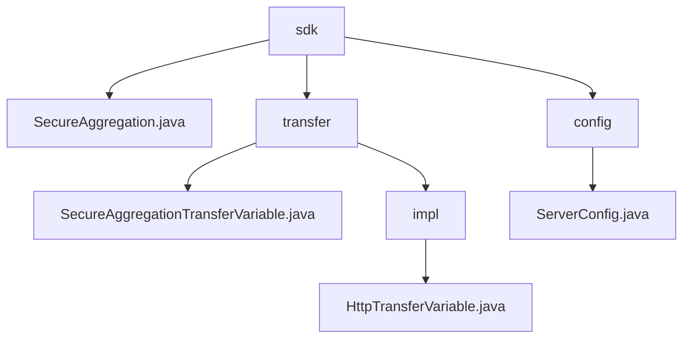

# Basic Information

|      |      |
|------|------|
| Name | sdk |
| Language | .java |
| Code Path | WeFe/mpc/mpc-sa/mpc-sa-sdk/src/main/java/com/welab/wefe/mpc/sa/sdk |
| Package Name | docs.mpc.mpc-sa.mpc-sa-sdk.src.main.java.com.welab.wefe.mpc.sa.sdk |
| Brief Description | This module enables secure data transmission via the HTTP protocol, supporting Diffie-Hellman key exchange and result query, making it suitable for scenarios such as federated learning. Core interfaces include key negotiation and result retrieval, dependent on HTTP server configuration. |

# Description

## Overview  
This module implements privacy-preserving data transmission in secure multi-party computation, ensuring communication security through Diffie-Hellman key exchange and HTTP aggregated queries. The unified interface includes `queryDiffieHellmanKey` (key negotiation) and `queryResult` (result retrieval), adopting an RPC-like request-response pattern. Core data structures are `QueryDiffieHellmanKeyRequest/Response` and `QuerySAResultRequest/Response`, with external dependencies limited to HTTP server configuration (e.g., `ServerConfig`). For instance, the `SecureAggregation` class implements secure aggregation via UUID and key management, while `ServerConfig` defines parameters such as service URLs and operation types.  

## Key Business Scenarios  
The typical workflow consists of two phases: first negotiating keys via the Diffie-Hellman protocol, then initiating obfuscated result queries. Interactions employ synchronous HTTP calls, such as client requests for public keys followed by server responses. The functionality fully supports scenarios like federated learning, with the `SecureAggregation` class demonstrating a complete implementation: iterating through server configurations to initiate key requests before collecting and accumulating computed results. The API provides query-oriented interfaces supporting ADD/SUB operations and weight configuration, with robust exception handling ensuring reliability.

### Package Internal Structure View

This flowchart illustrates the code structure of the MPC Secure Aggregation SDK, with the root node being the sdk directory that contains the core class SecureAggregation.java, the transfer module, and the config module. The transfer module is further divided into interface definitions and the impl implementation layer, where the implementation layer includes the HTTP transport implementation class. The config module solely consists of the server configuration class, with the overall structure clearly reflecting the functional division of the SDK.

# File List

| Name   | Type  | Description |
|-------|------|-------------|
| [transfer](transfer/_module.md) | package | The `HttpTransferVariable` class extends `AbstractHttpTransferVariable` and implements the `SecureAggregationTransferVariable` interface, designed for handling HTTP transfer variables. Its constructor initializes server configurations and provides methods for querying Diffie-Hellman keys and secure aggregation results. The `SecureAggregationTransferVariable` interface defines these two critical methods, which are used in secure aggregation transfer scenarios. |
| [SecureAggregation.java](SecureAggregation.md) | file | The SecureAggregation class securely queries data from multiple servers and aggregates the results using Diffie-Hellman key exchange. After generating UUIDs and keys, it proceeds with a two-phase request: first retrieving key values from each server, then querying and accumulating the results. Errors are thrown in case of exceptions. |
| [config](config/_module.md) | package | The ServerConfig class contains attributes such as service name, URL, operation method, weight, query parameters, and communication configuration, along with their corresponding getter/setter methods. |

