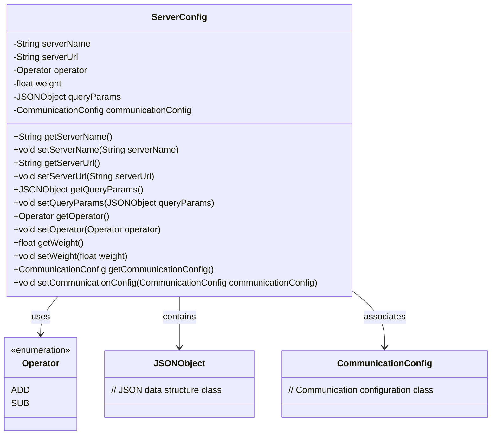

# Basic Information

|      |      |
|------|------|
| Name | ServerConfig |
| Language | .java |
| Code Path | WeFe/mpc/mpc-sa/mpc-sa-sdk/src/main/java/com/welab/wefe/mpc/sa/sdk/config/ServerConfig.java |
| Package Name | com.welab.wefe.mpc.sa.sdk.config |
| Dependencies | ['com.alibaba.fastjson.JSONObject', 'com.welab.wefe.mpc.commom.Operator', 'com.welab.wefe.mpc.config.CommunicationConfig'] |
| Brief Description | The `ServerConfig` class contains attributes such as service name, URL, operation method, weight, query parameters, and communication configuration, along with their corresponding getter/setter methods. |

# Description

The `ServerConfig` class defines server configuration information, including the service name, URL, operation method (ADD for addition or SUB for subtraction), weight (default 1.0), query parameter JSON object, and communication configuration object. It provides getter and setter methods for each attribute to retrieve and set these configuration parameters.

# Class Summary

| Name   | Type  | Description |
|-------|------|-------------|
| ServerConfig | class | The ServerConfig class contains service name, URL, operation method (ADD/SUB), weight, query parameters, and communication configuration, providing getter/setter methods. |

## Class ServerConfig

|      |      |
|------|------|
| Access Modifier | public |
| Type | class |
| Name | ServerConfig |
| Description | The ServerConfig class contains service name, URL, operation method (ADD/SUB), weight, query parameters, and communication configuration, providing getter/setter methods. |

### UML Class Diagram

This code describes a server configuration class `ServerConfig`, which includes core attributes such as service name, URL, operation type, weight, etc., and associates with the `CommunicationConfig` communication configuration class through aggregation. The `Operator` is an enumeration type defining two operation types: ADD and SUB. All fields in the class are encapsulated via getter/setter methods, reflecting good object-oriented design principles. This class is primarily used to store and manage server-side configuration information, supporting dynamic parameter modifications, with the weight field applicable in scenarios like load balancing.

### Internal Method Call Graph

```mermaid
graph TD
    A["Class ServerConfig"]
    B["Property: String serverName"]
    C["Property: String serverUrl"]
    D["Property: Operator operator = Operator.ADD"]
    E["Property: float weight = 1.0f"]
    F["Property: JSONObject queryParams"]
    G["Property: CommunicationConfig communicationConfig"]
    H["Method: String getServerName()"]
    I["Method: void setServerName(String)"]
    J["Method: String getServerUrl()"]
    K["Method: void setServerUrl(String)"]
    L["Method: JSONObject getQueryParams()"]
    M["Method: void setQueryParams(JSONObject)"]
    N["Method: Operator getOperator()"]
    O["Method: void setOperator(Operator)"]
    P["Method: float getWeight()"]
    Q["Method: void setWeight(float)"]
    R["Method: CommunicationConfig getCommunicationConfig()"]
    S["Method: void setCommunicationConfig(CommunicationConfig)"]

    A --> B
    A --> C
    A --> D
    A --> E
    A --> F
    A --> G
    A --> H
    A --> I
    A --> J
    A --> K
    A --> L
    A --> M
    A --> N
    A --> O
    A --> P
    A --> Q
    A --> R
    A --> S
```

This code defines a ServerConfig class for configuring server-related parameters. The class contains six private properties: serverName (service name), serverUrl (service URL), operator (operation method, defaulting to ADD), weight (service weight, defaulting to 1.0), queryParams (query parameters), and communicationConfig (communication configuration). Corresponding getter and setter methods are provided for each property to retrieve and modify their values. This class is primarily used for storing and managing server configuration information, allowing flexible modification and retrieval of configuration parameters through its methods.

### Field List

| Name  | Type  | Description |
|-------|-------|------|
| queryParams | JSONObject | The private JSONObject variable queryParams is used to store query parameters. |
| weight = 1.0f | float | Define a private floating-point variable weight with an initial value of 1.0. |
| operator = Operator.ADD | Operator | The private variable `operator` is initialized to the addition operator. |
| communicationConfig | CommunicationConfig | Private communication configuration object instance. |
| serverName | String | Private string variable serverName |
| serverUrl | String | Declare a private string variable serverUrl. |

### Method List

| Name  | Type  | Description |
|-------|-------|------|
| getServerUrl | String | The method returns the server URL string. |
| setOperator | void | Set the operator method to assign the passed `operator` parameter to the `operator` property of the current object. |
| getQueryParams | JSONObject | Method to obtain a JSON object of query parameters. |
| setServerUrl | void | Method to set the server URL, which assigns the input parameter to the serverUrl member variable of the class. |
| setQueryParams | void | This is a Java method used to set the queryParams property of a class, with the parameter type being JSONObject. |
| getOperator | Operator | Methods to obtain the current operator instance. |
| setServerName | void | This is a Java method used to set the value of the serverName property in a class. The method takes a string parameter serverName and assigns it to the property of the same name in the current object. |
| getServerName | String | Methods to obtain the server name, returns a string-type variable serverName. |
| getWeight | float | Get the weight value of the current object and return it. |
| setWeight | void | Method for setting the object's weight property, with the parameter being a floating-point number weight. |
| getCommunicationConfig | CommunicationConfig | Methods to obtain the communication configuration object, with a return type of CommunicationConfig. |
| setCommunicationConfig | void | Set communication configuration parameters. |

