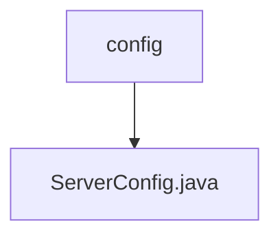

# Basic Information

|      |      |
|------|------|
| Name | config |
| Language | .java |
| Code Path | WeFe/mpc/mpc-sa/mpc-sa-sdk/src/main/java/com/welab/wefe/mpc/sa/sdk/config |
| Package Name | docs.mpc.mpc-sa.mpc-sa-sdk.src.main.java.com.welab.wefe.mpc.sa.sdk.config |
| Brief Description | The ServerConfig class contains attributes such as service name, URL, operation method, weight, query parameters, and communication configuration, along with their corresponding getter/setter methods. |

# Description

The `ServerConfig` class defines server configuration information, including the service name, URL, operation method (ADD for addition or SUB for subtraction), weight (default 1.0), query parameter JSON object, and communication configuration object. It provides getter and setter methods for each attribute to retrieve and set these configuration parameters.

### Package Internal Structure View

This flowchart illustrates the configuration module structure of the MPC secure aggregation SDK in the WeFe project. The root node "config" represents the configuration directory, which contains a specific configuration file "ServerConfig.java". This concise hierarchical relationship reflects the minimalist design of the SDK's configuration module, including only the essential server configuration class file.

# File List

| Name   | Type  | Description |
|-------|------|-------------|
| [ServerConfig.java](ServerConfig.md) | file | The ServerConfig class contains attributes such as service name, URL, operation method, weight, query parameters, and communication configuration, along with their corresponding getter/setter methods. |

