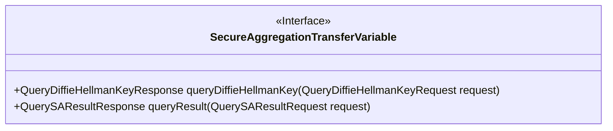
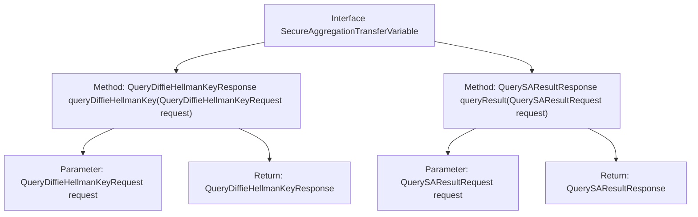

# Basic Information

|      |      |
|------|------|
| Name | SecureAggregationTransferVariable |
| Language | .java |
| Code Path | WeFe/mpc/mpc-sa/mpc-sa-sdk/src/main/java/com/welab/wefe/mpc/sa/sdk/transfer/SecureAggregationTransferVariable.java |
| Package Name | com.welab.wefe.mpc.sa.sdk.transfer |
| Dependencies | ['com.welab.wefe.mpc.sa.request.QueryDiffieHellmanKeyRequest', 'com.welab.wefe.mpc.sa.request.QueryDiffieHellmanKeyResponse', 'com.welab.wefe.mpc.sa.request.QuerySAResultRequest', 'com.welab.wefe.mpc.sa.request.QuerySAResultResponse'] |
| Brief Description | The SecureAggregationTransferVariable interface defines two methods: queryDiffieHellmanKey is used to obtain the server's Diffie-Hellman value, and queryResult is used to retrieve the obfuscated result data. |

# Description

The SecureAggregationTransferVariable interface defines two key methods: queryDiffieHellmanKey is used to retrieve the server's Diffie-Hellman key exchange value, accepting a QueryDiffieHellmanKeyRequest parameter and returning a QueryDiffieHellmanKeyResponse; queryResult is used to fetch the obfuscated result data, accepting a QuerySAResultRequest parameter and returning a QuerySAResultResponse. This interface is primarily designed for secure aggregation transfer scenarios.

# Class Summary

| Name   | Type  | Description |
|-------|------|-------------|
| SecureAggregationTransferVariable | interface | The SecureAggregationTransferVariable interface defines two methods: queryDiffieHellmanKey is used to obtain the server's Diffie-Hellman value, and queryResult is used to retrieve the obfuscated result data. |

## Class SecureAggregationTransferVariable

|      |      |
|------|------|
| Access Modifier | public |
| Type | interface |
| Name | SecureAggregationTransferVariable |
| Description | The SecureAggregationTransferVariable interface defines two methods: queryDiffieHellmanKey is used to obtain the server's Diffie-Hellman value, and queryResult is used to retrieve the obfuscated result data. |

### UML Class Diagram

This class diagram illustrates an interface named `SecureAggregationTransferVariable`, which defines two core methods for secure aggregation transmission: `queryDiffieHellmanKey` for retrieving the server's Diffie-Hellman key and `queryResult` for querying the obfuscated aggregation results. Marked with <<Interface>> to explicitly denote its abstract nature, both methods accept specific request objects and return corresponding response objects, embodying the standard interaction patterns of key exchange and result query in secure multi-party computation.

### Internal Method Call Graph

This code defines an interface named `SecureAggregationTransferVariable`, which includes two core methods: `queryDiffieHellmanKey` for retrieving the server's Diffie-Hellman key and `queryResult` for obtaining the obfuscated result data of secure aggregation. The flowchart illustrates the hierarchical relationship between the interface and its methods, along with the input parameters and return types of each method, clearly reflecting the data transmission functionality of this interface in secure aggregation communication.

### Field List

| Name  | Type  | Description |
|-------|-------|------|

### Method List

| Name  | Type  | Description |
|-------|-------|------|
| queryResult | QuerySAResultResponse | Query the response method of SAResult, which receives request parameters and returns results. |
| queryDiffieHellmanKey | QueryDiffieHellmanKeyResponse | Query the Diffie-Hellman key exchange response, with the request parameters as input. |

