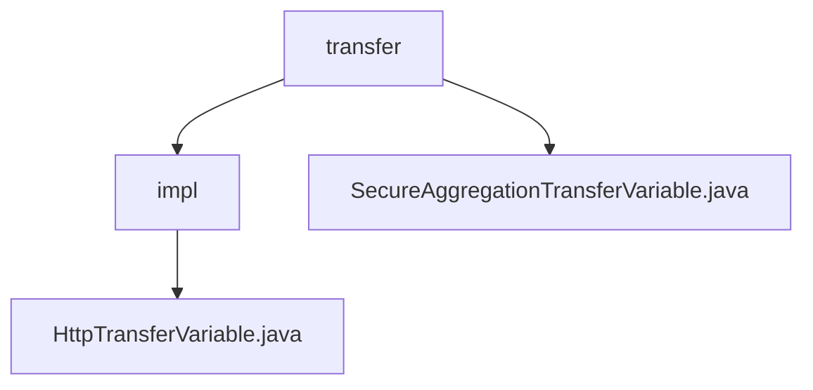

# Basic Information

|      |      |
|------|------|
| Name | transfer |
| Language | .java |
| Code Path | WeFe/mpc/mpc-sa/mpc-sa-sdk/src/main/java/com/welab/wefe/mpc/sa/sdk/transfer |
| Package Name | docs.mpc.mpc-sa.mpc-sa-sdk.src.main.java.com.welab.wefe.mpc.sa.sdk.transfer |
| Brief Description | The `HttpTransferVariable` class extends `AbstractHttpTransferVariable` and implements the `SecureAggregationTransferVariable` interface, designed for handling HTTP transfer variables. Its constructor initializes server configurations and provides methods for querying Diffie-Hellman keys and secure aggregation results. The `SecureAggregationTransferVariable` interface defines these two critical methods, which are used in secure aggregation transfer scenarios. |

# Description

## Overview  
The core responsibility of this module is to implement secure aggregated transmission based on the HTTP protocol, ensuring data transmission security through the Diffie-Hellman key exchange and result query mechanism. The interface specification uniformly provides the `queryDiffieHellmanKey` and `queryResult` methods, corresponding to key negotiation and aggregated result retrieval respectively, adopting a request-response model (similar to RPC calls). Key data structures include `QueryDiffieHellmanKeyRequest/Response` and `QuerySAResultRequest/Response`, encapsulating communication parameters and results. The only external dependency is the HTTP server configuration (e.g., `ServerConfig`). For instance, `HttpTransferVariable` reuses network request logic through the private `query` method.  

## Primary Business Scenarios  
A typical application is privacy-preserving data transmission in secure multi-party computation, where the business process consists of a key negotiation phase (via the Diffie-Hellman protocol) and an obfuscated result retrieval phase. The interaction mode employs synchronous HTTP calls—for example, after a client initiates a `queryDiffieHellmanKey` request, the server returns a response containing the public key. Functional completeness is reflected in the simultaneous support for key exchange and result pulling, making it suitable for scenarios such as federated learning. The API type is a typical query-style interface, with integration examples visible in the concrete implementation of the interface by `HttpTransferVariable`.

### Package Internal Structure View

This flowchart illustrates the hierarchical structure of the transfer module in the MPC Secure Aggregation SDK. The top level is the transfer directory, which contains two child nodes: the impl implementation directory and the SecureAggregationTransferVariable interface file. The impl directory includes the concrete HttpTransferVariable implementation class. The entire structure clearly reflects the abstraction and implementation relationship of secure aggregation transfer variables.

# File List

| Name   | Type  | Description |
|-------|------|-------------|
| [SecureAggregationTransferVariable.java](SecureAggregationTransferVariable.md) | file | The SecureAggregationTransferVariable interface defines two methods: queryDiffieHellmanKey is used to obtain the server's Diffie-Hellman value, and queryResult is used to retrieve the obfuscated result data. |
| [impl](impl/_module.md) | package | The HttpTransferVariable class inherits from AbstractHttpTransferVariable and implements the SecureAggregationTransferVariable interface. It includes configuration initialization and query methods, supporting Diffie-Hellman key and SA result queries. |

