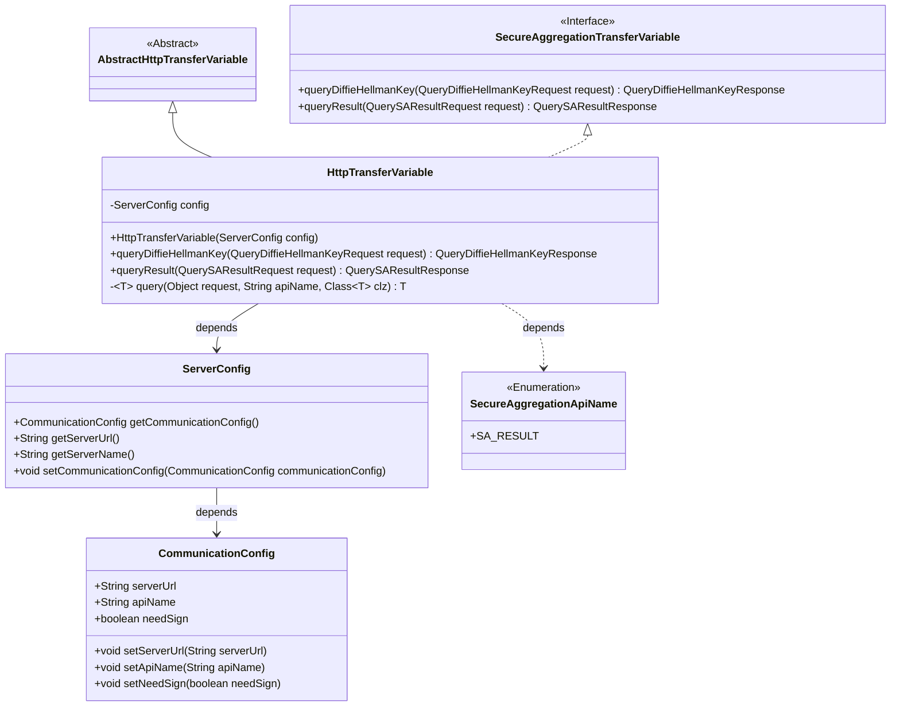
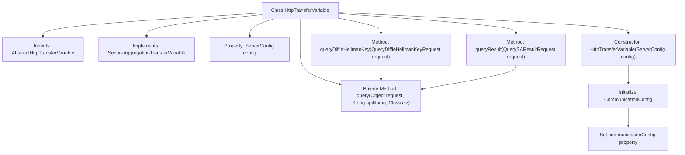

# Basic Information

|      |      |
|------|------|
| Name | HttpTransferVariable |
| Language | .java |
| Code Path | WeFe/mpc/mpc-sa/mpc-sa-sdk/src/main/java/com/welab/wefe/mpc/sa/sdk/transfer/impl/HttpTransferVariable.java |
| Package Name | com.welab.wefe.mpc.sa.sdk.transfer.impl |
| Dependencies | ['com.welab.wefe.mpc.config.CommunicationConfig', 'com.welab.wefe.mpc.sa.SecureAggregationApiName', 'com.welab.wefe.mpc.sa.request.QueryDiffieHellmanKeyRequest', 'com.welab.wefe.mpc.sa.request.QueryDiffieHellmanKeyResponse', 'com.welab.wefe.mpc.sa.request.QuerySAResultRequest', 'com.welab.wefe.mpc.sa.request.QuerySAResultResponse', 'com.welab.wefe.mpc.sa.sdk.config.ServerConfig', 'com.welab.wefe.mpc.sa.sdk.transfer.SecureAggregationTransferVariable', 'com.welab.wefe.mpc.trasfer.AbstractHttpTransferVariable'] |
| Brief Description | The HttpTransferVariable class inherits from AbstractHttpTransferVariable and implements the SecureAggregationTransferVariable interface. It includes configuration initialization and query methods, supporting Diffie-Hellman key and SA result queries. |

# Description

The `HttpTransferVariable` class extends `AbstractHttpTransferVariable` and implements the `SecureAggregationTransferVariable` interface, designed for handling HTTP transfer variables. The constructor accepts a `ServerConfig` parameter to initialize communication configurations, including the server URL, API name, and signature requirements. It provides the `queryDiffieHellmanKey` and `queryResult` methods for querying the Diffie-Hellman key and secure aggregation results, respectively, with the internal private `query` method implementing the generic query logic.

# Class Summary

| Name   | Type  | Description |
|-------|------|-------------|
| HttpTransferVariable | class | The HttpTransferVariable class inherits from AbstractHttpTransferVariable and implements the SecureAggregationTransferVariable interface, designed for secure aggregation communication. The constructor initializes communication configurations and provides methods for querying Diffie-Hellman keys and SA results. |

## Class HttpTransferVariable

|      |      |
|------|------|
| Access Modifier | public |
| Type | class |
| Name | HttpTransferVariable |
| Description | The HttpTransferVariable class inherits from AbstractHttpTransferVariable and implements the SecureAggregationTransferVariable interface, designed for secure aggregation communication. The constructor initializes communication configurations and provides methods for querying Diffie-Hellman keys and SA results. |

### UML Class Diagram

Class diagram description: The HttpTransferVariable class inherits from the AbstractHttpTransferVariable abstract class and implements the SecureAggregationTransferVariable interface, designed for handling secure aggregation transfer variables. It configures communication parameters via ServerConfig, containing core methods for querying Diffie-Hellman keys and results, with internal generic query method implementing specific query logic. The CommunicationConfig class stores communication configuration details, while SecureAggregationApiName is an enumeration class containing API names.

### Internal Method Call Graph

This code flowchart illustrates the structure of the HttpTransferVariable class, which inherits from AbstractHttpTransferVariable and implements the SecureAggregationTransferVariable interface. Key logic includes: 1) The constructor initializes ServerConfig and verifies/creates a CommunicationConfig object; 2) Two public APIs (queryDiffieHellmanKey and queryResult) both invoke the internal private query method; 3) The private query method serves as a unified entry point for queries. The diagram clearly presents the class inheritance hierarchy, property configuration flow, and main method call chains, particularly highlighting the communication configuration initialization process and the unified query mechanism for request handling.

### Field List

| Name  | Type  | Description |
|-------|-------|------|
| config | ServerConfig | Declare a variable named config of type ServerConfig. |

### Method List

| Name  | Type  | Description |
|-------|-------|------|
| queryDiffieHellmanKey | QueryDiffieHellmanKeyResponse | This method processes Diffie-Hellman key query requests, invokes the generic query method, and returns the response result. |
| queryResult | QuerySAResultResponse | This method is used to query the secure aggregation results, receiving a request object and returning a response, internally invoking a generic query interface. |
| query | T | The private generic method `query` accepts a request object, an API name, and a target class, invokes the overloaded method, and returns the result. |

