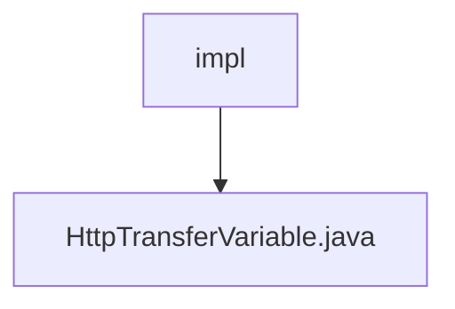

# Basic Information

|      |      |
|------|------|
| Name | impl |
| Language | .java |
| Code Path | WeFe/mpc/mpc-sa/mpc-sa-sdk/src/main/java/com/welab/wefe/mpc/sa/sdk/transfer/impl |
| Package Name | docs.mpc.mpc-sa.mpc-sa-sdk.src.main.java.com.welab.wefe.mpc.sa.sdk.transfer.impl |
| Brief Description | The HttpTransferVariable class inherits from AbstractHttpTransferVariable and implements the SecureAggregationTransferVariable interface. It includes configuration initialization and query methods, supporting Diffie-Hellman key and SA result queries. |

# Description

The `HttpTransferVariable` class extends `AbstractHttpTransferVariable` and implements the `SecureAggregationTransferVariable` interface, designed for handling HTTP transfer variables. The constructor takes a `ServerConfig` parameter to initialize communication settings, including the server URL, API name, and signature requirements. It provides the `queryDiffieHellmanKey` and `queryResult` methods for querying Diffie-Hellman keys and secure aggregation results, respectively, with internal generic query logic implemented via a private `query` method.

### Package Internal Structure View

This flowchart illustrates the simple structure of the transfer implementation module in the MPC secure aggregation SDK. The `impl` folder serves as the parent node, containing a specific implementation file `HttpTransferVariable.java`. This indicates that in the secure multi-party computation (MPC) secure aggregation SDK, the concrete implementation of HTTP transfer variables is organized under the `transfer/impl` directory, reflecting a modular code structure.

# File List

| Name   | Type  | Description |
|-------|------|-------------|
| [HttpTransferVariable.java](HttpTransferVariable.md) | file | The `HttpTransferVariable` class inherits from `AbstractHttpTransferVariable` and implements the `SecureAggregationTransferVariable` interface. It includes configuration initialization and query methods, supporting Diffie-Hellman key and SA result queries. |

